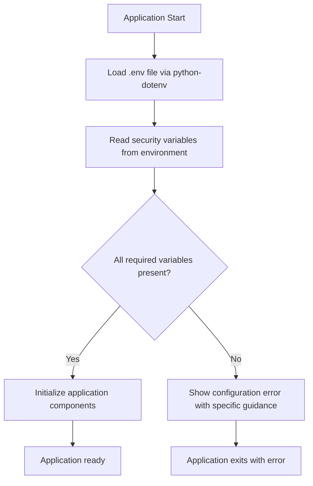

# Design Document

## Overview

This design outlines the approach for reverting the security-related environment variables (AUTH_ADMIN_USERNAME, AUTH_ADMIN_EMAIL, AUTH_ADMIN_PASSWORD, FLASK_SECRET_KEY, and PLATFORM_ENCRYPTION_KEY) back to the .env file approach for simplicity while maintaining proper security documentation and best practices.

The current implementation requires these variables to be set as system environment variables, which has proven complex for users. This design will move them back to .env/.env.example files with appropriate security warnings and documentation.

## Architecture

### Configuration Loading Flow



### Security Variable Management

The design maintains the same security practices but simplifies the configuration approach:

1. **Storage Location**: Variables stored in .env file (loaded by python-dotenv)
2. **Security Documentation**: Clear warnings about not using default values
3. **Generation Tools**: Scripts to generate secure values for .env file
4. **Validation**: Same validation logic, but reading from .env-loaded environment

## Components and Interfaces

### 1. Configuration System (config.py)

**Current State**: Requires system environment variables with ConfigurationError if missing
**Target State**: Reads from .env-loaded environment variables with same validation

**Changes Required**:
- Remove explicit environment variable requirement errors
- Maintain validation logic for security requirements
- Update error messages to reference .env file setup

### 2. Environment File Templates

**`.env.example` Updates**:
- Add placeholder values for all five security variables
- Include security warnings and comments
- Reference documentation for secure value generation

**`.env` File**:
- Users will copy from .env.example and populate with actual values
- Contains real sensitive values (gitignored)

### 3. Documentation Updates

**Security Documentation**:
- Update environment-setup.md to focus on .env file approach
- Maintain security best practices and generation instructions
- Provide clear migration path from environment variables

### 4. Setup and Generation Scripts

**Script Updates**:
- Modify generation scripts to write to .env file instead of system environment
- Update verification scripts to check .env file contents
- Maintain same security standards for generated values

## Data Models

### Environment Variable Structure

```
# Security Settings in .env file
FLASK_SECRET_KEY=<32-character-secure-token>
AUTH_ADMIN_USERNAME=<admin-username>
AUTH_ADMIN_EMAIL=<admin-email@domain.com>
AUTH_ADMIN_PASSWORD=<secure-password>
PLATFORM_ENCRYPTION_KEY=<fernet-encryption-key>
```

### Configuration Validation

The same validation rules apply:
- FLASK_SECRET_KEY: Must be 32+ characters, cryptographically secure
- AUTH_ADMIN_USERNAME: 3-64 characters, alphanumeric and underscores
- AUTH_ADMIN_EMAIL: Valid email format
- AUTH_ADMIN_PASSWORD: Strong password requirements
- PLATFORM_ENCRYPTION_KEY: Valid Fernet key format

## Error Handling

### Configuration Error Messages

**Before (Environment Variable Approach)**:
```
ConfigurationError: AUTH_ADMIN_USERNAME environment variable is required. 
Please see docs/security/environment-setup.md for setup instructions.
```

**After (.env File Approach)**:
```
ConfigurationError: AUTH_ADMIN_USERNAME is required in .env file. 
Please copy .env.example to .env and configure your security settings.
See docs/security/environment-setup.md for secure value generation.
```

### Missing .env File Handling

If .env file is missing or incomplete:
1. Clear error message indicating missing .env file
2. Instructions to copy from .env.example
3. Reference to documentation for secure value generation
4. Application exits gracefully with helpful guidance

## Testing Strategy

### Configuration Testing

1. **Valid Configuration Tests**:
   - Test loading with properly configured .env file
   - Verify all security variables are loaded correctly
   - Confirm validation passes for secure values

2. **Missing Configuration Tests**:
   - Test behavior when .env file is missing
   - Test behavior when individual variables are missing
   - Verify error messages are helpful and actionable

3. **Invalid Configuration Tests**:
   - Test with weak/invalid FLASK_SECRET_KEY
   - Test with invalid email format
   - Test with invalid encryption key format

### Migration Testing

1. **Environment Variable to .env Migration**:
   - Test migration scripts work correctly
   - Verify existing users can migrate smoothly
   - Confirm no data loss during migration

2. **Backward Compatibility**:
   - Ensure existing installations continue to work
   - Test upgrade path from environment variable approach
   - Verify platform connections remain functional

### Security Testing

1. **Value Generation Testing**:
   - Test that generated values meet security requirements
   - Verify encryption keys are valid Fernet keys
   - Confirm passwords meet complexity requirements

2. **File Security Testing**:
   - Verify .env file is properly gitignored
   - Test file permissions are appropriate
   - Confirm sensitive values are not logged

## Implementation Approach

### Phase 1: Update Configuration System
1. Modify config.py to remove environment variable requirements
2. Update error messages to reference .env file setup
3. Maintain same validation logic

### Phase 2: Update Environment Files
1. Add security variables to .env.example with placeholders
2. Include comprehensive comments and security warnings
3. Update gitignore to ensure .env is excluded

### Phase 3: Update Documentation
1. Revise environment-setup.md for .env file approach
2. Update setup instructions and best practices
3. Provide migration guidance for existing users

### Phase 4: Update Scripts and Tools
1. Modify generation scripts to write to .env file
2. Update verification scripts for .env file validation
3. Create migration helper scripts

### Phase 5: Testing and Validation
1. Test all configuration scenarios
2. Verify migration path works correctly
3. Confirm security standards are maintained

## Security Considerations

### Maintained Security Practices

1. **Strong Value Generation**: Same cryptographically secure generation methods
2. **Validation Requirements**: Same validation rules for all security variables
3. **Documentation**: Comprehensive security guidance and best practices
4. **Gitignore Protection**: .env file remains excluded from version control

### Security Warnings

1. **Default Value Warnings**: Clear warnings about not using example values
2. **Production Guidance**: Specific guidance for production deployments
3. **Key Rotation**: Instructions for rotating security keys
4. **Access Control**: Guidance on file permissions and access control

### Risk Mitigation

1. **Documentation Quality**: Comprehensive setup and security documentation
2. **Validation Strictness**: Maintain strict validation for all security values
3. **Error Clarity**: Clear, actionable error messages for configuration issues
4. **Migration Support**: Smooth migration path from environment variable approach

## Benefits of This Approach

1. **Simplicity**: Single configuration file approach is easier to manage
2. **Consistency**: Aligns with existing .env file pattern used throughout application
3. **User Experience**: Simpler setup process for new users
4. **Maintainability**: Easier to document and support
5. **Security**: Maintains same security standards with better usability