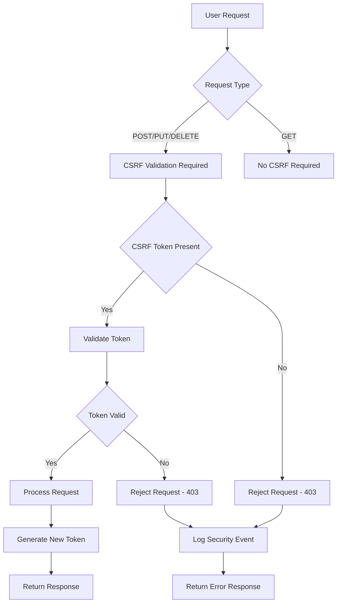

# CSRF Security Audit Design Document

## Overview

This design document outlines the comprehensive approach to auditing and improving CSRF (Cross-Site Request Forgery) protection across the Vedfolnir application. The design addresses inconsistencies in current CSRF implementation, ensures tokens are properly hidden from HTML output, and establishes security standards for all forms and AJAX requests.

## Architecture

### Current CSRF Implementation Analysis

**Strengths Identified:**
- Flask-WTF CSRF protection is enabled
- Most forms use `{{ form.hidden_tag() }}` for CSRF tokens
- AJAX requests include `X-CSRFToken` headers
- Meta tag provides CSRF token for JavaScript access

**Vulnerabilities Identified:**
- Inconsistent CSRF token implementation across templates
- Some forms use `{{ csrf_token() }}` directly (visible in HTML)
- GET forms unnecessarily include CSRF tokens
- Mixed patterns for AJAX CSRF handling
- Potential token exposure in HTML source

### Security Architecture



## Components and Interfaces

### 1. CSRF Token Management Component

**Purpose:** Centralized CSRF token generation, validation, and management

**Key Functions:**
- Generate secure CSRF tokens with sufficient entropy
- Validate tokens against session and request context
- Handle token expiration and refresh
- Integrate with Flask-WTF security framework

**Interface:**
```python
class CSRFTokenManager:
    def generate_token(self, session_id: str) -> str
    def validate_token(self, token: str, session_id: str) -> bool
    def is_token_expired(self, token: str) -> bool
    def refresh_token(self, session_id: str) -> str
```

### 2. Template Security Validator

**Purpose:** Audit and validate CSRF implementation across all templates

**Key Functions:**
- Scan templates for CSRF token usage
- Identify forms missing CSRF protection
- Detect improper CSRF token exposure
- Generate security compliance reports

**Interface:**
```python
class TemplateSecurityValidator:
    def audit_template(self, template_path: str) -> SecurityAuditResult
    def scan_all_templates(self) -> List[SecurityAuditResult]
    def validate_csrf_implementation(self, template_content: str) -> ValidationResult
    def generate_compliance_report(self) -> ComplianceReport
```

### 3. CSRF Error Handler

**Purpose:** Handle CSRF validation failures with user-friendly responses

**Key Functions:**
- Provide clear error messages for CSRF failures
- Preserve form data when possible
- Log security events for monitoring
- Guide users on how to retry actions

**Interface:**
```python
class CSRFErrorHandler:
    def handle_csrf_failure(self, request: Request, error: CSRFError) -> Response
    def log_csrf_violation(self, request: Request, error: CSRFError) -> None
    def preserve_form_data(self, form_data: Dict) -> str
    def generate_retry_guidance(self, request: Request) -> str
```

### 4. AJAX CSRF Integration

**Purpose:** Ensure all AJAX requests include proper CSRF protection

**Key Functions:**
- Automatically inject CSRF tokens into AJAX requests
- Handle CSRF token refresh for long-running sessions
- Provide JavaScript utilities for CSRF handling
- Integrate with existing JavaScript frameworks

**Interface:**
```javascript
class AjaxCSRFHandler {
    getCSRFToken(): string
    injectCSRFToken(request: XMLHttpRequest): void
    handleCSRFError(response: Response): void
    refreshCSRFToken(): Promise<string>
}
```

## Data Models

### CSRF Security Audit Result

```python
@dataclass
class SecurityAuditResult:
    template_path: str
    csrf_protected: bool
    csrf_method: str  # 'hidden_tag', 'csrf_token', 'none'
    vulnerabilities: List[str]
    recommendations: List[str]
    compliance_score: float
    last_audited: datetime
```

### CSRF Validation Context

```python
@dataclass
class CSRFValidationContext:
    request_method: str
    endpoint: str
    user_id: Optional[int]
    session_id: str
    token_source: str  # 'form', 'header', 'meta'
    validation_result: bool
    error_details: Optional[str]
    timestamp: datetime
```

### Template Security Configuration

```python
@dataclass
class TemplateSecurityConfig:
    template_name: str
    requires_csrf: bool
    csrf_method: str
    ajax_endpoints: List[str]
    security_headers: Dict[str, str]
    validation_rules: List[str]
```

## Error Handling

### CSRF Validation Failure Handling

**Error Types:**
1. **Missing CSRF Token** - Token not provided in request
2. **Invalid CSRF Token** - Token format or value is incorrect
3. **Expired CSRF Token** - Token has exceeded its lifetime
4. **Token Mismatch** - Token doesn't match session context

**Error Response Strategy:**
```python
def handle_csrf_error(error_type: str, request: Request) -> Response:
    # Log security event
    security_logger.log_csrf_violation(request, error_type)
    
    # Preserve form data if possible
    preserved_data = preserve_form_data(request.form)
    
    # Generate user-friendly error response
    if request.is_ajax:
        return jsonify({
            'error': 'CSRF validation failed',
            'message': get_csrf_error_message(error_type),
            'retry_token': generate_new_csrf_token(),
            'preserved_data': preserved_data
        }), 403
    else:
        flash(get_csrf_error_message(error_type), 'error')
        return redirect(request.referrer or url_for('index'))
```

### Template Security Violations

**Violation Types:**
1. **Exposed CSRF Token** - Token visible in HTML source
2. **Missing CSRF Protection** - POST form without CSRF token
3. **Unnecessary CSRF Token** - GET form with CSRF token
4. **Inconsistent Implementation** - Mixed CSRF patterns

**Violation Handling:**
```python
def handle_template_violation(violation: TemplateViolation) -> None:
    # Log security violation
    security_logger.log_template_violation(violation)
    
    # Generate fix recommendations
    recommendations = generate_fix_recommendations(violation)
    
    # Create security report entry
    security_report.add_violation(violation, recommendations)
    
    # Notify security team if critical
    if violation.severity == 'CRITICAL':
        notify_security_team(violation)
```

## Testing Strategy

### 1. CSRF Token Security Tests

**Test Categories:**
- Token generation and entropy validation
- Token validation and expiration handling
- Cross-session token validation
- Token reuse and replay attack prevention

**Example Test:**
```python
def test_csrf_token_entropy():
    """Test that CSRF tokens have sufficient entropy"""
    tokens = [generate_csrf_token() for _ in range(1000)]
    
    # Check uniqueness
    assert len(set(tokens)) == len(tokens)
    
    # Check entropy (simplified)
    for token in tokens:
        assert len(token) >= 32
        assert re.match(r'^[a-zA-Z0-9+/=]+$', token)
```

### 2. Template Security Audit Tests

**Test Categories:**
- Template CSRF implementation validation
- HTML output inspection for token exposure
- Form submission security testing
- AJAX request CSRF validation

**Example Test:**
```python
def test_template_csrf_protection():
    """Test that all POST forms have CSRF protection"""
    templates = scan_all_templates()
    
    for template in templates:
        forms = extract_forms_from_template(template)
        
        for form in forms:
            if form.method.upper() == 'POST':
                assert has_csrf_protection(form), f"Form in {template} missing CSRF protection"
```

### 3. AJAX CSRF Integration Tests

**Test Categories:**
- AJAX request CSRF header validation
- JavaScript CSRF token retrieval
- CSRF error handling in AJAX responses
- Token refresh functionality

**Example Test:**
```python
def test_ajax_csrf_integration():
    """Test that AJAX requests include proper CSRF tokens"""
    with app.test_client() as client:
        # Login to get session
        client.post('/login', data={'username': 'test', 'password': 'test'})
        
        # Make AJAX request without CSRF token
        response = client.post('/api/test', 
                             headers={'X-Requested-With': 'XMLHttpRequest'})
        assert response.status_code == 403
        
        # Make AJAX request with CSRF token
        csrf_token = get_csrf_token_from_session()
        response = client.post('/api/test',
                             headers={
                                 'X-Requested-With': 'XMLHttpRequest',
                                 'X-CSRFToken': csrf_token
                             })
        assert response.status_code == 200
```

### 4. Security Compliance Tests

**Test Categories:**
- OWASP CSRF protection compliance
- Security header validation
- Error message security (no information disclosure)
- Logging and monitoring validation

**Example Test:**
```python
def test_csrf_compliance():
    """Test CSRF implementation against security standards"""
    audit_results = audit_all_templates()
    
    for result in audit_results:
        # Check compliance score
        assert result.compliance_score >= 0.9, f"Template {result.template_path} below compliance threshold"
        
        # Check for critical vulnerabilities
        critical_vulns = [v for v in result.vulnerabilities if v.severity == 'CRITICAL']
        assert len(critical_vulns) == 0, f"Critical vulnerabilities found in {result.template_path}"
```

## Implementation Phases

### Phase 1: Security Audit and Assessment
1. **Template Security Scan** - Audit all templates for CSRF implementation
2. **Vulnerability Assessment** - Identify security gaps and risks
3. **Compliance Baseline** - Establish current security compliance level
4. **Risk Prioritization** - Prioritize fixes based on security impact

### Phase 2: CSRF Token Standardization
1. **Token Generation** - Implement consistent token generation
2. **Template Updates** - Standardize CSRF implementation across templates
3. **Hidden Token Implementation** - Ensure tokens are properly hidden
4. **GET Form Cleanup** - Remove unnecessary CSRF tokens from GET forms

### Phase 3: AJAX Security Enhancement
1. **JavaScript CSRF Library** - Create centralized CSRF handling
2. **AJAX Integration** - Update all AJAX requests for CSRF compliance
3. **Error Handling** - Implement proper CSRF error responses
4. **Token Refresh** - Add automatic token refresh functionality

### Phase 4: Security Monitoring and Validation
1. **Security Logging** - Implement comprehensive CSRF event logging
2. **Monitoring Dashboard** - Add CSRF security metrics to monitoring
3. **Automated Testing** - Create continuous security validation tests
4. **Documentation** - Document security standards and procedures

## Security Considerations

### Token Security
- **Entropy Requirements** - CSRF tokens must have at least 128 bits of entropy
- **Session Binding** - Tokens must be bound to user sessions
- **Expiration Policy** - Tokens should expire with session or after reasonable time
- **Secure Transmission** - Tokens must only be transmitted over HTTPS in production

### Template Security
- **Hidden Implementation** - CSRF tokens must be in hidden form fields
- **No Source Exposure** - Tokens must not be visible in HTML comments or text
- **Consistent Patterns** - All templates must follow the same CSRF patterns
- **Validation Coverage** - All state-changing operations must be CSRF protected

### Error Security
- **No Information Disclosure** - Error messages must not reveal token values
- **Secure Logging** - CSRF violations must be logged without exposing tokens
- **User Guidance** - Error responses must provide clear guidance without security details
- **Attack Detection** - Repeated CSRF failures should trigger security alerts

### Compliance Requirements
- **OWASP Standards** - Implementation must comply with OWASP CSRF prevention guidelines
- **Security Headers** - Appropriate security headers must be included
- **Audit Trail** - All CSRF events must be logged for security auditing
- **Regular Assessment** - Security compliance must be regularly validated

## Performance Considerations

### Token Generation Performance
- **Caching Strategy** - Cache tokens appropriately without compromising security
- **Generation Efficiency** - Use efficient random number generation
- **Memory Usage** - Minimize memory footprint of token storage
- **Cleanup Process** - Regularly clean up expired tokens

### Template Rendering Performance
- **Minimal Overhead** - CSRF implementation should add minimal rendering overhead
- **Caching Compatibility** - CSRF tokens must work with template caching
- **JavaScript Efficiency** - CSRF JavaScript should be lightweight and efficient
- **Network Impact** - Minimize additional network requests for CSRF handling

## Monitoring and Metrics

### Security Metrics
- **CSRF Violation Rate** - Track frequency of CSRF validation failures
- **Template Compliance Score** - Monitor security compliance across templates
- **Token Generation Rate** - Monitor token generation performance
- **Error Response Time** - Track CSRF error handling performance

### Operational Metrics
- **Template Audit Coverage** - Percentage of templates audited for security
- **Fix Implementation Rate** - Rate of security fix implementation
- **Security Test Coverage** - Percentage of CSRF functionality under test
- **Compliance Trend** - Trend of security compliance over time

This design provides a comprehensive approach to CSRF security that addresses all identified vulnerabilities while maintaining usability and performance.