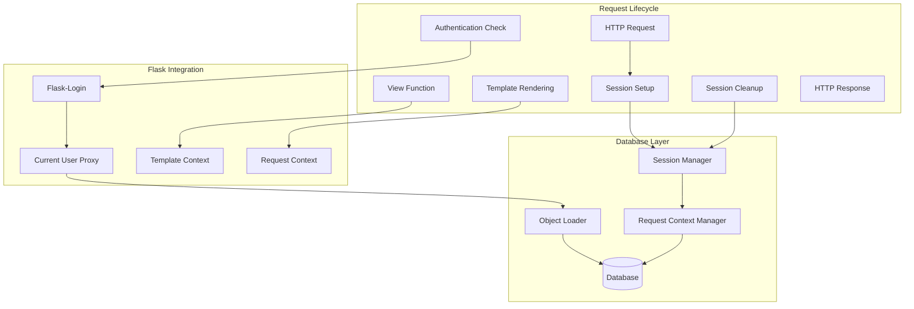

# DetachedInstanceError Fix Design

## Overview

The DetachedInstanceError occurs when SQLAlchemy objects are accessed outside of their database session context. This design provides a comprehensive solution to ensure proper database session management throughout the Flask application lifecycle, with specific focus on the current_user object and platform context that are causing dashboard access failures.

## Architecture

### Problem Analysis

The DetachedInstanceError typically occurs in these scenarios:
1. Database objects are loaded in one session and accessed in another
2. Objects are accessed after their originating session has been closed
3. Lazy-loaded relationships are accessed outside the session context
4. Flask-Login's current_user proxy accesses detached User objects

### Solution Architecture



## Components and Interfaces

### 1. Request-Scoped Session Manager

```python
from flask import g
from contextlib import contextmanager
from sqlalchemy.orm import sessionmaker, scoped_session

class RequestScopedSessionManager:
    """Manages database sessions scoped to Flask requests"""
    
    def __init__(self, db_manager):
        self.db_manager = db_manager
        self.session_factory = scoped_session(
            sessionmaker(bind=db_manager.engine)
        )
    
    def get_request_session(self):
        """Get or create session for current request"""
        if not hasattr(g, 'db_session'):
            g.db_session = self.session_factory()
        return g.db_session
    
    def close_request_session(self):
        """Close session at end of request"""
        if hasattr(g, 'db_session'):
            g.db_session.close()
            delattr(g, 'db_session')
        self.session_factory.remove()
    
    @contextmanager
    def session_scope(self):
        """Context manager for database operations"""
        session = self.get_request_session()
        try:
            yield session
            session.commit()
        except Exception:
            session.rollback()
            raise
```

### 2. Enhanced User Loader for Flask-Login

```python
from flask_login import UserMixin
from sqlalchemy.orm import joinedload

class SessionAwareUser(UserMixin):
    """User class that maintains session attachment"""
    
    def __init__(self, user_obj, session):
        self._user_obj = user_obj
        self._session = session
        self._cached_platforms = None
    
    def __getattr__(self, name):
        """Proxy attribute access to the underlying user object"""
        if hasattr(self._user_obj, name):
            return getattr(self._user_obj, name)
        raise AttributeError(f"'{type(self).__name__}' object has no attribute '{name}'")
    
    @property
    def platforms(self):
        """Get platforms with proper session attachment"""
        if self._cached_platforms is None:
            # Ensure we're in the same session
            if self._user_obj not in self._session:
                # Reattach the user object to current session
                self._user_obj = self._session.merge(self._user_obj)
            
            # Load platforms with explicit join to avoid lazy loading issues
            self._cached_platforms = (
                self._session.query(PlatformConnection)
                .filter_by(user_id=self._user_obj.id, is_active=True)
                .options(joinedload(PlatformConnection.user))
                .all()
            )
        return self._cached_platforms
    
    def get_active_platform(self):
        """Get the active platform with session attachment"""
        platforms = self.platforms
        default_platform = next((p for p in platforms if p.is_default), None)
        return default_platform or (platforms[0] if platforms else None)

@login_manager.user_loader
def load_user(user_id):
    """Load user with proper session attachment"""
    session_manager = current_app.session_manager
    
    with session_manager.session_scope() as session:
        user = session.query(User).options(
            joinedload(User.platform_connections)
        ).get(int(user_id))
        
        if user and user.is_active:
            return SessionAwareUser(user, session_manager.get_request_session())
        return None
```

### 3. Database Context Middleware

```python
class DatabaseContextMiddleware:
    """Middleware to ensure proper database session lifecycle"""
    
    def __init__(self, app, session_manager):
        self.app = app
        self.session_manager = session_manager
        self.setup_handlers()
    
    def setup_handlers(self):
        """Setup Flask request handlers"""
        
        @self.app.before_request
        def before_request():
            """Initialize database session for request"""
            # Ensure we have a request-scoped session
            self.session_manager.get_request_session()
        
        @self.app.teardown_request
        def teardown_request(exception=None):
            """Clean up database session after request"""
            if exception:
                # Rollback on exception
                if hasattr(g, 'db_session'):
                    g.db_session.rollback()
            self.session_manager.close_request_session()
        
        @self.app.context_processor
        def inject_session_aware_objects():
            """Inject session-aware objects into template context"""
            context = {}
            
            if current_user.is_authenticated:
                # Ensure current_user has proper session attachment
                session = self.session_manager.get_request_session()
                if hasattr(current_user, '_user_obj'):
                    # Reattach user object if needed
                    if current_user._user_obj not in session:
                        current_user._user_obj = session.merge(current_user._user_obj)
                        current_user._session = session
                        current_user._cached_platforms = None  # Clear cache
                
                context['user_platforms'] = current_user.platforms
                context['active_platform'] = current_user.get_active_platform()
            
            return context
```

### 4. Session-Aware View Decorators

```python
from functools import wraps
from flask import current_app

def with_db_session(f):
    """Decorator to ensure view functions have proper database session"""
    @wraps(f)
    def decorated_function(*args, **kwargs):
        session_manager = current_app.session_manager
        
        # Ensure we have a request session
        session = session_manager.get_request_session()
        
        # If current_user is authenticated, ensure proper attachment
        if current_user.is_authenticated and hasattr(current_user, '_user_obj'):
            if current_user._user_obj not in session:
                # Reattach user to current session
                current_user._user_obj = session.merge(current_user._user_obj)
                current_user._session = session
                current_user._cached_platforms = None
        
        return f(*args, **kwargs)
    return decorated_function

def require_platform_context(f):
    """Decorator to ensure platform context is available"""
    @wraps(f)
    @with_db_session
    def decorated_function(*args, **kwargs):
        if not current_user.is_authenticated:
            return redirect(url_for('login'))
        
        active_platform = current_user.get_active_platform()
        if not active_platform:
            flash('No active platform found. Please configure a platform.', 'warning')
            return redirect(url_for('platform_setup'))
        
        return f(*args, **kwargs)
    return decorated_function
```

## Data Models

### Enhanced User Model

```python
from sqlalchemy.orm import relationship, backref
from sqlalchemy.ext.hybrid import hybrid_property

class User(db.Model):
    __tablename__ = 'users'
    
    id = db.Column(db.Integer, primary_key=True)
    username = db.Column(db.String(80), unique=True, nullable=False)
    email = db.Column(db.String(120), unique=True, nullable=False)
    password_hash = db.Column(db.String(255), nullable=False)
    role = db.Column(db.Enum(UserRole), nullable=False, default=UserRole.USER)
    is_active = db.Column(db.Boolean, default=True)
    created_at = db.Column(db.DateTime, default=datetime.utcnow)
    
    # Relationships with explicit loading strategies
    platform_connections = relationship(
        'PlatformConnection',
        backref=backref('user', lazy='select'),
        lazy='select',  # Avoid lazy loading issues
        cascade='all, delete-orphan'
    )
    
    sessions = relationship(
        'UserSession',
        backref=backref('user', lazy='select'),
        lazy='select',
        cascade='all, delete-orphan'
    )
    
    @hybrid_property
    def active_platforms(self):
        """Get active platforms for this user"""
        return [p for p in self.platform_connections if p.is_active]
    
    @hybrid_property
    def default_platform(self):
        """Get the default platform for this user"""
        active_platforms = self.active_platforms
        default = next((p for p in active_platforms if p.is_default), None)
        return default or (active_platforms[0] if active_platforms else None)
```

### Session-Aware Platform Connection Model

```python
class PlatformConnection(db.Model):
    __tablename__ = 'platform_connections'
    
    id = db.Column(db.Integer, primary_key=True)
    user_id = db.Column(db.Integer, db.ForeignKey('users.id'), nullable=False)
    name = db.Column(db.String(100), nullable=False)
    platform_type = db.Column(db.String(50), nullable=False)
    instance_url = db.Column(db.String(255), nullable=False)
    username = db.Column(db.String(100), nullable=False)
    _access_token = db.Column('access_token', db.Text)
    is_active = db.Column(db.Boolean, default=True)
    is_default = db.Column(db.Boolean, default=False)
    created_at = db.Column(db.DateTime, default=datetime.utcnow)
    updated_at = db.Column(db.DateTime, default=datetime.utcnow, onupdate=datetime.utcnow)
    
    def to_dict(self):
        """Convert to dictionary for JSON serialization"""
        return {
            'id': self.id,
            'name': self.name,
            'platform_type': self.platform_type,
            'instance_url': self.instance_url,
            'username': self.username,
            'is_active': self.is_active,
            'is_default': self.is_default
        }
```

## Error Handling

### DetachedInstanceError Recovery

```python
from sqlalchemy.exc import InvalidRequestError
from sqlalchemy.orm.exc import DetachedInstanceError

class DetachedInstanceHandler:
    """Handler for DetachedInstanceError recovery"""
    
    def __init__(self, session_manager):
        self.session_manager = session_manager
    
    def handle_detached_instance(self, obj, session=None):
        """Attempt to recover from DetachedInstanceError"""
        if session is None:
            session = self.session_manager.get_request_session()
        
        try:
            # Try to merge the object back into the session
            return session.merge(obj)
        except InvalidRequestError:
            # If merge fails, try to reload from database
            if hasattr(obj, 'id') and obj.id:
                model_class = type(obj)
                return session.query(model_class).get(obj.id)
            raise
    
    def safe_access(self, obj, attr_name, default=None):
        """Safely access object attributes with detachment recovery"""
        try:
            return getattr(obj, attr_name)
        except DetachedInstanceError:
            # Attempt recovery
            session = self.session_manager.get_request_session()
            recovered_obj = self.handle_detached_instance(obj, session)
            return getattr(recovered_obj, attr_name, default)
        except AttributeError:
            return default

# Global error handler
@app.errorhandler(DetachedInstanceError)
def handle_detached_instance_error(error):
    """Global handler for DetachedInstanceError"""
    app.logger.error(f"DetachedInstanceError occurred: {error}")
    
    # Try to recover by redirecting to a safe page
    if request.endpoint == 'dashboard':
        flash('Session expired. Please log in again.', 'warning')
        return redirect(url_for('login'))
    
    # For other endpoints, return a generic error
    flash('A database error occurred. Please try again.', 'error')
    return redirect(url_for('index'))
```

### Template Context Error Handling

```python
@app.context_processor
def safe_template_context():
    """Provide safe template context with error handling"""
    context = {}
    
    if current_user.is_authenticated:
        try:
            # Safely access user properties
            handler = DetachedInstanceHandler(current_app.session_manager)
            
            context['current_user_safe'] = {
                'id': handler.safe_access(current_user, 'id'),
                'username': handler.safe_access(current_user, 'username'),
                'email': handler.safe_access(current_user, 'email'),
                'role': handler.safe_access(current_user, 'role')
            }
            
            # Safely get platforms
            try:
                platforms = current_user.platforms
                context['user_platforms'] = [p.to_dict() for p in platforms]
                context['active_platform'] = current_user.get_active_platform()
            except DetachedInstanceError:
                # Reload platforms from database
                session = current_app.session_manager.get_request_session()
                platforms = session.query(PlatformConnection).filter_by(
                    user_id=current_user.id, is_active=True
                ).all()
                context['user_platforms'] = [p.to_dict() for p in platforms]
                context['active_platform'] = next(
                    (p for p in platforms if p.is_default), 
                    platforms[0] if platforms else None
                )
        
        except Exception as e:
            app.logger.error(f"Error in template context: {e}")
            context['template_error'] = True
    
    return context
```

## Testing Strategy

### Unit Tests for Session Management

```python
import unittest
from unittest.mock import Mock, patch
from sqlalchemy.orm.exc import DetachedInstanceError

class TestDetachedInstanceFix(unittest.TestCase):
    
    def setUp(self):
        self.app = create_test_app()
        self.session_manager = Mock()
        self.app.session_manager = self.session_manager
    
    def test_request_scoped_session_creation(self):
        """Test that request-scoped sessions are created properly"""
        with self.app.test_request_context():
            session = self.session_manager.get_request_session()
            self.assertIsNotNone(session)
    
    def test_user_loader_with_session_attachment(self):
        """Test that user loader creates properly attached user objects"""
        with self.app.test_request_context():
            user = load_user('1')
            self.assertIsInstance(user, SessionAwareUser)
            self.assertIsNotNone(user._session)
    
    def test_detached_instance_recovery(self):
        """Test recovery from DetachedInstanceError"""
        handler = DetachedInstanceHandler(self.session_manager)
        
        # Mock a detached object
        detached_obj = Mock()
        detached_obj.id = 1
        
        # Mock session.merge to return recovered object
        recovered_obj = Mock()
        self.session_manager.get_request_session.return_value.merge.return_value = recovered_obj
        
        result = handler.handle_detached_instance(detached_obj)
        self.assertEqual(result, recovered_obj)
    
    def test_safe_attribute_access(self):
        """Test safe attribute access with detachment recovery"""
        handler = DetachedInstanceHandler(self.session_manager)
        
        # Mock object that raises DetachedInstanceError
        obj = Mock()
        obj.name = Mock(side_effect=DetachedInstanceError())
        obj.id = 1
        
        # Mock recovery
        recovered_obj = Mock()
        recovered_obj.name = "recovered_name"
        self.session_manager.get_request_session.return_value.merge.return_value = recovered_obj
        
        result = handler.safe_access(obj, 'name')
        self.assertEqual(result, "recovered_name")
```

### Integration Tests

```python
class TestDashboardAccess(unittest.TestCase):
    
    def setUp(self):
        self.app = create_test_app()
        self.client = self.app.test_client()
        self.create_test_user()
    
    def test_dashboard_access_after_login(self):
        """Test that dashboard is accessible after login without DetachedInstanceError"""
        # Login
        response = self.client.post('/login', data={
            'username': 'testuser',
            'password': 'testpass'
        })
        
        # Access dashboard
        response = self.client.get('/dashboard')
        self.assertEqual(response.status_code, 200)
        self.assertNotIn('DetachedInstanceError', response.get_data(as_text=True))
    
    def test_platform_switching_without_detachment(self):
        """Test platform switching doesn't cause DetachedInstanceError"""
        # Login and switch platform
        self.client.post('/login', data={'username': 'testuser', 'password': 'testpass'})
        
        response = self.client.post('/api/switch_platform', json={
            'platform_id': 1
        })
        
        self.assertEqual(response.status_code, 200)
        
        # Verify dashboard still accessible
        response = self.client.get('/dashboard')
        self.assertEqual(response.status_code, 200)
```

This design provides a comprehensive solution to the DetachedInstanceError by implementing proper request-scoped session management, session-aware user objects, and robust error handling and recovery mechanisms.