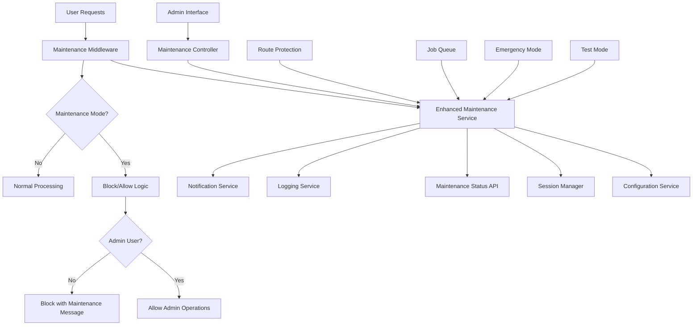

# Design Document

## Overview

This design implements a comprehensive enhanced maintenance mode system that provides granular operation blocking, automatic user session management, and robust maintenance workflows. The solution builds upon the existing maintenance mode service and integrates deeply with the application's middleware, routing, and session management systems to ensure complete protection during maintenance operations.

## Architecture

### High-Level Architecture



### Component Interaction Flow

1. **Maintenance Activation**: Admin Interface → Controller → Enhanced Service → Configuration
2. **Request Processing**: User Request → Middleware → Maintenance Check → Block/Allow Decision
3. **Session Management**: Maintenance Service → Session Manager → User Session Invalidation
4. **Status Monitoring**: Status API → Maintenance Service → Real-time Status Response
5. **Emergency Mode**: Emergency Trigger → Immediate Blocking → Session Cleanup

## Components and Interfaces

### 1. Enhanced Maintenance Mode Service (`EnhancedMaintenanceModeService`)

**Purpose**: Central service managing all maintenance mode functionality with granular operation control.

**Interface**:
```python
class EnhancedMaintenanceModeService:
    def enable_maintenance(self, reason: str, duration: Optional[int] = None, 
                          mode: MaintenanceMode = MaintenanceMode.NORMAL) -> bool
    def disable_maintenance(self) -> bool
    def enable_emergency_maintenance(self, reason: str) -> bool
    def is_operation_blocked(self, operation: str, user: Optional[User] = None) -> bool
    def get_maintenance_status(self) -> MaintenanceStatus
    def get_blocked_operations(self) -> List[str]
    def invalidate_non_admin_sessions(self) -> int
    def allow_operation_completion(self, operation_id: str) -> bool
    def get_maintenance_message(self, operation: str) -> str
```

**Key Features**:
- Granular operation blocking based on operation type
- Automatic non-admin session invalidation
- Emergency mode with immediate blocking
- Test mode for validation without impact
- Real-time status updates and notifications

### 2. Maintenance Mode Middleware (`MaintenanceModeMiddleware`)

**Purpose**: Flask middleware that automatically applies maintenance mode checks to all requests.

**Interface**:
```python
class MaintenanceModeMiddleware:
    def __init__(self, app: Flask, maintenance_service: EnhancedMaintenanceModeService)
    def before_request(self) -> Optional[Response]
    def is_admin_user(self, user: Optional[User]) -> bool
    def is_allowed_operation(self, endpoint: str, user: Optional[User]) -> bool
    def create_maintenance_response(self, operation: str) -> Response
    def log_blocked_attempt(self, endpoint: str, user: Optional[User]) -> None
```

**Implementation**:
- Automatic request interception
- Operation classification and blocking
- Admin user bypass logic
- Consistent maintenance response formatting

### 3. Operation Classifier (`MaintenanceOperationClassifier`)

**Purpose**: Classifies operations into categories for granular blocking control.

**Interface**:
```python
class MaintenanceOperationClassifier:
    def classify_operation(self, endpoint: str, method: str) -> OperationType
    def is_blocked_operation(self, operation_type: OperationType, 
                           maintenance_mode: MaintenanceMode) -> bool
    def get_operation_description(self, operation_type: OperationType) -> str
    def add_custom_classification(self, pattern: str, operation_type: OperationType) -> None
```

**Operation Types**:
- `CAPTION_GENERATION`: AI caption generation operations
- `JOB_CREATION`: Background job creation
- `PLATFORM_OPERATIONS`: Platform switching and connection testing
- `BATCH_OPERATIONS`: Bulk processing tasks
- `USER_DATA_MODIFICATION`: Profile and settings updates
- `IMAGE_PROCESSING`: Image upload and processing
- `ADMIN_OPERATIONS`: Administrative functions (always allowed)
- `READ_OPERATIONS`: Read-only operations (allowed in normal maintenance)

### 4. Session Management Integration (`MaintenanceSessionManager`)

**Purpose**: Manages user sessions during maintenance mode transitions.

**Interface**:
```python
class MaintenanceSessionManager:
    def __init__(self, session_manager: RedisSessionManager, 
                 maintenance_service: EnhancedMaintenanceModeService)
    def invalidate_non_admin_sessions(self) -> List[str]
    def prevent_non_admin_login(self) -> None
    def allow_non_admin_login(self) -> None
    def get_active_non_admin_sessions(self) -> List[SessionInfo]
    def notify_users_of_maintenance(self, message: str) -> int
    def cleanup_expired_maintenance_sessions(self) -> int
```

**Features**:
- Selective session invalidation based on user role
- Login prevention for non-admin users
- User notification system
- Session cleanup and monitoring

### 5. Maintenance Status API (`MaintenanceStatusAPI`)

**Purpose**: Provides real-time maintenance status information for frontend applications.

**Interface**:
```python
class MaintenanceStatusAPI:
    def get_status(self) -> MaintenanceStatusResponse
    def get_blocked_operations(self) -> List[BlockedOperation]
    def get_maintenance_message(self, operation: str) -> str
    def subscribe_to_status_changes(self, callback: Callable) -> str
    def unsubscribe(self, subscription_id: str) -> bool
```

**Response Format**:
```python
@dataclass
class MaintenanceStatusResponse:
    is_active: bool
    mode: MaintenanceMode
    reason: Optional[str]
    estimated_duration: Optional[int]
    started_at: Optional[datetime]
    estimated_completion: Optional[datetime]
    blocked_operations: List[str]
    active_jobs_count: int
    message: str
```

### 6. Emergency Maintenance Handler (`EmergencyMaintenanceHandler`)

**Purpose**: Handles emergency maintenance scenarios with immediate system protection.

**Interface**:
```python
class EmergencyMaintenanceHandler:
    def activate_emergency_mode(self, reason: str, triggered_by: str) -> bool
    def terminate_running_jobs(self, grace_period: int = 30) -> List[str]
    def force_session_cleanup(self) -> int
    def enable_critical_admin_only(self) -> None
    def create_emergency_report(self) -> EmergencyReport
    def deactivate_emergency_mode(self) -> bool
```

**Emergency Features**:
- Immediate operation blocking
- Safe job termination with grace period
- Force session cleanup
- Critical admin-only access
- Emergency activity reporting

## Data Models

### Maintenance Status Model
```python
@dataclass
class MaintenanceStatus:
    is_active: bool
    mode: MaintenanceMode
    reason: Optional[str]
    estimated_duration: Optional[int]
    started_at: Optional[datetime]
    estimated_completion: Optional[datetime]
    enabled_by: Optional[str]
    blocked_operations: List[OperationType]
    active_jobs_count: int
    invalidated_sessions: int
    test_mode: bool
```

### Maintenance Mode Enum
```python
class MaintenanceMode(Enum):
    NORMAL = "normal"          # Block new operations, allow completion
    EMERGENCY = "emergency"    # Block all non-admin operations immediately
    TEST = "test"             # Simulate maintenance without actual blocking
```

### Operation Type Enum
```python
class OperationType(Enum):
    CAPTION_GENERATION = "caption_generation"
    JOB_CREATION = "job_creation"
    PLATFORM_OPERATIONS = "platform_operations"
    BATCH_OPERATIONS = "batch_operations"
    USER_DATA_MODIFICATION = "user_data_modification"
    IMAGE_PROCESSING = "image_processing"
    ADMIN_OPERATIONS = "admin_operations"
    READ_OPERATIONS = "read_operations"
    AUTHENTICATION = "authentication"
```

### Blocked Operation Model
```python
@dataclass
class BlockedOperation:
    operation_type: OperationType
    endpoint_pattern: str
    description: str
    blocked_since: datetime
    attempt_count: int
    last_attempt: Optional[datetime]
    user_message: str
```

## Error Handling

### Error Hierarchy
```python
class MaintenanceModeError(Exception): pass
class MaintenanceActivationError(MaintenanceModeError): pass
class SessionInvalidationError(MaintenanceModeError): pass
class EmergencyModeError(MaintenanceModeError): pass
class OperationBlockedError(MaintenanceModeError): pass
```

### Error Handling Strategy

1. **Maintenance Activation Failures**: Log error, maintain current state, notify administrators
2. **Session Invalidation Errors**: Continue with partial invalidation, log affected sessions
3. **Emergency Mode Failures**: Escalate to critical alerts, attempt safe fallback
4. **Operation Blocking Errors**: Allow operation with warning, log for review
5. **Status API Errors**: Return cached status, log error for investigation

### Graceful Degradation

1. **Service Unavailable**: Use cached maintenance status, default to allowing operations
2. **Session Manager Down**: Skip session invalidation, log warning
3. **Configuration Service Down**: Use last known maintenance state
4. **Database Errors**: Continue with in-memory state, sync when available

## Testing Strategy

### Unit Tests

1. **Enhanced Maintenance Service Tests**
   - Operation blocking logic
   - Session invalidation
   - Emergency mode activation
   - Status reporting

2. **Middleware Tests**
   - Request interception
   - Admin user bypass
   - Response formatting
   - Logging functionality

3. **Operation Classifier Tests**
   - Endpoint classification
   - Custom rule addition
   - Operation type mapping

### Integration Tests

1. **End-to-End Maintenance Flow**
   - Admin activation → Operation blocking → User notification
   - Session invalidation → Login prevention → Status updates
   - Emergency mode → Immediate blocking → Recovery

2. **Cross-Component Integration**
   - Middleware + Service integration
   - Session manager integration
   - Configuration service integration

3. **Real-World Scenarios**
   - Maintenance during active user sessions
   - Emergency activation during high load
   - Recovery after maintenance completion

### Load Tests

1. **High-Traffic Maintenance Activation**
   - Maintenance activation under load
   - Session invalidation performance
   - Status API response times

2. **Blocked Operation Handling**
   - Multiple simultaneous blocked requests
   - Admin bypass performance
   - Logging system performance

## Security Considerations

### Access Control

1. **Admin-Only Activation**: Only admin users can enable/disable maintenance mode
2. **Emergency Mode Protection**: Additional authentication for emergency mode
3. **Session Security**: Secure session invalidation without data exposure
4. **Audit Logging**: Complete audit trail of maintenance activities

### Data Protection

1. **Session Data**: Secure cleanup of invalidated session data
2. **User Privacy**: No exposure of user data in maintenance logs
3. **Configuration Security**: Encrypted storage of maintenance configuration
4. **Emergency Procedures**: Secure emergency access protocols

### Attack Prevention

1. **DoS Protection**: Rate limiting on maintenance status API
2. **Privilege Escalation**: Strict admin role verification
3. **Session Hijacking**: Secure session invalidation process
4. **Information Disclosure**: Minimal information in maintenance messages

## Performance Considerations

### Response Time Optimization

1. **Middleware Performance**: Sub-millisecond maintenance checks
2. **Status API**: <100ms response time for status queries
3. **Session Invalidation**: Batch processing for multiple sessions
4. **Operation Classification**: Cached classification rules

### Memory Management

1. **Status Caching**: In-memory caching of maintenance status
2. **Session Tracking**: Efficient tracking of invalidated sessions
3. **Log Management**: Rotating logs to prevent memory bloat
4. **Event Cleanup**: Automatic cleanup of old maintenance events

### Scalability

1. **Distributed Systems**: Support for multiple application instances
2. **Database Load**: Minimal database queries for status checks
3. **Event Broadcasting**: Efficient notification of status changes
4. **Resource Usage**: Low overhead during normal operations

## Deployment Strategy

### Phase 1: Core Infrastructure
1. Implement `EnhancedMaintenanceModeService`
2. Create operation classification system
3. Build maintenance middleware
4. Add basic session management integration

### Phase 2: Advanced Features
1. Implement emergency maintenance mode
2. Add comprehensive logging and monitoring
3. Create maintenance status API
4. Build user notification system

### Phase 3: Testing and Validation
1. Implement test mode functionality
2. Add comprehensive test suite
3. Create performance monitoring
4. Build admin interface enhancements

### Phase 4: Production Readiness
1. Security hardening and audit
2. Performance optimization
3. Documentation and training
4. Monitoring and alerting setup

## Monitoring and Observability

### Metrics Collection

1. **Maintenance Events**
   - Activation/deactivation frequency
   - Duration of maintenance periods
   - Emergency mode usage

2. **Operation Blocking**
   - Blocked operation counts by type
   - User impact metrics
   - Admin bypass frequency

3. **Performance Metrics**
   - Middleware response times
   - Session invalidation performance
   - Status API response times

### Alerting

1. **Maintenance Status Changes**
   - Maintenance mode activation/deactivation
   - Emergency mode activation
   - Failed maintenance operations

2. **System Health During Maintenance**
   - High blocked operation rates
   - Session invalidation failures
   - Status API performance issues

### Dashboards

1. **Maintenance Overview Dashboard**
   - Current maintenance status
   - Active maintenance operations
   - User impact metrics

2. **Historical Analysis Dashboard**
   - Maintenance frequency and duration
   - Operation blocking patterns
   - User behavior during maintenance

This design provides a comprehensive, secure, and performant solution for enhanced maintenance mode functionality that meets all the specified requirements while maintaining system reliability and user experience.