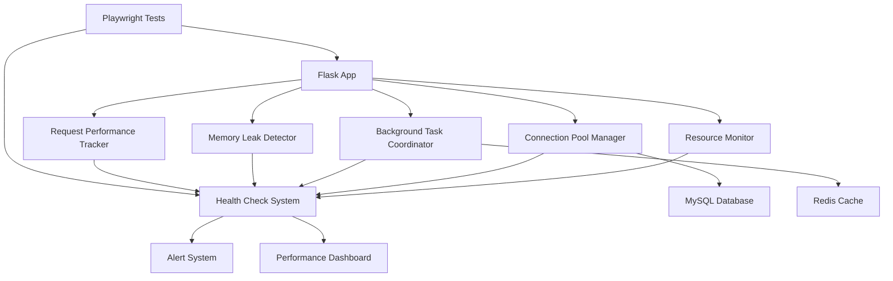

# Flask App Responsiveness Optimization - Design

## Overview

This design addresses the Flask application responsiveness issues through a comprehensive approach targeting resource management, connection optimization, background task management, memory leak prevention, and performance monitoring. The solution implements monitoring systems, optimizes existing components, and adds safeguards to prevent unresponsiveness.

## Architecture

### Enhanced Existing Components

1. **SystemOptimizer Enhancement** - Extend existing SystemOptimizer class with responsiveness monitoring
2. **DatabaseManager Enhancement** - Add connection pool monitoring to existing DatabaseManager
3. **BackgroundCleanupManager Integration** - Enhance existing background cleanup with task coordination
4. **Session Monitoring Extension** - Extend existing session monitoring with memory leak detection
5. **Performance Dashboard Enhancement** - Add responsiveness metrics to existing admin performance dashboard
6. **Health Check Integration** - Enhance existing health check systems with responsiveness monitoring

### Component Interactions



## Components and Interfaces

### 1. SystemOptimizer Enhancement

**Purpose**: Extend existing SystemOptimizer class with responsiveness monitoring and automated cleanup triggers.

**Enhanced Methods**:
- `get_performance_metrics()` - Enhanced with responsiveness thresholds and alerts
- `get_recommendations()` - Extended with automated cleanup triggers
- `get_health_status()` - Enhanced with connection pool and background task status
- `check_responsiveness()` - New method for comprehensive responsiveness analysis
- `trigger_cleanup_if_needed()` - New method for automated resource cleanup

**Configuration Integration**:
```python
# Add to existing config.py
@dataclass
class ResponsivenessConfig:
    memory_warning_threshold: float = 0.8  # 80%
    memory_critical_threshold: float = 0.9  # 90%
    cpu_warning_threshold: float = 0.8     # 80%
    cpu_critical_threshold: float = 0.9    # 90%
    monitoring_interval: int = 30          # seconds
    cleanup_enabled: bool = True
```

### 2. DatabaseManager Enhancement

**Purpose**: Extend existing DatabaseManager with connection pool monitoring and leak detection.

**Enhanced Methods**:
- `get_mysql_performance_stats()` - Enhanced with responsiveness metrics
- `test_mysql_connection()` - Extended with connection pool health checks
- `get_session()` - Enhanced with connection lifecycle tracking
- `close_session()` - Enhanced with leak detection
- `monitor_connection_health()` - New method for continuous monitoring

**Enhanced Features**:
- Integration with existing connection pool monitoring
- Extension of current MySQL performance statistics
- Enhancement of existing session management
- Integration with current error handling system

### 3. BackgroundCleanupManager Integration

**Purpose**: Enhance existing BackgroundCleanupManager with task coordination and health monitoring.

**Enhanced Methods**:
- `start_background_cleanup()` - Enhanced with health monitoring
- `stop_background_cleanup()` - Enhanced with graceful shutdown tracking
- `get_cleanup_stats()` - Enhanced with responsiveness metrics
- `monitor_task_health()` - New method for task health monitoring
- `coordinate_cleanup_tasks()` - New method for task coordination

**Integration Points**:
- Extend existing cleanup task management
- Enhance current thread monitoring
- Integrate with existing NotificationSystemMonitor
- Extend current cleanup statistics reporting

### 4. Session Monitoring Extension

**Purpose**: Extend existing session monitoring systems with memory leak detection and cleanup.

**Enhanced Methods**:
- Extend existing `SessionMonitor` with memory pattern analysis
- Enhance existing session cleanup with leak detection
- Extend current session health checking with memory monitoring
- Enhance existing session performance monitoring with memory metrics

**Integration Points**:
- Extend existing session_monitoring.py functionality
- Enhance current session_health_checker.py with memory analysis
- Integrate with existing session_performance_monitor.py
- Extend current session cleanup mechanisms

### 5. Performance Dashboard Enhancement

**Purpose**: Extend existing admin performance dashboard with request performance tracking and responsiveness metrics.

**Enhanced Features**:
- Extend existing performance dashboard with responsiveness metrics
- Enhance current admin monitoring pages with request timing
- Integrate with existing performance_monitoring_dashboard.py
- Extend current SystemOptimizer metrics with request performance

**Integration Points**:
- Enhance existing admin/routes/performance_dashboard.py
- Extend current performance metrics collection
- Integrate with existing admin dashboard templates
- Enhance current monitoring API endpoints

### 6. Health Check Integration

**Purpose**: Enhance existing health check systems with responsiveness monitoring and comprehensive reporting.

**Enhanced Systems**:
- Extend existing HealthChecker class with responsiveness checks
- Enhance current session_health_checker.py with system health
- Integrate with existing admin health monitoring endpoints
- Extend current health check API with responsiveness metrics

**Integration Points**:
- Enhance existing health_check.py functionality
- Extend current admin health monitoring pages
- Integrate with existing alert systems
- Enhance current health status reporting

## Data Models

### Resource Metrics Model
```python
@dataclass
class ResourceMetrics:
    timestamp: datetime
    memory_usage_percent: float
    memory_usage_mb: float
    cpu_usage_percent: float
    disk_usage_percent: float
    connection_pool_utilization: float
    active_threads: int
    request_queue_size: int
```

### Performance Metrics Model
```python
@dataclass
class PerformanceMetrics:
    timestamp: datetime
    avg_response_time: float
    slow_request_count: int
    error_rate: float
    throughput_rps: float
    database_query_time: float
    cache_hit_rate: float
```

### Health Status Model
```python
@dataclass
class HealthStatus:
    overall_status: str  # healthy, warning, critical
    components: Dict[str, str]
    alerts: List[Alert]
    recommendations: List[str]
    last_check: datetime
```

## Error Handling

### Connection Error Recovery
- Implement exponential backoff for database reconnections
- Fallback to alternative connection pools
- Graceful degradation when connections are unavailable

### Memory Error Prevention
- Automatic garbage collection triggers
- Emergency memory cleanup procedures
- Request throttling during high memory usage

### Background Task Error Handling
- Task failure isolation
- Automatic task restart with backoff
- Error reporting and alerting

## Testing Strategy

### Unit Tests
- Resource monitor component testing
- Connection pool manager testing
- Memory leak detector testing
- Performance tracker testing

### Integration Tests
- End-to-end resource monitoring
- Database connection lifecycle testing
- Background task coordination testing
- Health check system validation

### Performance Tests
- Load testing with resource monitoring
- Memory leak detection over time
- Connection pool stress testing
- Request performance under load

### Playwright Tests
- Web application responsiveness testing
- User interface performance validation
- Real-world usage scenario testing
- Automated regression testing

**Test Scenarios**:
1. **Memory Leak Test**: Run application for extended period, monitor memory growth
2. **Connection Pool Test**: Simulate high database load, verify connection management
3. **Background Task Test**: Verify tasks don't block main application
4. **Resource Exhaustion Test**: Simulate resource constraints, verify graceful handling
5. **Recovery Test**: Simulate failures, verify automatic recovery

### Test Implementation Structure
```
tests/performance/
├── test_resource_monitoring.py
├── test_connection_pool_optimization.py
├── test_memory_leak_detection.py
├── test_background_task_management.py
└── test_request_performance.py

tests/playwright/
├── MMdd_HH_mm_test_responsiveness_under_load.js
├── MMdd_HH_mm_test_memory_leak_detection.js
├── MMdd_HH_mm_test_connection_pool_stress.js
└── MMdd_HH_mm_test_recovery_scenarios.js
```

## Implementation Considerations

### Existing Code Integration
- Enhance existing `SystemOptimizer` class in `web_app.py`
- Integrate with current database connection management
- Extend existing monitoring systems
- Preserve current session management functionality

### Configuration Management
- Add performance monitoring configuration to `config.py`
- Environment variable configuration for thresholds
- Runtime configuration updates without restart

### Monitoring Integration
- Extend existing admin performance dashboard with responsiveness metrics
- Add responsiveness monitoring to existing admin health endpoints
- Integrate with current admin monitoring pages (`/admin/monitoring`, `/admin/health`)
- Add new admin responsiveness dashboard page if comprehensive view is needed
- Utilize existing admin templates and styling for consistency

### Admin Interface Integration
- Add responsiveness metrics to existing admin dashboard widgets
- Extend current monitoring templates with resource usage alerts
- Create new admin page `/admin/responsiveness` for detailed analysis if needed
- Integrate with existing admin navigation and security controls
- Reuse existing admin static assets (CSS, JavaScript) for consistency

### Backward Compatibility
- Maintain existing API interfaces
- Preserve current functionality while adding optimizations
- Extend existing admin routes rather than replacing them
- Gradual rollout of new monitoring features through existing admin interface