# Notification System Migration Design

## Overview

This design document outlines the architecture for migrating all user and admin pages from legacy notification systems to the standardized WebSocket CORS framework. The solution leverages the existing `.kiro/specs/websocket-cors-standardization` infrastructure to create a unified, consistent notification experience across the entire application while maintaining security, performance, and reliability standards.

## Architecture

### High-Level Migration Architecture

```mermaid
graph TB
    subgraph "Legacy Systems (To Be Removed)"
        LEGACY_USER[Legacy User Notifications]
        LEGACY_ADMIN[Legacy Admin Notifications]
        LEGACY_FLASH[Flask Flash Messages]
        LEGACY_POLLING[Legacy Polling Systems]
    end
    
    subgraph "Standardized WebSocket Framework"
        WS_CONFIG[WebSocket Config Manager]
        CORS_MGR[CORS Manager]
        WS_FACTORY[WebSocket Factory]
        AUTH_HANDLER[Authentication Handler]
        NAMESPACE_MGR[Namespace Manager]
    end
    
    subgraph "Unified Notification System"
        NOTIF_MGR[Notification Manager]
        MSG_ROUTER[Message Router]
        PERSIST_MGR[Persistence Manager]
        UI_RENDERER[UI Renderer]
    end
    
    subgraph "Migrated User Pages"
        USER_DASH[User Dashboard]
        CAPTION_PAGE[Caption Processing]
        PLATFORM_PAGE[Platform Management]
        PROFILE_PAGE[User Profile]
    end
    
    subgraph "Migrated Admin Pages"
        ADMIN_DASH[Admin Dashboard]
        USER_MGT[User Management]
        SYS_HEALTH[System Health]
        MAINTENANCE[System Maintenance]
    end
    
    subgraph "Testing Framework"
        PLAYWRIGHT[Playwright Tests]
        UNIT_TESTS[Unit Tests]
        INTEGRATION[Integration Tests]
    end
    
    WS_FACTORY --> NOTIF_MGR
    NAMESPACE_MGR --> MSG_ROUTER
    AUTH_HANDLER --> NOTIF_MGR
    
    NOTIF_MGR --> USER_DASH
    NOTIF_MGR --> CAPTION_PAGE
    NOTIF_MGR --> PLATFORM_PAGE
    NOTIF_MGR --> PROFILE_PAGE
    
    NOTIF_MGR --> ADMIN_DASH
    NOTIF_MGR --> USER_MGT
    NOTIF_MGR --> SYS_HEALTH
    NOTIF_MGR --> MAINTENANCE
    
    PLAYWRIGHT --> USER_DASH
    PLAYWRIGHT --> ADMIN_DASH
    
    LEGACY_USER -.->|Remove| NOTIF_MGR
    LEGACY_ADMIN -.->|Remove| NOTIF_MGR
    LEGACY_FLASH -.->|Replace| UI_RENDERER
    LEGACY_POLLING -.->|Replace| MSG_ROUTER
```



### Component Architecture

The migration leverages existing standardized components and adds new unified notification components:

1. **Legacy System Analysis Layer**: Identifies and catalogs legacy notification code
2. **Migration Orchestration Layer**: Manages the migration process and rollback capabilities
3. **Unified Notification Layer**: Provides consistent notification services across all pages
4. **Page Integration Layer**: Integrates notifications into user and admin pages
5. **Testing and Validation Layer**: Ensures migration success and functionality

## Components and Interfaces

### 1. Legacy System Analyzer

**Purpose**: Identifies and catalogs all legacy notification systems for removal

**Interface**:
```python
class LegacySystemAnalyzer:
    def __init__(self, project_root: str)
    def scan_legacy_notifications(self) -> Dict[str, List[str]]
    def identify_dependencies(self) -> Dict[str, List[str]]
    def generate_removal_plan(self) -> List[Dict[str, Any]]
    def validate_safe_removal(self, file_path: str) -> bool
```

**Key Features**:
- Scans codebase for legacy notification patterns
- Identifies Flask flash messages, custom notification systems
- Maps dependencies and import relationships
- Generates safe removal plans with rollback options

### 2. Unified Notification Manager

**Purpose**: Central management for all notification operations across user and admin interfaces

**Interface**:
```python
class UnifiedNotificationManager:
    def __init__(self, websocket_factory: WebSocketFactory, auth_handler: WebSocketAuthHandler)
    def send_user_notification(self, user_id: int, message: NotificationMessage) -> bool
    def send_admin_notification(self, message: AdminNotificationMessage) -> bool
    def broadcast_system_notification(self, message: SystemNotificationMessage) -> bool
    def queue_offline_notification(self, user_id: int, message: NotificationMessage) -> None
    def get_notification_history(self, user_id: int, limit: int = 50) -> List[NotificationMessage]
```

**Key Features**:
- Unified interface for all notification types
- Role-based message routing and authorization
- Offline message queuing and persistence
- Message history and replay capabilities
- Integration with existing WebSocket framework

### 3. Message Router

**Purpose**: Routes notifications to appropriate WebSocket namespaces and rooms

**Interface**:
```python
class NotificationMessageRouter:
    def __init__(self, namespace_manager: NamespaceManager)
    def route_user_message(self, user_id: int, message: NotificationMessage) -> None
    def route_admin_message(self, message: AdminNotificationMessage) -> None
    def route_system_broadcast(self, message: SystemNotificationMessage) -> None
    def validate_routing_permissions(self, user_id: int, message_type: str) -> bool
```

**Key Features**:
- Intelligent message routing based on user roles and permissions
- WebSocket namespace and room management
- Message delivery confirmation and retry logic
- Security validation for sensitive notifications

### 4. Notification Persistence Manager

**Purpose**: Manages notification storage, queuing, and replay for offline users

**Interface**:
```python
class NotificationPersistenceManager:
    def __init__(self, db_manager: DatabaseManager)
    def store_notification(self, notification: NotificationMessage) -> str
    def queue_for_offline_user(self, user_id: int, notification: NotificationMessage) -> None
    def get_pending_notifications(self, user_id: int) -> List[NotificationMessage]
    def mark_as_delivered(self, notification_id: str) -> bool
    def cleanup_old_notifications(self, retention_days: int = 30) -> int
```

**Key Features**:
- Database storage for notification persistence
- Offline user message queuing
- Delivery confirmation tracking
- Automatic cleanup of old notifications
- Message replay for reconnecting users

### 5. UI Notification Renderer

**Purpose**: Provides consistent notification UI components across all pages

**Interface**:
```javascript
class NotificationUIRenderer {
    constructor(containerId, options = {})
    renderNotification(notification)
    renderSystemAlert(alert)
    renderProgressUpdate(progress)
    clearNotifications(type = null)
    setNotificationLimit(limit)
    enableAutoHide(duration)
}
```

**Key Features**:
- Consistent notification styling and behavior
- Support for different notification types (success, warning, error, info)
- Progress update rendering for long-running operations
- Auto-hide and manual dismiss functionality
- Notification stacking and queue management

### 6. Page Integration Manager

**Purpose**: Integrates unified notifications into existing user and admin pages

**Interface**:
```javascript
class PageNotificationIntegrator {
    constructor(pageType, userRole)
    initializeNotifications()
    setupWebSocketConnection()
    registerEventHandlers()
    handleConnectionError(error)
    cleanup()
}
```

**Key Features**:
- Page-specific notification initialization
- WebSocket connection management per page
- Event handler registration for page-specific notifications
- Error handling and recovery integration
- Proper cleanup on page unload

## Data Models

### Notification Message Schema

```python
@dataclass
class NotificationMessage:
    id: str
    type: NotificationType  # SUCCESS, WARNING, ERROR, INFO, PROGRESS
    title: str
    message: str
    user_id: Optional[int]
    priority: NotificationPriority  # LOW, NORMAL, HIGH, CRITICAL
    category: str  # 'system', 'caption', 'platform', 'maintenance'
    data: Optional[Dict[str, Any]]
    timestamp: datetime
    expires_at: Optional[datetime]
    requires_action: bool
    action_url: Optional[str]
    action_text: Optional[str]
    delivered: bool
    read: bool
```

### Admin Notification Schema

```python
@dataclass
class AdminNotificationMessage(NotificationMessage):
    admin_only: bool = True
    system_health_data: Optional[Dict[str, Any]] = None
    user_action_data: Optional[Dict[str, Any]] = None
    security_event_data: Optional[Dict[str, Any]] = None
    requires_admin_action: bool = False
```

### System Notification Schema

```python
@dataclass
class SystemNotificationMessage(NotificationMessage):
    broadcast_to_all: bool = True
    maintenance_info: Optional[Dict[str, Any]] = None
    system_status: Optional[str] = None
    estimated_duration: Optional[int] = None  # minutes
    affects_functionality: List[str] = field(default_factory=list)
```

### Page Integration Configuration

```javascript
const PageNotificationConfig = {
    userDashboard: {
        enabledTypes: ['system', 'caption', 'platform', 'maintenance'],
        autoHide: true,
        maxNotifications: 5,
        position: 'top-right'
    },
    adminDashboard: {
        enabledTypes: ['system', 'admin', 'security', 'maintenance'],
        autoHide: false,
        maxNotifications: 10,
        position: 'top-center'
    },
    captionProcessing: {
        enabledTypes: ['caption', 'system', 'maintenance'],
        showProgress: true,
        autoHide: true,
        maxNotifications: 3,
        position: 'bottom-center'
    }
};
```

## Migration Strategy

### Phase 1: Legacy System Analysis and Cataloging

1. **Codebase Scanning**
   - Scan all Python files for Flask flash message usage
   - Identify custom notification systems and AJAX polling
   - Catalog JavaScript notification libraries and custom implementations
   - Map template files using legacy notification displays

2. **Dependency Analysis**
   - Identify all imports and dependencies related to legacy notifications
   - Map relationships between notification systems and page components
   - Document current notification flows and user interactions
   - Assess impact of removing each legacy component

3. **Migration Planning**
   - Create detailed migration plan for each page and component
   - Identify equivalent functionality in standardized framework
   - Plan rollback procedures for each migration step
   - Document testing requirements for each migrated component
   - Remove rollback procedures after succesful migration

### Phase 2: Unified Notification System Implementation

1. **Core System Development**
   - Implement UnifiedNotificationManager using existing WebSocket framework
   - Create NotificationMessageRouter with namespace integration
   - Develop NotificationPersistenceManager with database storage
   - Build NotificationUIRenderer with consistent styling

2. **Integration Components**
   - Create PageNotificationIntegrator for seamless page integration
   - Develop migration utilities for converting legacy notifications
   - Implement fallback mechanisms for notification delivery failures
   - Add comprehensive error handling and recovery

### Phase 3: Page-by-Page Migration

1. **User Pages Migration**
   - Migrate user dashboard notification display
   - Update caption processing progress notifications
   - Convert platform management status messages
   - Migrate user profile and settings notifications

2. **Admin Pages Migration**
   - Migrate admin dashboard system health notifications
   - Update user management operation notifications
   - Convert system maintenance progress displays
   - Migrate security and audit notifications

### Phase 4: Legacy System Removal

1. **Safe Removal Process**
   - Remove legacy notification code in dependency order
   - Clean up unused imports and dependencies
   - Update templates to remove legacy notification displays
   - Verify no orphaned code remains

2. **Validation and Testing**
   - Comprehensive testing of all migrated pages
   - Validation of notification delivery and display
   - Performance testing of unified notification system
   - Security testing of notification authorization

## Error Handling and Recovery

### Migration Error Handling

1. **Migration Failure Recovery**
   ```python
   class MigrationErrorHandler:
       def handle_migration_failure(self, page: str, error: Exception) -> bool
       def rollback_page_migration(self, page: str) -> bool
       def validate_page_functionality(self, page: str) -> bool
       def generate_migration_report(self) -> Dict[str, Any]
   ```

2. **Notification Delivery Errors**
   - WebSocket connection failures handled by existing CORS framework
   - Message delivery retry with exponential backoff
   - Fallback to database storage for offline users
   - User notification of delivery issues when appropriate

3. **UI Rendering Errors**
   - Graceful degradation when notification UI fails
   - Fallback to browser alerts for critical notifications
   - Error logging and reporting for debugging
   - Automatic recovery attempts with connection restoration

### Performance Considerations

1. **Connection Management**
   - Reuse existing WebSocket connections across pages
   - Efficient message batching for high-volume notifications
   - Connection pooling and resource optimization
   - Graceful degradation under high load

2. **Message Optimization**
   - Message compression for large notifications
   - Selective message routing to reduce bandwidth
   - Notification deduplication and filtering
   - Efficient database queries for message persistence

3. **UI Performance**
   - Virtual scrolling for notification history
   - Lazy loading of notification details
   - Efficient DOM updates for real-time notifications
   - Memory management for long-running pages

## Security Considerations

### Authentication and Authorization

1. **WebSocket Security**
   - Leverage existing WebSocket authentication from CORS framework
   - Role-based notification access control
   - Session validation for notification subscriptions
   - Security event logging for notification access

2. **Message Security**
   - Input validation and sanitization for notification content
   - XSS prevention in notification rendering
   - CSRF protection for notification actions
   - Encryption for sensitive notification data

3. **Admin Notification Security**
   - Strict admin role verification for sensitive notifications
   - Audit logging for admin notification access
   - Rate limiting for admin notification requests
   - Secure handling of system health and security data

## Testing Strategy

### Unit Testing

1. **Component Testing**
   - UnifiedNotificationManager functionality
   - NotificationMessageRouter routing logic
   - NotificationPersistenceManager storage operations
   - NotificationUIRenderer display logic

2. **Integration Testing**
   - WebSocket framework integration
   - Database persistence integration
   - Authentication and authorization integration
   - Error handling and recovery integration

### Playwright Testing

1. **Browser Automation Tests**
   ```javascript
   // Example Playwright test structure
   test('Admin notification delivery', async ({ page }) => {
       await page.goto('/admin/dashboard');
       await page.fill('[name="username"]', 'admin');
       await page.fill('[name="password"]', 'BEw@e3pA*!Gv{(x9umOwIndQ');
       await page.click('button[type="submit"]');
       
       // Validate WebSocket connection
       await page.waitForFunction(() => window.websocketConnected === true);
       
       // Test notification delivery
       await page.evaluate(() => {
           window.sendTestNotification('admin', 'Test admin notification');
       });
       
       // Validate notification display
       await page.waitForSelector('.notification.admin');
       const notification = await page.textContent('.notification.admin');
       expect(notification).toContain('Test admin notification');
   });
   ```

2. **Cross-Browser Testing**
   - WebKit (primary target as specified)
   - Chromium and Firefox for compatibility
   - Mobile browser testing for responsive notifications
   - WebSocket connection testing across browsers

3. **Error Scenario Testing**
   - Network disconnection and reconnection
   - WebSocket connection failures
   - CORS error simulation and recovery
   - Authentication failure handling

### Performance Testing

1. **Load Testing**
   - High-volume notification delivery
   - Concurrent user notification handling
   - WebSocket connection scaling
   - Database performance under load

2. **Memory and Resource Testing**
   - Memory usage monitoring for long-running pages
   - WebSocket connection resource usage
   - Notification queue memory management
   - Browser performance impact assessment

## Implementation Phases

### Phase 1: Foundation (Week 1-2)
- Implement LegacySystemAnalyzer
- Create UnifiedNotificationManager
- Develop NotificationMessageRouter
- Set up NotificationPersistenceManager

### Phase 2: UI and Integration (Week 3-4)
- Build NotificationUIRenderer
- Create PageNotificationIntegrator
- Implement migration utilities
- Add comprehensive error handling

### Phase 3: User Page Migration (Week 5-6)
- Migrate user dashboard notifications
- Update caption processing notifications
- Convert platform management notifications
- Migrate user profile notifications

### Phase 4: Admin Page Migration (Week 7-8)
- Migrate admin dashboard notifications
- Update user management notifications
- Convert system maintenance notifications
- Migrate security and audit notifications

### Phase 5: Legacy Removal and Testing (Week 9-10)
- Remove legacy notification systems
- Comprehensive Playwright testing
- Performance optimization
- Security validation

### Phase 6: Documentation and Deployment (Week 11-12)
- Update documentation
- Create troubleshooting guides
- Prepare deployment procedures
- Final validation and sign-off

## Rollback Procedures

### Migration Rollback Strategy

1. **Page-Level Rollback**
   ```python
   class MigrationRollback:
       def rollback_page(self, page_name: str) -> bool
       def restore_legacy_notifications(self, page_name: str) -> bool
       def validate_rollback_success(self, page_name: str) -> bool
   ```

2. **System-Level Rollback**
   - Restore legacy notification systems
   - Revert WebSocket configuration changes
   - Restore original template files
   - Validate full system functionality

3. **Data Preservation**
   - Backup notification data before migration
   - Preserve user notification preferences
   - Maintain notification history during rollback
   - Ensure no data loss during rollback process
   - After sucessful migration remove the rollback processes

## Success Metrics

### Technical Metrics
- Zero legacy notification code remaining in codebase
- 100% Playwright test pass rate across all browsers
- Zero console errors related to WebSocket or CORS issues
- Sub-100ms notification delivery latency
- 99.9% notification delivery success rate

### User Experience Metrics
- Consistent notification behavior across all pages
- Seamless user experience during migration
- No functionality regression after migration
- Improved notification reliability and performance
- Enhanced admin monitoring and alerting capabilities

This design provides a comprehensive approach to migrating all notification systems to the standardized WebSocket CORS framework while maintaining system reliability, security, and performance.