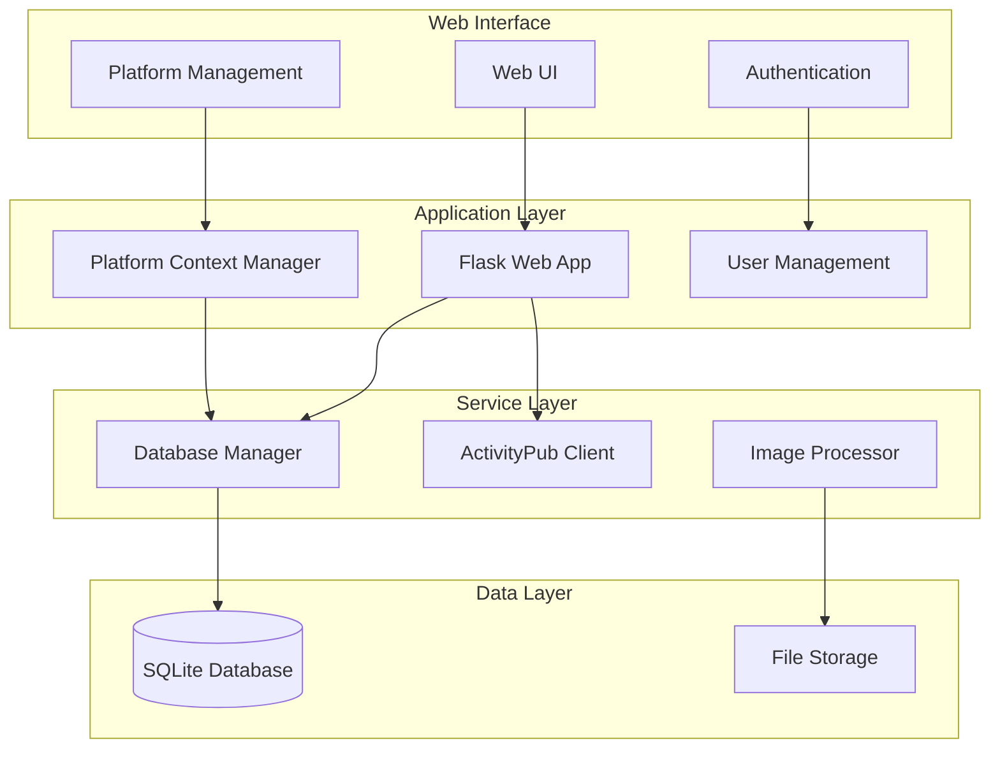

# Platform-Aware Database Design Document

## Overview

This design implements a comprehensive platform-aware database system that supports multiple ActivityPub platforms (Pixelfed, Mastodon) with user-managed platform connections through a web interface. The system ensures data isolation, prevents corruption during platform switching, and provides clear platform context throughout the user interface.

## Architecture

### High-Level Architecture



## Database Schema Design

### New Tables

#### Platform Connections Table
```sql
CREATE TABLE platform_connections (
    id INTEGER PRIMARY KEY AUTOINCREMENT,
    user_id INTEGER NOT NULL,
    name VARCHAR(100) NOT NULL,
    platform_type VARCHAR(50) NOT NULL,
    instance_url VARCHAR(500) NOT NULL,
    username VARCHAR(200),
    access_token TEXT NOT NULL,
    client_key TEXT,
    client_secret TEXT,
    is_active BOOLEAN DEFAULT TRUE,
    is_default BOOLEAN DEFAULT FALSE,
    created_at DATETIME DEFAULT CURRENT_TIMESTAMP,
    updated_at DATETIME DEFAULT CURRENT_TIMESTAMP,
    last_used DATETIME,
    
    FOREIGN KEY (user_id) REFERENCES users (id) ON DELETE CASCADE,
    UNIQUE(user_id, name),
    UNIQUE(user_id, instance_url, username)
);

CREATE INDEX idx_platform_connections_user ON platform_connections(user_id);
CREATE INDEX idx_platform_connections_active ON platform_connections(user_id, is_active);
```

#### User Sessions Table (for platform context)
```sql
CREATE TABLE user_sessions (
    id INTEGER PRIMARY KEY AUTOINCREMENT,
    user_id INTEGER NOT NULL,
    session_id VARCHAR(255) NOT NULL,
    active_platform_id INTEGER,
    created_at DATETIME DEFAULT CURRENT_TIMESTAMP,
    updated_at DATETIME DEFAULT CURRENT_TIMESTAMP,
    
    FOREIGN KEY (user_id) REFERENCES users (id) ON DELETE CASCADE,
    FOREIGN KEY (active_platform_id) REFERENCES platform_connections (id) ON DELETE SET NULL,
    UNIQUE(session_id)
);

CREATE INDEX idx_user_sessions_session ON user_sessions(session_id);
CREATE INDEX idx_user_sessions_user ON user_sessions(user_id);
```

### Modified Existing Tables

#### Posts Table Updates
```sql
ALTER TABLE posts ADD COLUMN platform_connection_id INTEGER;
ALTER TABLE posts ADD COLUMN platform_type VARCHAR(50) NOT NULL DEFAULT 'pixelfed';
ALTER TABLE posts ADD COLUMN instance_url VARCHAR(500) NOT NULL DEFAULT '';

-- Add foreign key constraint
ALTER TABLE posts ADD CONSTRAINT fk_posts_platform 
    FOREIGN KEY (platform_connection_id) REFERENCES platform_connections (id) ON DELETE SET NULL;

-- Create indexes for performance
CREATE INDEX idx_posts_platform_connection ON posts(platform_connection_id);
CREATE INDEX idx_posts_platform_type ON posts(platform_type, instance_url);

-- Update unique constraint to be platform-aware
DROP INDEX IF EXISTS posts_post_id_key;
CREATE UNIQUE INDEX idx_posts_unique_platform ON posts(post_id, platform_connection_id);
```

#### Images Table Updates
```sql
ALTER TABLE images ADD COLUMN platform_connection_id INTEGER;
ALTER TABLE images ADD COLUMN platform_type VARCHAR(50) NOT NULL DEFAULT 'pixelfed';

-- Add foreign key constraint
ALTER TABLE images ADD CONSTRAINT fk_images_platform 
    FOREIGN KEY (platform_connection_id) REFERENCES platform_connections (id) ON DELETE SET NULL;

-- Create indexes
CREATE INDEX idx_images_platform_connection ON images(platform_connection_id);
CREATE INDEX idx_images_platform_type ON images(platform_type);
```

#### Processing Runs Table Updates
```sql
ALTER TABLE processing_runs ADD COLUMN platform_connection_id INTEGER;
ALTER TABLE processing_runs ADD COLUMN platform_type VARCHAR(50) NOT NULL DEFAULT 'pixelfed';
ALTER TABLE processing_runs ADD COLUMN instance_url VARCHAR(500) NOT NULL DEFAULT '';

-- Add foreign key constraint
ALTER TABLE processing_runs ADD CONSTRAINT fk_processing_runs_platform 
    FOREIGN KEY (platform_connection_id) REFERENCES platform_connections (id) ON DELETE SET NULL;

-- Create indexes
CREATE INDEX idx_processing_runs_platform_connection ON processing_runs(platform_connection_id);
CREATE INDEX idx_processing_runs_platform_type ON processing_runs(platform_type, instance_url);
```

## Data Models

### New Models

#### PlatformConnection Model
```python
from sqlalchemy import Column, Integer, String, Text, Boolean, DateTime, ForeignKey
from sqlalchemy.orm import relationship
from cryptography.fernet import Fernet
import os

class PlatformConnection(Base):
    __tablename__ = 'platform_connections'
    
    id = Column(Integer, primary_key=True)
    user_id = Column(Integer, ForeignKey('users.id'), nullable=False)
    name = Column(String(100), nullable=False)
    platform_type = Column(String(50), nullable=False)  # 'pixelfed', 'mastodon'
    instance_url = Column(String(500), nullable=False)
    username = Column(String(200))
    
    # Encrypted credentials
    _access_token = Column('access_token', Text, nullable=False)
    _client_key = Column('client_key', Text)
    _client_secret = Column('client_secret', Text)
    
    is_active = Column(Boolean, default=True)
    is_default = Column(Boolean, default=False)
    created_at = Column(DateTime, default=datetime.utcnow)
    updated_at = Column(DateTime, default=datetime.utcnow, onupdate=datetime.utcnow)
    last_used = Column(DateTime)
    
    # Relationships
    user = relationship("User", back_populates="platform_connections")
    posts = relationship("Post", back_populates="platform_connection")
    images = relationship("Image", back_populates="platform_connection")
    processing_runs = relationship("ProcessingRun", back_populates="platform_connection")
    
    # Encryption key (should be stored securely in production)
    _encryption_key = os.getenv('PLATFORM_ENCRYPTION_KEY', Fernet.generate_key())
    _cipher = Fernet(_encryption_key)
    
    @property
    def access_token(self):
        if self._access_token:
            return self._cipher.decrypt(self._access_token.encode()).decode()
        return None
    
    @access_token.setter
    def access_token(self, value):
        if value:
            self._access_token = self._cipher.encrypt(value.encode()).decode()
        else:
            self._access_token = None
    
    @property
    def client_key(self):
        if self._client_key:
            return self._cipher.decrypt(self._client_key.encode()).decode()
        return None
    
    @client_key.setter
    def client_key(self, value):
        if value:
            self._client_key = self._cipher.encrypt(value.encode()).decode()
        else:
            self._client_key = None
    
    @property
    def client_secret(self):
        if self._client_secret:
            return self._cipher.decrypt(self._client_secret.encode()).decode()
        return None
    
    @client_secret.setter
    def client_secret(self, value):
        if value:
            self._client_secret = self._cipher.encrypt(value.encode()).decode()
        else:
            self._client_secret = None
    
    def to_activitypub_config(self):
        """Convert to ActivityPubConfig for client usage"""
        from config import ActivityPubConfig, RetryConfig, RateLimitConfig
        
        return ActivityPubConfig(
            instance_url=self.instance_url,
            access_token=self.access_token,
            api_type=self.platform_type,
            username=self.username,
            client_key=self.client_key,
            client_secret=self.client_secret,
            retry=RetryConfig.from_env(),
            rate_limit=RateLimitConfig.from_env()
        )
    
    def test_connection(self):
        """Test the platform connection"""
        try:
            from activitypub_client import ActivityPubClient
            config = self.to_activitypub_config()
            client = ActivityPubClient(config)
            # Test with a simple API call
            return client.test_connection()
        except Exception as e:
            return False, str(e)
    
    def __repr__(self):
        return f"<PlatformConnection {self.name} ({self.platform_type})>"

class UserSession(Base):
    __tablename__ = 'user_sessions'
    
    id = Column(Integer, primary_key=True)
    user_id = Column(Integer, ForeignKey('users.id'), nullable=False)
    session_id = Column(String(255), nullable=False, unique=True)
    active_platform_id = Column(Integer, ForeignKey('platform_connections.id'))
    created_at = Column(DateTime, default=datetime.utcnow)
    updated_at = Column(DateTime, default=datetime.utcnow, onupdate=datetime.utcnow)
    
    # Relationships
    user = relationship("User")
    active_platform = relationship("PlatformConnection")
```

### Updated Models

#### User Model Updates
```python
class User(Base):
    # ... existing fields ...
    
    # New relationships
    platform_connections = relationship("PlatformConnection", back_populates="user", cascade="all, delete-orphan")
    sessions = relationship("UserSession", cascade="all, delete-orphan")
    
    def get_default_platform(self):
        """Get user's default platform connection"""
        return next((pc for pc in self.platform_connections if pc.is_default and pc.is_active), None)
    
    def get_active_platforms(self):
        """Get all active platform connections for user"""
        return [pc for pc in self.platform_connections if pc.is_active]
```

#### Post Model Updates
```python
class Post(Base):
    # ... existing fields ...
    
    platform_connection_id = Column(Integer, ForeignKey('platform_connections.id'))
    platform_type = Column(String(50), nullable=False, default='pixelfed')
    instance_url = Column(String(500), nullable=False, default='')
    
    # Updated relationships
    platform_connection = relationship("PlatformConnection", back_populates="posts")
    
    # Update unique constraint
    __table_args__ = (
        UniqueConstraint('post_id', 'platform_connection_id', name='uq_post_platform'),
    )
```

## Service Layer Design

### Platform Context Manager

```python
class PlatformContextManager:
    """Manages platform context for database operations"""
    
    def __init__(self, db_manager):
        self.db_manager = db_manager
        self._current_platform = None
        self._current_user = None
    
    def set_user_context(self, user_id, platform_connection_id=None):
        """Set the current user and platform context"""
        session = self.db_manager.get_session()
        try:
            user = session.query(User).get(user_id)
            if not user:
                raise ValueError(f"User {user_id} not found")
            
            self._current_user = user
            
            if platform_connection_id:
                platform = session.query(PlatformConnection).filter_by(
                    id=platform_connection_id,
                    user_id=user_id,
                    is_active=True
                ).first()
                if not platform:
                    raise ValueError(f"Platform connection {platform_connection_id} not found or inactive")
                self._current_platform = platform
            else:
                # Use default platform
                self._current_platform = user.get_default_platform()
                
        finally:
            session.close()
    
    def get_platform_filter(self):
        """Get filter criteria for current platform"""
        if not self._current_platform:
            raise ValueError("No platform context set")
        
        return {
            'platform_connection_id': self._current_platform.id,
            'platform_type': self._current_platform.platform_type,
            'instance_url': self._current_platform.instance_url
        }
    
    def apply_platform_data(self, data_dict):
        """Add platform information to data dictionary"""
        if not self._current_platform:
            raise ValueError("No platform context set")
        
        data_dict.update({
            'platform_connection_id': self._current_platform.id,
            'platform_type': self._current_platform.platform_type,
            'instance_url': self._current_platform.instance_url
        })
        return data_dict
    
    def get_activitypub_config(self):
        """Get ActivityPub configuration for current platform"""
        if not self._current_platform:
            raise ValueError("No platform context set")
        
        return self._current_platform.to_activitypub_config()
    
    @property
    def current_platform(self):
        return self._current_platform
    
    @property
    def current_user(self):
        return self._current_user
```

### Enhanced Database Manager

```python
class DatabaseManager:
    # ... existing methods ...
    
    def __init__(self, config: Config):
        # ... existing initialization ...
        self.platform_context = PlatformContextManager(self)
    
    def set_platform_context(self, user_id, platform_connection_id=None):
        """Set platform context for operations"""
        self.platform_context.set_user_context(user_id, platform_connection_id)
    
    def get_posts_for_platform(self, user_id=None, limit=None):
        """Get posts filtered by current platform"""
        if not self.platform_context.current_platform:
            raise ValueError("No platform context set")
        
        session = self.get_session()
        try:
            query = session.query(Post).filter(
                Post.platform_connection_id == self.platform_context.current_platform.id
            )
            
            if user_id:
                query = query.filter(Post.user_id == user_id)
            if limit:
                query = query.limit(limit)
            
            return query.all()
        finally:
            session.close()
    
    def create_post_with_platform(self, post_data):
        """Create post with platform information"""
        if not self.platform_context.current_platform:
            raise ValueError("No platform context set")
        
        post_data = self.platform_context.apply_platform_data(post_data)
        return self.get_or_create_post(**post_data)
    
    def get_platform_statistics(self, platform_connection_id):
        """Get statistics for a specific platform"""
        session = self.get_session()
        try:
            stats = {}
            
            # Posts count
            stats['total_posts'] = session.query(Post).filter_by(
                platform_connection_id=platform_connection_id
            ).count()
            
            # Images count by status
            for status in ProcessingStatus:
                stats[f'images_{status.value}'] = session.query(Image).filter_by(
                    platform_connection_id=platform_connection_id,
                    status=status
                ).count()
            
            # Processing runs
            stats['processing_runs'] = session.query(ProcessingRun).filter_by(
                platform_connection_id=platform_connection_id
            ).count()
            
            return stats
        finally:
            session.close()
    
    # Platform connection management methods
    def create_platform_connection(self, user_id, name, platform_type, instance_url, 
                                 username, access_token, client_key=None, client_secret=None):
        """Create a new platform connection"""
        session = self.get_session()
        try:
            # Check if this is the user's first platform (make it default)
            existing_count = session.query(PlatformConnection).filter_by(
                user_id=user_id, is_active=True
            ).count()
            
            platform = PlatformConnection(
                user_id=user_id,
                name=name,
                platform_type=platform_type,
                instance_url=instance_url,
                username=username,
                access_token=access_token,
                client_key=client_key,
                client_secret=client_secret,
                is_default=(existing_count == 0)  # First platform becomes default
            )
            
            session.add(platform)
            session.commit()
            return platform
        except SQLAlchemyError as e:
            session.rollback()
            logger.error(f"Error creating platform connection: {e}")
            raise
        finally:
            session.close()
    
    def get_user_platforms(self, user_id, active_only=True):
        """Get all platform connections for a user"""
        session = self.get_session()
        try:
            query = session.query(PlatformConnection).filter_by(user_id=user_id)
            if active_only:
                query = query.filter_by(is_active=True)
            return query.order_by(PlatformConnection.is_default.desc(), 
                                PlatformConnection.name).all()
        finally:
            session.close()
    
    def set_default_platform(self, user_id, platform_connection_id):
        """Set a platform as the user's default"""
        session = self.get_session()
        try:
            # Remove default from all user's platforms
            session.query(PlatformConnection).filter_by(
                user_id=user_id
            ).update({'is_default': False})
            
            # Set new default
            platform = session.query(PlatformConnection).filter_by(
                id=platform_connection_id,
                user_id=user_id
            ).first()
            
            if platform:
                platform.is_default = True
                session.commit()
                return True
            return False
        except SQLAlchemyError as e:
            session.rollback()
            logger.error(f"Error setting default platform: {e}")
            raise
        finally:
            session.close()
```

## Frontend Design

### Platform Management Interface

#### Platform List Component
```html
<!-- templates/platform_management.html -->
<div class="platform-management">
    <div class="current-platform-indicator">
        <h5>Current Platform</h5>
        
        <div class="platform-card active">
            <div class="platform-icon">
                <i class="bi bi-{{ 'mastodon' if current_platform.platform_type == 'mastodon' else 'image' }}"></i>
            </div>
            <div class="platform-info">
                <h6>{{ current_platform.name }}</h6>
                <small>{{ current_platform.platform_type|title }} - {{ current_platform.instance_url|domain }}</small>
                <div class="platform-stats">
                    <span class="badge bg-primary">{{ platform_stats.total_posts }} posts</span>
                    <span class="badge bg-success">{{ platform_stats.images_approved }} approved</span>
                </div>
            </div>
        </div>
        
        <div class="alert alert-warning">
            <i class="bi bi-exclamation-triangle"></i>
            No platform selected. Please add and select a platform connection.
        </div>
        
    </div>
    
    <div class="platform-connections">
        <div class="d-flex justify-content-between align-items-center mb-3">
            <h5>Platform Connections</h5>
            <button class="btn btn-primary" data-bs-toggle="modal" data-bs-target="#addPlatformModal">
                <i class="bi bi-plus-circle"></i> Add Platform
            </button>
        </div>
        
        <div class="row">
            
            <div class="col-md-6 mb-3">
                <div class="card platform-connection-card {{ 'border-primary' if platform.is_default else '' }}">
                    <div class="card-body">
                        <div class="d-flex justify-content-between align-items-start">
                            <div class="platform-info">
                                <h6 class="card-title">
                                    <i class="bi bi-{{ 'mastodon' if platform.platform_type == 'mastodon' else 'image' }}"></i>
                                    {{ platform.name }}
                                    
                                    <span class="badge bg-primary ms-2">Default</span>
                                    
                                </h6>
                                <p class="card-text">
                                    <small class="text-muted">
                                        {{ platform.platform_type|title }} - {{ platform.instance_url|domain }}<br>
                                        @{{ platform.username }}
                                    </small>
                                </p>
                            </div>
                            <div class="platform-actions">
                                <div class="btn-group" role="group">
                                    
                                    <button class="btn btn-sm btn-outline-primary" 
                                            onclick="switchPlatform({{ platform.id }})">
                                        Switch
                                    </button>
                                    
                                    <button class="btn btn-sm btn-outline-secondary" 
                                            onclick="editPlatform({{ platform.id }})">
                                        Edit
                                    </button>
                                    <button class="btn btn-sm btn-outline-danger" 
                                            onclick="deletePlatform({{ platform.id }})">
                                        Delete
                                    </button>
                                </div>
                            </div>
                        </div>
                        
                        <div class="platform-status mt-2">
                            
                            <span class="badge bg-success">
                                <i class="bi bi-check-circle"></i> Active
                            </span>
                            
                            <span class="badge bg-danger">
                                <i class="bi bi-x-circle"></i> Inactive
                            </span>
                            
                            
                            
                            <small class="text-muted ms-2">
                                Last used: {{ platform.last_used|timeago }}
                            </small>
                            
                        </div>
                    </div>
                </div>
            </div>
            
        </div>
    </div>
</div>
```

#### Add Platform Modal
```html
<!-- Add Platform Modal -->
<div class="modal fade" id="addPlatformModal" tabindex="-1">
    <div class="modal-dialog">
        <div class="modal-content">
            <div class="modal-header">
                <h5 class="modal-title">Add Platform Connection</h5>
                <button type="button" class="btn-close" data-bs-dismiss="modal"></button>
            </div>
            <form id="addPlatformForm">
                <div class="modal-body">
                    <div class="mb-3">
                        <label for="platformName" class="form-label">Connection Name</label>
                        <input type="text" class="form-control" id="platformName" name="name" required>
                        <div class="form-text">A friendly name for this connection</div>
                    </div>
                    
                    <div class="mb-3">
                        <label for="platformType" class="form-label">Platform Type</label>
                        <select class="form-select" id="platformType" name="platform_type" required>
                            <option value="">Select platform...</option>
                            <option value="pixelfed">Pixelfed</option>
                            <option value="mastodon">Mastodon</option>
                        </select>
                    </div>
                    
                    <div class="mb-3">
                        <label for="instanceUrl" class="form-label">Instance URL</label>
                        <input type="url" class="form-control" id="instanceUrl" name="instance_url" required>
                        <div class="form-text">e.g., https://pixelfed.social or https://mastodon.social</div>
                    </div>
                    
                    <div class="mb-3">
                        <label for="username" class="form-label">Username</label>
                        <input type="text" class="form-control" id="username" name="username">
                        <div class="form-text">Your username on this platform</div>
                    </div>
                    
                    <div class="mb-3">
                        <label for="accessToken" class="form-label">Access Token</label>
                        <input type="password" class="form-control" id="accessToken" name="access_token" required>
                        <div class="form-text">Your API access token</div>
                    </div>
                    
                    <!-- Mastodon-specific fields -->
                    <div id="mastodonFields" style="display: none;">
                        <div class="mb-3">
                            <label for="clientKey" class="form-label">Client Key</label>
                            <input type="text" class="form-control" id="clientKey" name="client_key">
                        </div>
                        
                        <div class="mb-3">
                            <label for="clientSecret" class="form-label">Client Secret</label>
                            <input type="password" class="form-control" id="clientSecret" name="client_secret">
                        </div>
                    </div>
                    
                    <div class="mb-3">
                        <div class="form-check">
                            <input class="form-check-input" type="checkbox" id="testConnection" name="test_connection" checked>
                            <label class="form-check-label" for="testConnection">
                                Test connection before saving
                            </label>
                        </div>
                    </div>
                </div>
                <div class="modal-footer">
                    <button type="button" class="btn btn-secondary" data-bs-dismiss="modal">Cancel</button>
                    <button type="submit" class="btn btn-primary">Add Platform</button>
                </div>
            </form>
        </div>
    </div>
</div>
```

### Enhanced Navigation with Platform Context

```html
<!-- templates/base.html - Updated navigation -->
<nav class="navbar navbar-expand-lg navbar-dark bg-dark">
    <div class="container-fluid">
        <a class="navbar-brand" href="{{ url_for('index') }}">
            🤖 Vedfolnir
        </a>
        
        <!-- Platform indicator -->
        
        <div class="navbar-text platform-indicator">
            <i class="bi bi-{{ 'mastodon' if current_platform.platform_type == 'mastodon' else 'image' }}"></i>
            <span class="platform-name">{{ current_platform.name }}</span>
            <small class="platform-details">{{ current_platform.instance_url|domain }}</small>
        </div>
        
        
        <div class="navbar-nav ms-auto">
            
            <div class="nav-item dropdown">
                <a class="nav-link dropdown-toggle" href="#" role="button" data-bs-toggle="dropdown">
                    <i class="bi bi-server"></i> Platforms
                </a>
                <ul class="dropdown-menu">
                    <li><a class="dropdown-item" href="{{ url_for('platform_management') }}">
                        <i class="bi bi-gear"></i> Manage Platforms
                    </a></li>
                    <li><hr class="dropdown-divider"></li>
                    
                    <li>
                        <a class="dropdown-item {{ 'active' if platform.id == current_platform.id else '' }}" 
                           href="{{ url_for('switch_platform', platform_id=platform.id) }}">
                            <i class="bi bi-{{ 'mastodon' if platform.platform_type == 'mastodon' else 'image' }}"></i>
                            {{ platform.name }}
                            
                            <span class="badge bg-primary ms-1">Default</span>
                            
                        </a>
                    </li>
                    
                </ul>
            </div>
            
        </div>
    </div>
</nav>
```

## Migration Strategy

### Migration Script Design

```python
class PlatformAwareMigration:
    """Handles migration to platform-aware schema"""
    
    def __init__(self, db_manager, config):
        self.db_manager = db_manager
        self.config = config
        self.session = db_manager.get_session()
    
    def migrate_up(self):
        """Apply platform-aware schema changes"""
        try:
            logger.info("Starting platform-aware migration...")
            
            # Step 1: Create new tables
            self.create_new_tables()
            
            # Step 2: Add columns to existing tables
            self.add_platform_columns()
            
            # Step 3: Create default platform from environment config
            default_platform = self.create_default_platform()
            
            # Step 4: Migrate existing data
            self.migrate_existing_data(default_platform)
            
            # Step 5: Create indexes
            self.create_indexes()
            
            # Step 6: Validate migration
            self.validate_migration()
            
            logger.info("Platform-aware migration completed successfully")
            
        except Exception as e:
            logger.error(f"Migration failed: {e}")
            self.session.rollback()
            raise
        finally:
            self.session.close()
    
    def create_new_tables(self):
        """Create platform_connections and user_sessions tables"""
        from models import PlatformConnection, UserSession
        
        # Tables will be created by SQLAlchemy metadata
        Base.metadata.create_all(self.db_manager.engine)
        logger.info("Created new platform-aware tables")
    
    def add_platform_columns(self):
        """Add platform columns to existing tables"""
        # This would typically be done via Alembic migrations
        # For SQLite, we need to recreate tables with new columns
        
        # Add columns using raw SQL (SQLite doesn't support ALTER COLUMN)
        self.session.execute(text("""
            ALTER TABLE posts ADD COLUMN platform_connection_id INTEGER;
        """))
        self.session.execute(text("""
            ALTER TABLE posts ADD COLUMN platform_type VARCHAR(50) DEFAULT 'pixelfed';
        """))
        self.session.execute(text("""
            ALTER TABLE posts ADD COLUMN instance_url VARCHAR(500) DEFAULT '';
        """))
        
        # Similar for other tables...
        self.session.commit()
        logger.info("Added platform columns to existing tables")
    
    def create_default_platform(self):
        """Create default platform from environment configuration"""
        # Get admin user (create if doesn't exist)
        admin_user = self.session.query(User).filter_by(
            username=self.config.auth.admin_username
        ).first()
        
        if not admin_user:
            admin_user = User(
                username=self.config.auth.admin_username,
                email=self.config.auth.admin_email,
                role=UserRole.ADMIN
            )
            if self.config.auth.admin_password:
                admin_user.set_password(self.config.auth.admin_password)
            self.session.add(admin_user)
            self.session.commit()
        
        # Create platform connection from environment config
        platform = PlatformConnection(
            user_id=admin_user.id,
            name="Default Platform",
            platform_type=self.config.activitypub.api_type,
            instance_url=self.config.activitypub.instance_url,
            username=self.config.activitypub.username,
            access_token=self.config.activitypub.access_token,
            client_key=self.config.activitypub.client_key,
            client_secret=self.config.activitypub.client_secret,
            is_default=True
        )
        
        self.session.add(platform)
        self.session.commit()
        
        logger.info(f"Created default platform connection: {platform.name}")
        return platform
    
    def migrate_existing_data(self, default_platform):
        """Migrate existing data to use platform connections"""
        # Update all existing posts
        self.session.execute(text("""
            UPDATE posts SET 
                platform_connection_id = :platform_id,
                platform_type = :platform_type,
                instance_url = :instance_url
            WHERE platform_connection_id IS NULL
        """), {
            'platform_id': default_platform.id,
            'platform_type': default_platform.platform_type,
            'instance_url': default_platform.instance_url
        })
        
        # Update all existing images
        self.session.execute(text("""
            UPDATE images SET 
                platform_connection_id = :platform_id,
                platform_type = :platform_type
            WHERE platform_connection_id IS NULL
        """), {
            'platform_id': default_platform.id,
            'platform_type': default_platform.platform_type
        })
        
        # Update all existing processing runs
        self.session.execute(text("""
            UPDATE processing_runs SET 
                platform_connection_id = :platform_id,
                platform_type = :platform_type,
                instance_url = :instance_url
            WHERE platform_connection_id IS NULL
        """), {
            'platform_id': default_platform.id,
            'platform_type': default_platform.platform_type,
            'instance_url': default_platform.instance_url
        })
        
        self.session.commit()
        logger.info("Migrated existing data to use platform connections")
    
    def create_indexes(self):
        """Create performance indexes"""
        indexes = [
            "CREATE INDEX IF NOT EXISTS idx_posts_platform_connection ON posts(platform_connection_id)",
            "CREATE INDEX IF NOT EXISTS idx_images_platform_connection ON images(platform_connection_id)",
            "CREATE INDEX IF NOT EXISTS idx_processing_runs_platform_connection ON processing_runs(platform_connection_id)",
        ]
        
        for index_sql in indexes:
            self.session.execute(text(index_sql))
        
        self.session.commit()
        logger.info("Created performance indexes")
    
    def validate_migration(self):
        """Validate migration completed successfully"""
        # Check that all records have platform associations
        posts_without_platform = self.session.execute(text("""
            SELECT COUNT(*) FROM posts WHERE platform_connection_id IS NULL
        """)).scalar()
        
        if posts_without_platform > 0:
            raise Exception(f"{posts_without_platform} posts without platform association")
        
        # Similar checks for other tables...
        logger.info("Migration validation passed")
    
    def migrate_down(self):
        """Rollback platform-aware changes"""
        # Implementation for rollback
        pass
```

## Testing Strategy

### Unit Tests

```python
class TestPlatformAwareDatabase:
    def test_platform_connection_creation(self):
        """Test creating platform connections"""
        user = create_test_user()
        platform = db_manager.create_platform_connection(
            user_id=user.id,
            name="Test Platform",
            platform_type="pixelfed",
            instance_url="https://test.pixelfed.social",
            username="testuser",
            access_token="test_token"
        )
        
        assert platform.name == "Test Platform"
        assert platform.is_default == True  # First platform becomes default
        assert platform.access_token == "test_token"  # Test encryption/decryption
    
    def test_platform_context_filtering(self):
        """Test that queries are filtered by platform context"""
        user = create_test_user()
        platform1 = create_test_platform(user, "Platform 1")
        platform2 = create_test_platform(user, "Platform 2")
        
        # Create posts on different platforms
        db_manager.set_platform_context(user.id, platform1.id)
        post1 = db_manager.create_post_with_platform({
            'post_id': 'post1',
            'user_id': 'testuser',
            'post_url': 'https://test.com/post1'
        })
        
        db_manager.set_platform_context(user.id, platform2.id)
        post2 = db_manager.create_post_with_platform({
            'post_id': 'post2',
            'user_id': 'testuser',
            'post_url': 'https://test.com/post2'
        })
        
        # Test filtering
        db_manager.set_platform_context(user.id, platform1.id)
        platform1_posts = db_manager.get_posts_for_platform()
        assert len(platform1_posts) == 1
        assert platform1_posts[0].post_id == 'post1'
        
        db_manager.set_platform_context(user.id, platform2.id)
        platform2_posts = db_manager.get_posts_for_platform()
        assert len(platform2_posts) == 1
        assert platform2_posts[0].post_id == 'post2'
```

### Integration Tests

```python
class TestPlatformSwitching:
    def test_safe_platform_switching(self):
        """Test switching between platforms doesn't corrupt data"""
        user = create_test_user()
        pixelfed_platform = create_test_platform(user, "Pixelfed", "pixelfed")
        mastodon_platform = create_test_platform(user, "Mastodon", "mastodon")
        
        # Create data on Pixelfed
        db_manager.set_platform_context(user.id, pixelfed_platform.id)
        create_test_posts_and_images(count=5)
        
        # Switch to Mastodon
        db_manager.set_platform_context(user.id, mastodon_platform.id)
        create_test_posts_and_images(count=3)
        
        # Verify data isolation
        mastodon_posts = db_manager.get_posts_for_platform()
        assert len(mastodon_posts) == 3
        
        # Switch back to Pixelfed
        db_manager.set_platform_context(user.id, pixelfed_platform.id)
        pixelfed_posts = db_manager.get_posts_for_platform()
        assert len(pixelfed_posts) == 5
        
        # Verify no data corruption
        assert all(post.platform_type == "pixelfed" for post in pixelfed_posts)
```

## Security Considerations

### Credential Encryption
- All platform credentials are encrypted using Fernet symmetric encryption
- Encryption key should be stored securely (environment variable or key management service)
- Credentials are only decrypted when needed for API calls

### Access Control
- Users can only access their own platform connections
- Platform switching is restricted to user's own platforms
- Admin users can manage all platform connections (if needed)

### Data Isolation
- Strict foreign key relationships ensure data integrity
- Platform context is enforced at the service layer
- Database constraints prevent cross-platform data corruption

## Performance Considerations

### Database Optimization
- Indexes on platform_connection_id for fast filtering
- Composite indexes for common query patterns
- Connection pooling for database performance

### Caching Strategy
- Cache active platform connections per user session
- Cache platform statistics to reduce database queries
- Invalidate cache on platform configuration changes

### Query Optimization
- Use platform context filtering in all queries
- Avoid N+1 queries with proper eager loading
- Monitor query performance with logging

## Deployment Strategy

### Migration Deployment
1. **Backup**: Create full database backup before migration
2. **Schema Migration**: Apply new tables and columns
3. **Data Migration**: Migrate existing data to new schema
4. **Validation**: Verify data integrity and completeness
5. **Rollback Plan**: Prepared rollback scripts if needed

### Configuration Migration
1. **Environment Variables**: Convert existing config to database records
2. **User Creation**: Create admin user if doesn't exist
3. **Default Platform**: Create default platform from environment
4. **Testing**: Verify platform connections work correctly

### Monitoring and Validation
1. **Health Checks**: Monitor platform connection health
2. **Data Integrity**: Regular validation of platform associations
3. **Performance Monitoring**: Track query performance with platform filtering
4. **Error Handling**: Comprehensive error logging and alerting

This design provides a robust, secure, and user-friendly platform-aware database system that supports multiple ActivityPub platforms while maintaining data integrity and providing clear platform context throughout the application.