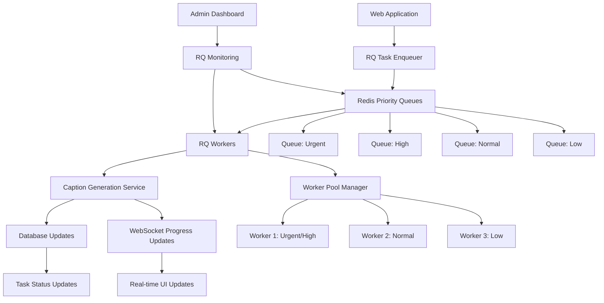
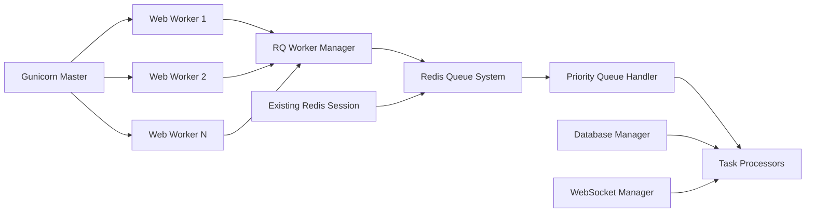

# Design Document

## Overview

The Redis Queue (RQ) migration will transform Vedfolnir's task processing from a database-polling architecture to an efficient, Redis-based queue system. This design leverages the existing Redis infrastructure used for session management and provides multi-priority task processing with seamless Gunicorn integration.

The system will maintain backward compatibility while providing significant performance improvements, better resource utilization, and enhanced scalability for caption generation tasks.

## Architecture

### High-Level Architecture



### Component Integration



## Components and Interfaces

### 1. RQ Queue Manager

**Purpose**: Central component for managing Redis queues and task lifecycle with single-task-per-user enforcement.

```python
class RQQueueManager:
    def __init__(self, redis_connection, db_manager, config, security_manager):
        self.redis = redis_connection
        self.db_manager = db_manager
        self.config = config
        self.security_manager = security_manager
        self.queues = self._initialize_priority_queues()
        self.user_task_tracker = UserTaskTracker(redis_connection)
        self.redis_health_monitor = RedisHealthMonitor(redis_connection)
    
    def enqueue_task(self, task: CaptionGenerationTask, priority: TaskPriority) -> str
    def get_queue_stats(self) -> Dict[str, Any]
    def migrate_database_tasks(self) -> int
    def cleanup_completed_jobs(self) -> None
    def enforce_single_task_per_user(self, user_id: int) -> bool
    def generate_secure_task_id(self) -> str
    def handle_redis_failure(self) -> None
    def check_redis_health(self) -> bool
```

**Key Features**:
- Priority queue management (urgent, high, normal, low)
- Task serialization and deserialization
- Database task migration
- Queue statistics and monitoring

### 2. RQ Worker Manager

**Purpose**: Manages worker processes and their lifecycle within Gunicorn with proper coordination.

```python
class RQWorkerManager:
    def __init__(self, queue_manager, worker_config, db_manager):
        self.queue_manager = queue_manager
        self.workers = {}
        self.worker_config = worker_config
        self.db_manager = db_manager
        self.integrated_workers = []  # Workers running in Gunicorn threads
        self.external_workers = []    # External RQ worker processes
        self.worker_id = self._generate_unique_worker_id()
        self.coordination_key = f"rq:workers:{self.worker_id}"
        self.shutdown_timeout = 30  # seconds
    
    def start_integrated_workers(self) -> None
    def start_external_workers(self) -> None
    def stop_workers(self, graceful: bool = True, timeout: int = None) -> None
    def restart_worker(self, worker_id: str) -> None
    def scale_workers(self, queue_name: str, count: int) -> None
    def register_worker_coordination(self) -> None
    def cleanup_worker_coordination(self) -> None
    def _generate_unique_worker_id(self) -> str
```

**Worker Invocation Methods**:

1. **Integrated Workers** (Primary): Run as background threads within Gunicorn processes
   ```python
   # Started automatically when Gunicorn initializes
   worker = Worker(['urgent', 'high', 'normal'], connection=redis_conn)
   worker_thread = threading.Thread(target=worker.work, daemon=True)
   worker_thread.start()
   ```

2. **External Workers** (Optional): Separate `rq worker` processes for heavy workloads
   ```bash
   rq worker urgent high --url redis://localhost:6379/0
   ```

3. **Hybrid Mode** (Recommended): Combination of both for optimal resource utilization

**Key Features**:
- Multiple worker invocation strategies
- Dynamic worker scaling
- Graceful shutdown handling
- Worker health monitoring
- Integration with Gunicorn lifecycle

### 3. Task Serializer

**Purpose**: Handles serialization/deserialization of task data for Redis storage.

```python
class TaskSerializer:
    def serialize_task(self, task: CaptionGenerationTask) -> bytes
    def deserialize_task(self, data: bytes) -> CaptionGenerationTask
    def validate_task_data(self, task_data: Dict) -> bool
```

**Key Features**:
- Efficient binary serialization using pickle/msgpack
- Task validation and error handling
- Backward compatibility with database tasks

### 4. Priority Queue Handler

**Purpose**: Manages priority-based task distribution and processing order.

```python
class PriorityQueueHandler:
    def __init__(self, redis_connection):
        self.redis = redis_connection
        self.priority_order = ['urgent', 'high', 'normal', 'low']
    
    def get_next_task(self, worker_queues: List[str]) -> Optional[Task]
    def enqueue_by_priority(self, task: Task, priority: TaskPriority) -> None
    def requeue_failed_task(self, task: Task, retry_count: int) -> None
```

**Key Features**:
- Strict priority ordering
- Round-robin within same priority
- Retry logic with exponential backoff

### 5. Progress Tracker Integration

**Purpose**: Integrates RQ task progress with existing WebSocket system.

```python
class RQProgressTracker:
    def __init__(self, websocket_manager, db_manager):
        self.websocket_manager = websocket_manager
        self.db_manager = db_manager
    
    def update_task_progress(self, task_id: str, progress: int, message: str) -> None
    def send_completion_notification(self, task_id: str, success: bool) -> None
    def handle_task_failure(self, task_id: str, error: Exception) -> None
```

**Key Features**:
- Real-time progress updates via WebSocket
- Database persistence for reconnection scenarios
- Error notification handling

### 6. User Task Tracker

**Purpose**: Enforces single-task-per-user constraint using Redis.

```python
class UserTaskTracker:
    def __init__(self, redis_connection):
        self.redis = redis_connection
        self.user_task_prefix = "user_active_task:"
        self.task_ttl = 7200  # 2 hours
    
    def set_user_active_task(self, user_id: int, task_id: str) -> bool
    def get_user_active_task(self, user_id: int) -> Optional[str]
    def clear_user_active_task(self, user_id: int) -> None
    def has_active_task(self, user_id: int) -> bool
```

### 7. Redis Health Monitor

**Purpose**: Monitors Redis connectivity and triggers fallback mechanisms.

```python
class RedisHealthMonitor:
    def __init__(self, redis_connection):
        self.redis = redis_connection
        self.health_check_interval = 30  # seconds
        self.failure_threshold = 3
        self.consecutive_failures = 0
        self.is_healthy = True
    
    def check_health(self) -> bool
    def handle_failure(self) -> None
    def handle_recovery(self) -> None
    def get_memory_usage(self) -> Dict[str, Any]
    def trigger_cleanup_if_needed(self) -> None
```

### 8. Database Session Manager for Workers

**Purpose**: Manages database sessions properly in RQ worker threads.

```python
class WorkerSessionManager:
    def __init__(self, db_manager):
        self.db_manager = db_manager
        self._local = threading.local()
    
    def get_session(self):
        """Get thread-local database session"""
        if not hasattr(self._local, 'session'):
            self._local.session = self.db_manager.get_session()
        return self._local.session
    
    def close_session(self):
        """Close thread-local session"""
        if hasattr(self._local, 'session'):
            self._local.session.close()
            delattr(self._local, 'session')
```

## Data Models

### RQ Task Data Structure

```python
@dataclass
class RQTaskData:
    task_id: str
    user_id: int
    platform_connection_id: int
    priority: TaskPriority
    settings: Dict[str, Any]
    created_at: datetime
    retry_count: int = 0
    max_retries: int = 3
    
    def to_dict(self) -> Dict[str, Any]:
        """Convert to dictionary for Redis storage"""
        
    @classmethod
    def from_dict(cls, data: Dict[str, Any]) -> 'RQTaskData':
        """Create from dictionary loaded from Redis"""
```

### Queue Configuration

```python
@dataclass
class QueueConfig:
    name: str
    priority_level: int
    max_workers: int
    timeout: int
    retry_policy: RetryPolicy
    
class RetryPolicy:
    max_retries: int = 3
    backoff_strategy: str = 'exponential'  # linear, exponential, fixed
    base_delay: int = 60  # seconds
    max_delay: int = 3600  # seconds
```

### Worker Configuration

```python
@dataclass
class WorkerConfig:
    worker_id: str
    queues: List[str]  # Priority order
    concurrency: int
    memory_limit: int  # MB
    timeout: int  # seconds
    health_check_interval: int  # seconds
```

## Error Handling

### Retry Strategy

1. **Immediate Retry**: For transient network errors (1 retry)
2. **Exponential Backoff**: For service unavailability (3 retries: 1min, 4min, 16min)
3. **Dead Letter Queue**: For permanently failed tasks after all retries

### Fallback Mechanisms

```python
class TaskFallbackHandler:
    def __init__(self, db_manager, rq_manager):
        self.db_manager = db_manager
        self.rq_manager = rq_manager
    
    def handle_redis_unavailable(self, task: CaptionGenerationTask) -> None:
        """Fallback to database queuing when Redis is unavailable"""
        
    def migrate_fallback_tasks(self) -> int:
        """Migrate database tasks back to RQ when Redis recovers"""
        
    def ensure_task_completion(self, task_id: str) -> bool:
        """Ensure task completes via either RQ or database processing"""
```

### Error Categories

1. **Redis Connection Errors**: Automatic reconnection with exponential backoff
2. **Task Processing Errors**: Retry with different worker if available
3. **Serialization Errors**: Log and mark task as failed immediately
4. **Resource Exhaustion**: Queue task for later processing when resources available

## Testing Strategy

### Unit Tests

1. **RQ Queue Manager Tests**
   - Task enqueuing and dequeuing
   - Priority queue ordering
   - Error handling scenarios

2. **Worker Manager Tests**
   - Worker lifecycle management
   - Graceful shutdown procedures
   - Scaling operations

3. **Serialization Tests**
   - Task data integrity
   - Backward compatibility
   - Error handling for corrupted data

### Integration Tests

1. **End-to-End Task Processing**
   - Task submission through web interface
   - RQ processing and database updates
   - WebSocket progress notifications

2. **Gunicorn Integration Tests**
   - Worker startup/shutdown with Gunicorn
   - Multiple Gunicorn worker coordination
   - Resource cleanup on restart

3. **Fallback Mechanism Tests**
   - Redis unavailability scenarios
   - Database fallback processing
   - Recovery and migration procedures

### Performance Tests

1. **Load Testing**
   - High-volume task enqueueing
   - Concurrent task processing
   - Memory usage under load

2. **Scalability Testing**
   - Worker scaling under different loads
   - Queue performance with large backlogs
   - Redis memory usage optimization

### Monitoring Tests

1. **Health Check Validation**
   - Worker health monitoring
   - Queue statistics accuracy
   - Alert generation for failures

## RQ Worker Invocation Details

### Primary Approach: Integrated Workers with Gunicorn

The recommended approach integrates RQ workers directly into the Gunicorn application lifecycle:

```python
# In web_app.py - Application startup (Flask 2.2+ compatible)
def initialize_rq_workers(app):
    """Initialize RQ workers when Gunicorn starts"""
    redis_conn = get_redis_connection()
    db_manager = app.config['db_manager']
    security_manager = CaptionSecurityManager(db_manager)
    
    worker_manager = RQWorkerManager(redis_conn, app.config, db_manager)
    
    # Register worker coordination
    worker_manager.register_worker_coordination()
    
    # Start integrated workers as daemon threads
    worker_manager.start_integrated_workers()
    
    # Register cleanup on app shutdown
    atexit.register(worker_manager.cleanup_and_stop)
    
    return worker_manager

# Modern Flask startup (Flask 2.2+)
def create_app():
    app = Flask(__name__)
    
    # Initialize RQ workers after app context is available
    with app.app_context():
        app.rq_worker_manager = initialize_rq_workers(app)
    
    return app

# Alternative: Use Flask's record_once for one-time initialization
@app.record_once
def init_rq_workers(state):
    """Initialize RQ workers once per application instance"""
    app = state.app
    with app.app_context():
        app.rq_worker_manager = initialize_rq_workers(app)
```

### Worker Process Architecture

```python
class IntegratedRQWorker:
    def __init__(self, queues, redis_connection, app_context, db_manager, worker_id):
        self.worker = Worker(queues, connection=redis_connection, name=f"worker-{worker_id}")
        self.app_context = app_context
        self.db_manager = db_manager
        self.session_manager = WorkerSessionManager(db_manager)
        self.worker_id = worker_id
        self.thread = None
        self.running = False
        self.coordination_key = f"rq:active_workers:{worker_id}"
    
    def start(self):
        """Start worker in background thread with Flask app context and proper session management"""
        def worker_loop():
            try:
                # Register this worker as active
                redis_conn = self.worker.connection
                redis_conn.setex(self.coordination_key, 300, "active")  # 5 minute TTL
                
                with self.app_context:
                    # Set up proper exception handling for database sessions
                    def job_wrapper(job_func):
                        def wrapper(*args, **kwargs):
                            try:
                                return job_func(*args, **kwargs)
                            finally:
                                # Always clean up database session after job
                                self.session_manager.close_session()
                        return wrapper
                    
                    # Start worker with session cleanup
                    self.worker.work(with_scheduler=True)
            finally:
                # Clean up coordination key
                try:
                    redis_conn.delete(self.coordination_key)
                except:
                    pass  # Redis might be down
                
                # Final session cleanup
                self.session_manager.close_session()
        
        self.thread = threading.Thread(target=worker_loop, daemon=True, name=f"RQWorker-{self.worker_id}")
        self.thread.start()
        self.running = True
    
    def stop(self, timeout=30):
        """Gracefully stop worker with proper cleanup"""
        try:
            # Signal worker to stop
            self.worker.request_stop()
            
            # Wait for thread to finish
            if self.thread and self.thread.is_alive():
                self.thread.join(timeout=timeout)
                
            # Force cleanup if thread didn't stop gracefully
            if self.thread and self.thread.is_alive():
                logger.warning(f"Worker {self.worker_id} did not stop gracefully within {timeout}s")
            
        finally:
            # Always clean up resources
            self.session_manager.close_session()
            try:
                redis_conn = self.worker.connection
                redis_conn.delete(self.coordination_key)
            except:
                pass  # Redis might be down
            
            self.running = False
```

### Alternative: External RQ Workers

For high-load scenarios, external workers can be started separately:

```bash
# Production deployment script
#!/bin/bash

# Start Gunicorn with integrated workers
gunicorn -w 4 -b 0.0.0.0:8000 web_app:app &

# Start additional external RQ workers for heavy processing
rq worker urgent high --url $REDIS_URL --name urgent-worker-1 &
rq worker normal low --url $REDIS_URL --name normal-worker-1 &
rq worker normal low --url $REDIS_URL --name normal-worker-2 &

# Wait for all processes
wait
```

### Configuration-Driven Worker Management

```python
# Configuration for different deployment scenarios
WORKER_CONFIGS = {
    'development': {
        'integrated_workers': [
            {'queues': ['urgent', 'high', 'normal', 'low'], 'count': 1}
        ],
        'external_workers': []
    },
    'production': {
        'integrated_workers': [
            {'queues': ['urgent', 'high'], 'count': 2},
            {'queues': ['normal'], 'count': 2}
        ],
        'external_workers': [
            {'queues': ['low'], 'count': 3, 'separate_process': True}
        ]
    }
}
```

## Migration Strategy

### Phase 1: Infrastructure Setup (Week 1)

1. **RQ Installation and Configuration**
   - Add RQ dependencies to requirements.txt
   - Configure Redis queues for different priorities
   - Implement basic RQ queue manager

2. **Core Components Development**
   - Develop TaskSerializer for Redis storage
   - Implement PriorityQueueHandler
   - Create RQWorkerManager skeleton

### Phase 2: Task Processing Integration (Week 2)

1. **Task Enqueuing System**
   - Modify web interface to use RQ for new tasks
   - Implement task migration from database to RQ
   - Add priority assignment logic

2. **Worker Implementation**
   - Develop RQ worker processes
   - Integrate with existing caption generation service
   - Implement progress tracking integration

### Phase 3: Gunicorn Integration (Week 3)

1. **Production Integration**
   - Integrate RQ workers with Gunicorn lifecycle
   - Implement graceful shutdown procedures
   - Add worker scaling and management

2. **Monitoring and Administration**
   - Extend admin dashboard with RQ statistics
   - Implement health checks and alerting
   - Add queue management interfaces

### Phase 4: Testing and Optimization (Week 4)

1. **Comprehensive Testing**
   - Execute full test suite
   - Performance testing and optimization
   - Load testing with realistic workloads

2. **Documentation and Deployment**
   - Update deployment documentation
   - Create migration procedures
   - Prepare rollback plans

### Rollback Strategy

1. **Immediate Rollback**: Disable RQ enqueueing, process remaining RQ tasks, revert to database polling
2. **Gradual Rollback**: Process RQ tasks while enqueueing new tasks to database
3. **Data Preservation**: Ensure no task data is lost during rollback procedures

## Performance Considerations

### Memory Management

- **Task Data Size**: Optimize serialized task size (target: <1KB per task)
- **Worker Memory**: Limit worker memory usage (500MB per worker)
- **Redis Memory**: Implement TTL for completed tasks (24 hours)

### Scalability Targets

- **Task Throughput**: 100+ tasks per minute
- **Queue Latency**: <10ms for task enqueuing
- **Processing Latency**: <5 seconds from queue to worker pickup
- **Concurrent Workers**: Support 10+ workers per priority level

### Resource Optimization

- **Connection Pooling**: Reuse Redis connections across workers
- **Batch Operations**: Group database updates where possible
- **Lazy Loading**: Load task data only when needed for processing

## Security Considerations

### Task Data Security

- **Serialization Security**: Use safe serialization methods (avoid pickle for untrusted data)
- **Access Control**: Ensure workers can only access authorized tasks
- **Data Encryption**: Encrypt sensitive task data in Redis if required

### Worker Security

- **Process Isolation**: Run workers with minimal privileges
- **Resource Limits**: Enforce memory and CPU limits per worker
- **Error Sanitization**: Sanitize error messages to prevent information leakage

### Redis Security

- **Authentication**: Use Redis AUTH if available
- **Network Security**: Ensure Redis is not exposed to public networks
- **Data Persistence**: Configure appropriate Redis persistence for task durability