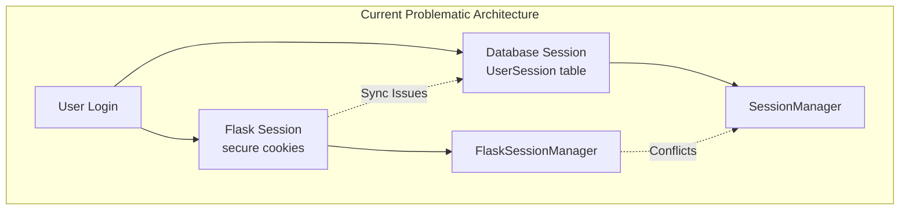
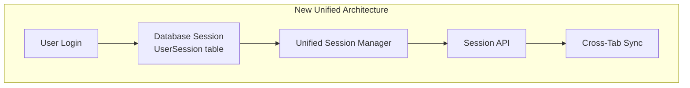
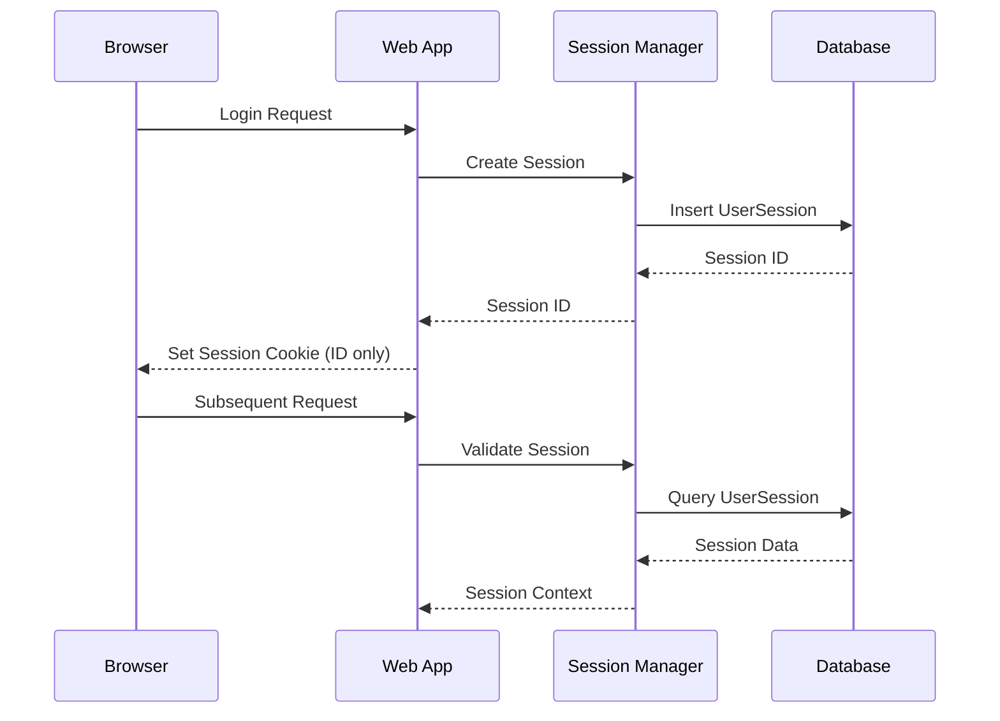

# Session Management Consolidation Design

## Overview

The current system uses both Flask sessions (secure cookies) and database sessions (UserSession table), creating complexity and potential conflicts. This design consolidates to use **database sessions exclusively** as the single source of truth for all session management, eliminating Flask session usage entirely.

## Architecture

### Current Dual Session Architecture (Problem)



### New Unified Database Session Architecture (Solution)



### Session Data Flow



## Components and Interfaces

### 1. Unified Session Manager

Replace both `SessionManager` and `FlaskSessionManager` with a single, comprehensive session manager:

```python
class UnifiedSessionManager:
    """Single session manager using database as source of truth"""
    
    def __init__(self, db_manager: DatabaseManager):
        self.db_manager = db_manager
        self.session_timeout = timedelta(hours=24)
    
    def create_session(self, user_id: int, platform_connection_id: int = None) -> str:
        """Create new database session and return session ID"""
        
    def get_session_context(self, session_id: str) -> Optional[Dict[str, Any]]:
        """Get complete session context from database"""
        
    def validate_session(self, session_id: str) -> bool:
        """Validate session exists and is not expired"""
        
    def update_session_activity(self, session_id: str) -> bool:
        """Update last activity timestamp"""
        
    def update_platform_context(self, session_id: str, platform_id: int) -> bool:
        """Update active platform for session"""
        
    def destroy_session(self, session_id: str) -> bool:
        """Remove session from database"""
        
    def cleanup_expired_sessions(self) -> int:
        """Remove expired sessions"""
```

### 2. Session Context Middleware

Replace Flask session access with database session context:

```python
class DatabaseSessionMiddleware:
    """Middleware to provide session context from database"""
    
    def __init__(self, app, session_manager: UnifiedSessionManager):
        self.app = app
        self.session_manager = session_manager
    
    def before_request(self):
        """Load session context before each request"""
        session_id = self.get_session_id_from_cookie()
        if session_id:
            g.session_context = self.session_manager.get_session_context(session_id)
            g.session_id = session_id
        else:
            g.session_context = None
            g.session_id = None
    
    def get_session_id_from_cookie(self) -> Optional[str]:
        """Extract session ID from secure cookie"""
        return request.cookies.get('session_id')
```

### 3. Session Cookie Management

Use minimal secure cookies to store only the session ID:

```python
class SessionCookieManager:
    """Manages secure session cookies containing only session ID"""
    
    def set_session_cookie(self, response, session_id: str):
        """Set secure session cookie with just the session ID"""
        response.set_cookie(
            'session_id',
            session_id,
            max_age=86400,  # 24 hours
            secure=True,
            httponly=True,
            samesite='Lax'
        )
    
    def clear_session_cookie(self, response):
        """Clear session cookie"""
        response.set_cookie('session_id', '', expires=0)
```

### 4. Session Context Access

Replace Flask session access with database session context:

```python
def get_current_session_context() -> Optional[Dict[str, Any]]:
    """Get current session context from g object"""
    return getattr(g, 'session_context', None)

def get_current_user_id() -> Optional[int]:
    """Get current user ID from session context"""
    context = get_current_session_context()
    return context.get('user_id') if context else None

def get_current_platform_id() -> Optional[int]:
    """Get current platform ID from session context"""
    context = get_current_session_context()
    return context.get('platform_connection_id') if context else None

def update_session_platform(platform_id: int) -> bool:
    """Update current session's platform context"""
    session_id = getattr(g, 'session_id', None)
    if session_id:
        return session_manager.update_platform_context(session_id, platform_id)
    return False
```

## Data Models

### Enhanced UserSession Model

The existing UserSession model will be the single source of truth:

```python
class UserSession(Base):
    """Enhanced user session model as single source of truth"""
    __tablename__ = 'user_sessions'
    
    id = Column(Integer, primary_key=True)
    session_id = Column(String(255), unique=True, nullable=False, index=True)
    user_id = Column(Integer, ForeignKey('users.id'), nullable=False, index=True)
    active_platform_id = Column(Integer, ForeignKey('platform_connections.id'), nullable=True)
    
    # Session metadata
    created_at = Column(DateTime, default=datetime.utcnow, nullable=False)
    updated_at = Column(DateTime, default=datetime.utcnow, onupdate=datetime.utcnow, nullable=False)
    last_activity = Column(DateTime, default=datetime.utcnow, nullable=False)
    expires_at = Column(DateTime, nullable=False)
    
    # Security and tracking
    is_active = Column(Boolean, default=True, nullable=False)
    session_fingerprint = Column(Text, nullable=True)
    user_agent = Column(Text, nullable=True)
    ip_address = Column(String(45), nullable=True)
    
    # Relationships
    user = relationship('User', backref='sessions')
    active_platform = relationship('PlatformConnection')
    
    def is_expired(self) -> bool:
        """Check if session is expired"""
        return datetime.utcnow() > self.expires_at
    
    def to_context_dict(self) -> Dict[str, Any]:
        """Convert session to context dictionary"""
        return {
            'session_id': self.session_id,
            'user_id': self.user_id,
            'platform_connection_id': self.active_platform_id,
            'created_at': self.created_at.isoformat(),
            'last_activity': self.last_activity.isoformat(),
            'user_info': {
                'id': self.user.id,
                'username': self.user.username,
                'email': self.user.email,
                'role': self.user.role.value
            } if self.user else None,
            'platform_info': {
                'id': self.active_platform.id,
                'name': self.active_platform.name,
                'platform_type': self.active_platform.platform_type,
                'instance_url': self.active_platform.instance_url,
                'is_default': self.active_platform.is_default
            } if self.active_platform else None
        }
```

## Error Handling

### Session Validation Errors

```python
class SessionValidationError(Exception):
    """Raised when session validation fails"""
    pass

class SessionExpiredError(SessionValidationError):
    """Raised when session has expired"""
    pass

class SessionNotFoundError(SessionValidationError):
    """Raised when session doesn't exist"""
    pass

def handle_session_error(error: SessionValidationError):
    """Handle session validation errors"""
    if isinstance(error, SessionExpiredError):
        # Clear cookie and redirect to login
        response = redirect(url_for('login'))
        session_cookie_manager.clear_session_cookie(response)
        flash('Your session has expired. Please log in again.', 'warning')
        return response
    elif isinstance(error, SessionNotFoundError):
        # Clear invalid cookie and redirect to login
        response = redirect(url_for('login'))
        session_cookie_manager.clear_session_cookie(response)
        flash('Please log in to continue.', 'info')
        return response
    else:
        # Generic session error
        flash('Session error occurred. Please try again.', 'error')
        return redirect(url_for('login'))
```

### Database Connection Errors

```python
@contextmanager
def database_session_context():
    """Context manager for database sessions with error handling"""
    db_session = db_manager.get_session()
    try:
        yield db_session
        db_session.commit()
    except SQLAlchemyError as e:
        db_session.rollback()
        logger.error(f"Database session error: {e}")
        raise SessionValidationError(f"Database error: {e}")
    finally:
        db_session.close()
```

## Testing Strategy

### Unit Tests

```python
class TestUnifiedSessionManager:
    def test_create_session(self):
        """Test session creation stores data in database only"""
        
    def test_get_session_context(self):
        """Test session context retrieval from database"""
        
    def test_validate_session_active(self):
        """Test validation of active session"""
        
    def test_validate_session_expired(self):
        """Test validation of expired session"""
        
    def test_update_platform_context(self):
        """Test platform context updates"""
        
    def test_cleanup_expired_sessions(self):
        """Test expired session cleanup"""

class TestSessionCookieManager:
    def test_set_session_cookie(self):
        """Test setting secure session cookie"""
        
    def test_clear_session_cookie(self):
        """Test clearing session cookie"""

class TestDatabaseSessionMiddleware:
    def test_load_session_context(self):
        """Test loading session context from database"""
        
    def test_handle_missing_session(self):
        """Test handling requests without session"""
        
    def test_handle_expired_session(self):
        """Test handling expired session"""
```

### Integration Tests

```python
class TestSessionConsolidation:
    def test_login_creates_database_session_only(self):
        """Test login creates only database session, no Flask session"""
        
    def test_session_context_available_across_requests(self):
        """Test session context persists across requests"""
        
    def test_platform_switching_updates_database(self):
        """Test platform switching updates database session"""
        
    def test_logout_clears_database_session(self):
        """Test logout removes database session"""
        
    def test_cross_tab_synchronization_works(self):
        """Test cross-tab sync works with database sessions"""
```

## Migration Strategy

### Phase 1: Preparation
1. Create unified session manager
2. Add session cookie management
3. Create database session middleware
4. Add session context access functions

### Phase 2: Implementation
1. Update login route to use unified session manager
2. Replace Flask session access with database session context
3. Update logout route to clear database sessions
4. Update platform switching to use database sessions

### Phase 3: Cleanup
1. Remove FlaskSessionManager class
2. Remove Flask session imports and usage
3. Remove Flask session configuration
4. Update tests to use database sessions only

### Phase 4: Validation
1. Run comprehensive tests
2. Verify cross-tab synchronization works
3. Validate session security
4. Performance testing

## Security Considerations

### Session Security
- **Secure Cookies**: Session ID stored in secure, httponly cookies
- **Session Expiration**: Configurable session timeout with automatic cleanup
- **Session Fingerprinting**: Optional fingerprinting for enhanced security
- **CSRF Protection**: Maintained through separate CSRF tokens

### Database Security
- **Encrypted Storage**: Sensitive session data encrypted at rest
- **Audit Trail**: Complete audit trail of session operations
- **Access Control**: Database-level access controls for session data
- **Session Isolation**: Each session isolated in database

## Performance Optimizations

### Database Performance
- **Indexed Queries**: Proper indexing on session_id and user_id
- **Connection Pooling**: Efficient database connection management
- **Batch Cleanup**: Bulk operations for expired session cleanup
- **Query Optimization**: Optimized queries for session validation

### Caching Strategy
- **Session Context Caching**: Cache session context for request duration
- **Platform Data Caching**: Cache platform information to reduce queries
- **Validation Caching**: Cache session validation results briefly

### Network Performance
- **Minimal Cookies**: Only session ID in cookies, not full session data
- **Compressed Responses**: Compress session API responses
- **Efficient Updates**: Only update database when session data changes

This design provides a clean, unified session management system that eliminates the complexity and conflicts of the dual session approach while maintaining all current functionality and improving security and maintainability.