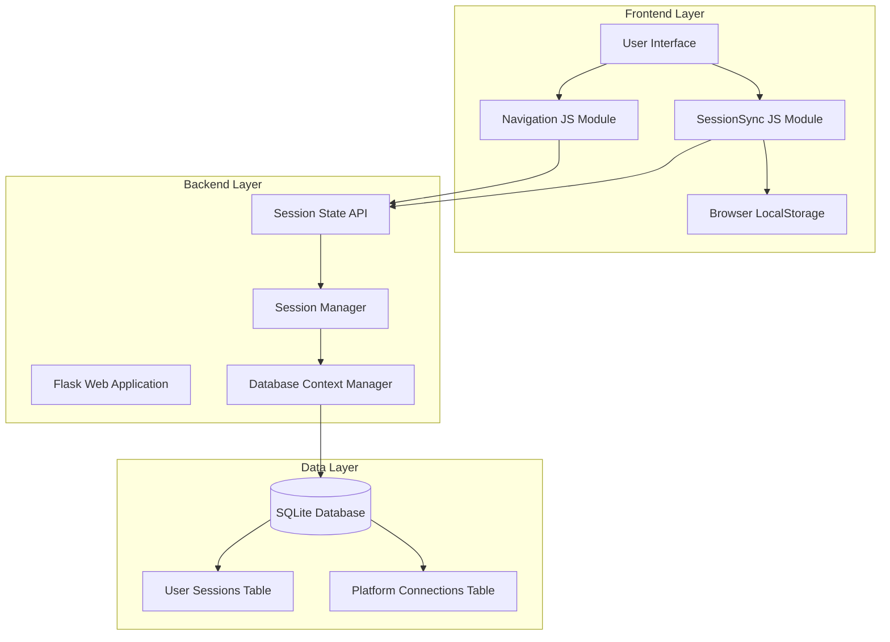
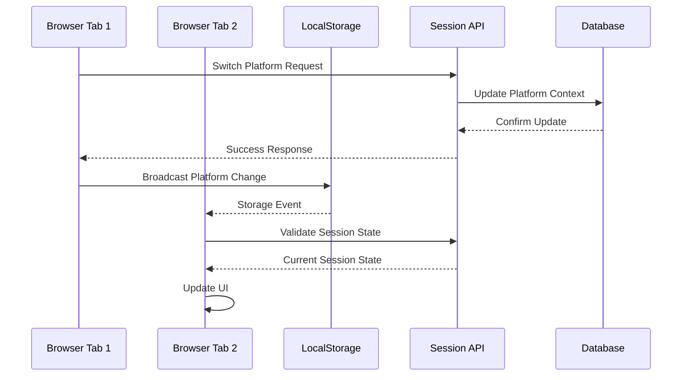

# Session Management System Design

## Overview

The Session Management System is a comprehensive solution that provides robust session handling, cross-tab synchronization, and platform context management for the Vedfolnir web application. The system ensures consistent user experience across multiple browser tabs while maintaining security, performance, and data integrity.

## Architecture

### High-Level Architecture



### Component Interaction Flow



## Components and Interfaces

### 1. Backend Components

#### SessionManager Class
```python
class SessionManager:
    """Manages user sessions with proper database lifecycle management"""
    
    @contextmanager
    def get_db_session(self):
        """Context manager for database sessions with automatic cleanup"""
        
    def create_user_session(self, user_id: int, platform_id: int) -> str:
        """Create new user session with platform context"""
        
    def validate_session(self, session_id: str) -> Optional[UserSession]:
        """Validate and return session if active"""
        
    def update_platform_context(self, session_id: str, platform_id: int) -> bool:
        """Update platform context for session"""
        
    def cleanup_expired_sessions(self) -> int:
        """Remove expired sessions and return count cleaned"""
```

#### Session State API Endpoint
```python
@app.route('/api/session_state', methods=['GET'])
@login_required
def api_session_state():
    """
    Returns current session state for cross-tab synchronization
    
    Response Format:
    {
        "success": true,
        "user": {
            "id": 123,
            "username": "user",
            "email": "user@example.com"
        },
        "platform": {
            "id": 456,
            "name": "Platform Name",
            "type": "pixelfed",
            "instance_url": "https://example.com",
            "is_default": true
        },
        "session_id": "session_uuid",
        "timestamp": "2025-01-09T12:00:00Z"
    }
    """
```

### 2. Frontend Components

#### SessionSync JavaScript Module
```javascript
class SessionSync {
    constructor() {
        this.tabId = this.generateTabId();
        this.syncInterval = 30000; // 30 seconds
        this.lastSyncTime = null;
        this.isOnline = navigator.onLine;
    }
    
    // Core synchronization methods
    syncSessionState()
    notifyPlatformSwitch(platformId, platformName)
    handleStorageEvent(event)
    validateSessionWithServer()
    
    // Event handling
    setupEventListeners()
    dispatchSessionEvent(eventType, data)
    
    // Utility methods
    generateTabId()
    isSessionExpired(timestamp)
    handleSessionExpiration()
}
```

#### Enhanced Navigation Module
```javascript
// Platform switching with race condition prevention
function switchPlatform(platformId, platformName) {
    // Prevent multiple simultaneous switches
    // Optimistic UI updates
    // Cross-tab notifications
    // Error handling with reversion
}

// UI update functions
function updatePlatformUI(platformId, platformName)
function revertPlatformUI()
function showPlatformError(message)
```

### 3. Data Models

#### UserSession Model Enhancement
```python
class UserSession(db.Model):
    __tablename__ = 'user_sessions'
    
    id = db.Column(db.Integer, primary_key=True)
    session_id = db.Column(db.String(255), unique=True, nullable=False)
    user_id = db.Column(db.Integer, db.ForeignKey('users.id'), nullable=False)
    active_platform_id = db.Column(db.Integer, db.ForeignKey('platform_connections.id'))
    created_at = db.Column(db.DateTime, default=datetime.utcnow)
    last_activity = db.Column(db.DateTime, default=datetime.utcnow)
    expires_at = db.Column(db.DateTime, nullable=False)
    is_active = db.Column(db.Boolean, default=True)
    user_agent = db.Column(db.Text)
    ip_address = db.Column(db.String(45))
    
    # Relationships
    user = db.relationship('User', backref='sessions')
    active_platform = db.relationship('PlatformConnection')
```

## Data Models

### Session State Storage

#### Database Schema
```sql
-- Enhanced user_sessions table
CREATE TABLE user_sessions (
    id INTEGER PRIMARY KEY AUTOINCREMENT,
    session_id VARCHAR(255) UNIQUE NOT NULL,
    user_id INTEGER NOT NULL,
    active_platform_id INTEGER,
    created_at DATETIME DEFAULT CURRENT_TIMESTAMP,
    last_activity DATETIME DEFAULT CURRENT_TIMESTAMP,
    expires_at DATETIME NOT NULL,
    is_active BOOLEAN DEFAULT 1,
    user_agent TEXT,
    ip_address VARCHAR(45),
    FOREIGN KEY (user_id) REFERENCES users(id),
    FOREIGN KEY (active_platform_id) REFERENCES platform_connections(id)
);

-- Indexes for performance
CREATE INDEX idx_user_sessions_session_id ON user_sessions(session_id);
CREATE INDEX idx_user_sessions_user_id ON user_sessions(user_id);
CREATE INDEX idx_user_sessions_expires_at ON user_sessions(expires_at);
```

#### LocalStorage Schema
```javascript
// Session synchronization data structure
const sessionSyncData = {
    tabId: "unique_tab_identifier",
    lastSync: "2025-01-09T12:00:00Z",
    sessionState: {
        userId: 123,
        platformId: 456,
        sessionId: "session_uuid"
    },
    events: [
        {
            type: "platform_switch",
            data: { platformId: 456, platformName: "New Platform" },
            timestamp: "2025-01-09T12:00:00Z",
            tabId: "originating_tab_id"
        }
    ]
};
```

## Error Handling

### Backend Error Handling

#### Database Session Errors
```python
@contextmanager
def get_db_session(self):
    """Context manager with comprehensive error handling"""
    db_session = self.db_manager.get_session()
    try:
        yield db_session
        db_session.commit()
    except SQLAlchemyError as e:
        db_session.rollback()
        logger.error(f"Database error: {e}")
        raise SessionDatabaseError(f"Database operation failed: {e}")
    except Exception as e:
        db_session.rollback()
        logger.error(f"Unexpected error in database session: {e}")
        raise SessionError(f"Session operation failed: {e}")
    finally:
        db_session.close()
```

#### API Error Responses
```python
# Standardized error response format
{
    "success": false,
    "error": "error_code",
    "message": "Human-readable error message",
    "details": {
        "timestamp": "2025-01-09T12:00:00Z",
        "request_id": "unique_request_id"
    }
}
```

### Frontend Error Handling

#### Session Sync Error Recovery
```javascript
class SessionSync {
    async handleSyncError(error) {
        console.error('Session sync error:', error);
        
        if (error.name === 'NetworkError') {
            // Handle offline scenarios
            this.handleOfflineMode();
        } else if (error.status === 401) {
            // Handle authentication errors
            this.handleSessionExpiration();
        } else {
            // Handle other errors with retry logic
            this.scheduleRetry();
        }
    }
    
    handleOfflineMode() {
        this.isOnline = false;
        this.showOfflineNotification();
        // Pause sync until online
    }
    
    handleSessionExpiration() {
        this.clearLocalSessionData();
        this.redirectToLogin();
    }
}
```

#### Platform Switch Error Handling
```javascript
function showPlatformError(message) {
    // Create dismissible error notification
    const errorDiv = document.createElement('div');
    errorDiv.className = 'alert alert-danger alert-dismissible fade show position-fixed';
    errorDiv.style.cssText = `
        top: 20px; right: 20px; z-index: 1060;
        min-width: 300px;
        box-shadow: 0 0.5rem 1rem rgba(0, 0, 0, 0.15);
    `;
    
    errorDiv.innerHTML = `
        <i class="bi bi-exclamation-triangle me-2"></i>${message}
        <button type="button" class="btn-close" data-bs-dismiss="alert"></button>
    `;
    
    document.body.appendChild(errorDiv);
    
    // Auto-remove after 5 seconds
    setTimeout(() => errorDiv.remove(), 5000);
}
```

## Testing Strategy

### Unit Testing

#### Backend Tests
```python
class TestSessionManager:
    def test_context_manager_success(self):
        """Test successful database operation with context manager"""
        
    def test_context_manager_error_rollback(self):
        """Test automatic rollback on database error"""
        
    def test_session_creation_with_platform(self):
        """Test creating session with platform context"""
        
    def test_session_validation(self):
        """Test session validation logic"""
        
    def test_expired_session_cleanup(self):
        """Test cleanup of expired sessions"""

class TestSessionAPI:
    def test_session_state_authenticated(self):
        """Test session state API with valid authentication"""
        
    def test_session_state_unauthenticated(self):
        """Test session state API without authentication"""
        
    def test_session_state_no_platform(self):
        """Test session state API with no active platform"""
```

#### Frontend Tests (Jest/Jasmine)
```javascript
describe('SessionSync', () => {
    test('should initialize with unique tab ID', () => {
        // Test tab ID generation
    });
    
    test('should sync session state across tabs', () => {
        // Test cross-tab synchronization
    });
    
    test('should handle storage events correctly', () => {
        // Test localStorage event handling
    });
    
    test('should validate session with server', () => {
        // Test server validation
    });
    
    test('should handle session expiration', () => {
        // Test expiration handling
    });
});

describe('Platform Switching', () => {
    test('should prevent race conditions', () => {
        // Test race condition prevention
    });
    
    test('should update UI optimistically', () => {
        // Test optimistic updates
    });
    
    test('should revert UI on error', () => {
        // Test error reversion
    });
});
```

### Integration Testing

#### Cross-Tab Synchronization Tests
```python
class TestCrossTabSync:
    def test_platform_switch_synchronization(self):
        """Test platform switch sync across multiple tabs"""
        
    def test_session_expiration_notification(self):
        """Test session expiration notification to all tabs"""
        
    def test_logout_synchronization(self):
        """Test logout synchronization across tabs"""
```

#### End-to-End Testing
```python
class TestSessionE2E:
    def test_complete_session_lifecycle(self):
        """Test complete session from login to logout"""
        
    def test_platform_switching_workflow(self):
        """Test complete platform switching workflow"""
        
    def test_session_recovery_after_error(self):
        """Test session recovery after various error scenarios"""
```

### Performance Testing

#### Load Testing
```python
class TestSessionPerformance:
    def test_concurrent_session_operations(self):
        """Test performance under concurrent session operations"""
        
    def test_database_connection_pool_efficiency(self):
        """Test database connection pool performance"""
        
    def test_cross_tab_sync_performance(self):
        """Test cross-tab synchronization performance"""
```

## Security Considerations

### Session Security
- **Session ID Generation**: Cryptographically secure random session IDs
- **Session Expiration**: Configurable session timeout with automatic cleanup
- **CSRF Protection**: Maintained for all state-changing operations
- **Secure Storage**: Sensitive data never stored in localStorage

### Cross-Tab Security
- **Data Sanitization**: Only non-sensitive data shared between tabs
- **Event Validation**: All cross-tab events validated before processing
- **Tab Isolation**: Each tab maintains its own security context
- **Automatic Logout**: All tabs logged out when session expires

### API Security
- **Authentication Required**: All session APIs require valid authentication
- **Rate Limiting**: Prevent abuse of session validation endpoints
- **Input Validation**: All API inputs validated and sanitized
- **Audit Logging**: All session operations logged for security monitoring

## Performance Optimizations

### Database Performance
- **Connection Pooling**: Efficient database connection management
- **Query Optimization**: Indexed queries for session lookups
- **Batch Operations**: Bulk session cleanup operations
- **Transaction Management**: Minimal transaction scope for better concurrency

### Frontend Performance
- **Debounced Operations**: Prevent excessive API calls
- **Optimistic Updates**: Immediate UI feedback
- **Efficient DOM Updates**: Minimal DOM manipulation
- **Memory Management**: Proper cleanup of event listeners and timers

### Network Performance
- **Request Batching**: Combine multiple session operations where possible
- **Caching Strategy**: Cache session state for reduced API calls
- **Compression**: Compress API responses for faster transfer
- **CDN Integration**: Static assets served from CDN

This design provides a robust, scalable, and secure session management system that addresses all the requirements while maintaining excellent user experience and system performance.