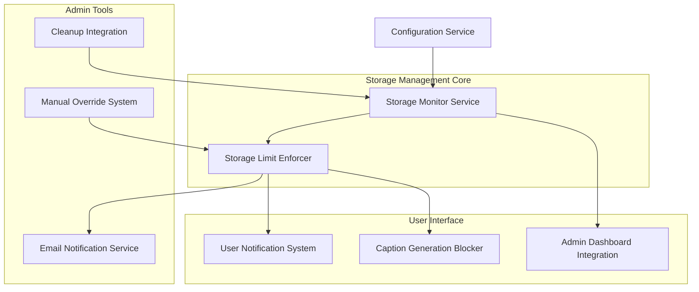

# Design Document

## Overview

The Storage Limit Management system provides automatic monitoring and enforcement of image storage limits for caption generation. It integrates with the existing configuration system, maintenance mode infrastructure, email notifications, and admin dashboard to provide a comprehensive storage management solution.

## Architecture

### System Components



### Integration Points

- **Configuration System**: Extends existing configuration management
- **Maintenance Mode**: Reuses notification patterns and UI components
- **Email Service**: Leverages existing email notification infrastructure
- **Admin Dashboard**: Integrates with existing admin monitoring systems
- **Cleanup Tools**: Connects with existing cleanup functionality

## Components and Interfaces

### 1. Storage Configuration Service

**Purpose**: Manages storage limit configuration and validation

**Interface**:
```python
class StorageConfigurationService:
    def get_max_storage_gb(self) -> float
    def validate_storage_config(self) -> bool
    def get_warning_threshold_gb(self) -> float  # 80% of limit
    def is_storage_monitoring_enabled(self) -> bool
```

**Configuration Variables**:
- `CAPTION_MAX_STORAGE_GB`: Maximum storage in GB (default: 10)
- `STORAGE_WARNING_THRESHOLD`: Warning threshold percentage (default: 80)
- `STORAGE_MONITORING_ENABLED`: Enable/disable monitoring (default: true)

### 2. Storage Monitor Service

**Purpose**: Monitors current storage usage and calculates metrics

**Interface**:
```python
class StorageMonitorService:
    def calculate_total_storage_bytes(self) -> int
    def get_storage_usage_gb(self) -> float
    def get_storage_usage_percentage(self) -> float
    def is_storage_limit_exceeded(self) -> bool
    def is_warning_threshold_exceeded(self) -> bool
    def get_storage_metrics(self) -> StorageMetrics
```

**Storage Calculation**:
- Scans `storage/images/` directory recursively
- Sums all image file sizes
- Caches results for 5 minutes to avoid excessive I/O
- Handles missing directories gracefully

### 3. Storage Limit Enforcer

**Purpose**: Enforces storage limits and coordinates responses

**Interface**:
```python
class StorageLimitEnforcer:
    def check_storage_before_generation(self) -> StorageCheckResult
    def block_caption_generation(self, reason: str) -> None
    def unblock_caption_generation(self) -> None
    def is_caption_generation_blocked(self) -> bool
    def get_block_reason(self) -> Optional[str]
    def trigger_limit_reached_actions(self) -> None
```

**Enforcement Logic**:
- Checks storage before each caption generation request
- Maintains blocking state in Redis (similar to maintenance mode)
- Automatically unblocks when storage drops below limit
- Logs all enforcement actions for audit

### 4. Storage Email Notification Service

**Purpose**: Sends email notifications to administrators

**Interface**:
```python
class StorageEmailNotificationService:
    def send_storage_limit_alert(self, metrics: StorageMetrics) -> bool
    def should_send_notification(self) -> bool  # Rate limiting
    def get_admin_email_list(self) -> List[str]
    def format_storage_alert_email(self, metrics: StorageMetrics) -> EmailContent
```

**Email Content**:
- Subject: "Vedfolnir Storage Limit Reached - Action Required"
- Current usage and limit information
- Direct link to admin cleanup page
- Suggested actions for administrators
- Rate limited to once per 24 hours

### 5. Storage User Notification System

**Purpose**: Displays storage limit notifications to users

**Interface**:
```python
class StorageUserNotificationSystem:
    def get_storage_notification_context(self) -> Optional[NotificationContext]
    def render_storage_limit_banner(self) -> str
    def should_hide_caption_form(self) -> bool
```

**UI Integration**:
- Reuses maintenance mode notification styling
- Displays on caption generation page when blocked
- Shows friendly message explaining temporary unavailability
- Hides caption generation form when blocked

### 6. Admin Dashboard Storage Integration

**Purpose**: Displays storage metrics in admin dashboard

**Interface**:
```python
class AdminStorageDashboard:
    def get_storage_dashboard_data(self) -> StorageDashboardData
    def get_storage_status_color(self) -> str  # green/yellow/red
    def format_storage_display(self) -> str
```

**Dashboard Elements**:
- Storage usage gauge (visual indicator)
- Current usage vs. limit display
- Storage status indicator with color coding
- Quick link to cleanup tools
- Override controls for administrators

### 7. Manual Override System

**Purpose**: Allows temporary override of storage limits

**Interface**:
```python
class StorageOverrideSystem:
    def activate_override(self, duration_hours: int, admin_user_id: int) -> bool
    def deactivate_override(self, admin_user_id: int) -> bool
    def is_override_active(self) -> bool
    def get_override_remaining_time(self) -> Optional[timedelta]
    def cleanup_expired_overrides(self) -> None
```

**Override Features**:
- Time-limited overrides (default 1 hour, max 24 hours)
- Audit logging of all override actions
- Automatic expiration and cleanup
- Admin-only access with role verification

## Data Models

### Storage Metrics Model

```python
@dataclass
class StorageMetrics:
    total_bytes: int
    total_gb: float
    limit_gb: float
    usage_percentage: float
    is_limit_exceeded: bool
    is_warning_exceeded: bool
    last_calculated: datetime
```

### Storage Override Model

```python
class StorageOverride(db.Model):
    id = db.Column(db.Integer, primary_key=True)
    admin_user_id = db.Column(db.Integer, db.ForeignKey('user.id'), nullable=False)
    activated_at = db.Column(db.DateTime, nullable=False)
    expires_at = db.Column(db.DateTime, nullable=False)
    duration_hours = db.Column(db.Integer, nullable=False)
    reason = db.Column(db.String(500))
    is_active = db.Column(db.Boolean, default=True)
    deactivated_at = db.Column(db.DateTime)
    deactivated_by_user_id = db.Column(db.Integer, db.ForeignKey('user.id'))
```

### Storage Event Log Model

```python
class StorageEventLog(db.Model):
    id = db.Column(db.Integer, primary_key=True)
    event_type = db.Column(db.String(50), nullable=False)  # limit_reached, override_activated, etc.
    storage_gb = db.Column(db.Float, nullable=False)
    limit_gb = db.Column(db.Float, nullable=False)
    user_id = db.Column(db.Integer, db.ForeignKey('user.id'))
    timestamp = db.Column(db.DateTime, default=datetime.utcnow)
    details = db.Column(db.JSON)
```

## Error Handling

### Storage Calculation Errors
- **Missing Directory**: Create directory if it doesn't exist, return 0 usage
- **Permission Errors**: Log error, use cached value if available
- **I/O Errors**: Retry once, then use cached value or default to safe mode (block generation)

### Email Notification Errors
- **SMTP Failures**: Log error, continue with blocking (don't fail silently)
- **Invalid Admin Emails**: Skip invalid emails, continue with valid ones
- **Rate Limiting**: Track last notification time in Redis

### Configuration Errors
- **Invalid Limit Values**: Use default value, log warning
- **Missing Configuration**: Use safe defaults, log warning
- **Type Conversion Errors**: Use default value, log error

### Override System Errors
- **Expired Overrides**: Automatically clean up, log cleanup actions
- **Invalid Admin Users**: Verify admin role before allowing overrides
- **Concurrent Overrides**: Allow only one active override at a time

## Testing Strategy

### Unit Tests
- **Storage Calculation**: Test with various directory structures and file sizes
- **Configuration Validation**: Test with valid/invalid configuration values
- **Email Formatting**: Test email content generation and formatting
- **Override Logic**: Test override activation, expiration, and cleanup

### Integration Tests
- **End-to-End Blocking**: Test complete flow from limit detection to user notification
- **Email Integration**: Test actual email sending (with test SMTP server)
- **Admin Dashboard**: Test dashboard display with various storage states
- **Cleanup Integration**: Test storage recalculation after cleanup operations

### Performance Tests
- **Storage Calculation Performance**: Test with large numbers of files
- **Caching Effectiveness**: Verify caching reduces I/O operations
- **Concurrent Access**: Test multiple simultaneous storage checks

### Security Tests
- **Admin Authorization**: Verify only admins can access override functionality
- **Input Validation**: Test configuration value validation and sanitization
- **Audit Logging**: Verify all administrative actions are logged

## Performance Considerations

### Storage Calculation Optimization
- **Caching**: Cache storage calculations for 5 minutes
- **Incremental Updates**: Track file changes when possible
- **Background Processing**: Consider background storage calculation for large installations

### Database Performance
- **Indexes**: Add indexes on storage event log timestamp and event type
- **Cleanup**: Regular cleanup of old storage event logs
- **Connection Pooling**: Reuse existing database connection pooling

### Memory Usage
- **Streaming Calculation**: Process large directories in chunks
- **Metric Caching**: Cache frequently accessed storage metrics
- **Cleanup**: Regular cleanup of expired override records

## Security Considerations

### Access Control
- **Admin-Only Overrides**: Verify admin role for all override operations
- **Audit Logging**: Log all storage-related administrative actions
- **Rate Limiting**: Prevent abuse of storage calculation endpoints

### Data Protection
- **Configuration Security**: Secure storage of configuration values
- **Email Security**: Secure email transmission and content
- **Log Security**: Protect storage event logs from unauthorized access

### Input Validation
- **Configuration Values**: Validate all storage configuration inputs
- **Override Parameters**: Validate override duration and reason inputs
- **File Path Security**: Prevent directory traversal in storage calculations