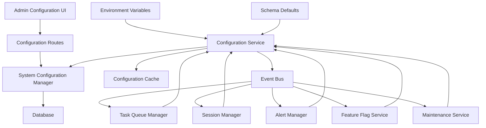

# Design Document

## Overview

This design implements a comprehensive configuration integration system that bridges the existing system configuration management interface with the application's runtime behavior. The solution uses a layered architecture with caching, event-driven updates, and graceful fallback mechanisms to ensure high performance and reliability.

## Architecture

### High-Level Architecture



### Component Interaction Flow

1. **Configuration Updates**: Admin UI → Routes → Configuration Manager → Database
2. **Configuration Access**: Services → Configuration Service → Cache/Database → Response
3. **Change Propagation**: Configuration Manager → Event Bus → Dependent Services
4. **Fallback Chain**: Environment Variables → Database → Schema Defaults

## Components and Interfaces

### 1. Configuration Service (`ConfigurationService`)

**Purpose**: Central service providing cached, high-performance access to configuration values with event-driven updates.

**Interface**:
```python
class ConfigurationService:
    def get_config(self, key: str, default: Any = None) -> Any
    def get_config_with_metadata(self, key: str) -> ConfigurationValue
    def refresh_config(self, key: str = None) -> bool
    def is_restart_required(self) -> bool
    def get_pending_restart_configs(self) -> List[str]
    def subscribe_to_changes(self, key: str, callback: Callable) -> str
    def unsubscribe(self, subscription_id: str) -> bool
```

**Key Features**:
- LRU cache with configurable TTL (default 300 seconds)
- Environment variable override support
- Schema default fallback
- Change event propagation
- Restart requirement tracking

### 2. Configuration Cache (`ConfigurationCache`)

**Purpose**: High-performance caching layer with intelligent invalidation.

**Interface**:
```python
class ConfigurationCache:
    def get(self, key: str) -> Optional[ConfigurationValue]
    def set(self, key: str, value: ConfigurationValue, ttl: int = None) -> None
    def invalidate(self, key: str) -> None
    def clear(self) -> None
    def get_stats(self) -> CacheStats
```

**Implementation**:
- In-memory LRU cache using `cachetools`
- Per-key TTL support
- Cache hit/miss metrics
- Thread-safe operations

### 3. Configuration Event Bus (`ConfigurationEventBus`)

**Purpose**: Decoupled event system for configuration change notifications.

**Interface**:
```python
class ConfigurationEventBus:
    def publish(self, event: ConfigurationChangeEvent) -> None
    def subscribe(self, key: str, callback: Callable) -> str
    def unsubscribe(self, subscription_id: str) -> bool
    def get_subscribers(self, key: str) -> List[str]
```

**Event Types**:
- `ConfigurationChangeEvent`: Configuration value updated
- `ConfigurationInvalidateEvent`: Cache invalidation required
- `RestartRequiredEvent`: Configuration requiring restart was changed

### 4. Service Integration Adapters

**Purpose**: Adapter classes that integrate existing services with the configuration system.

#### Task Queue Configuration Adapter
```python
class TaskQueueConfigurationAdapter:
    def __init__(self, task_queue: TaskQueueManager, config_service: ConfigurationService)
    def update_concurrency_limits(self) -> None
    def update_timeout_settings(self) -> None
    def handle_queue_limit_change(self, new_limit: int) -> None
```

#### Session Configuration Adapter
```python
class SessionConfigurationAdapter:
    def __init__(self, session_manager: SessionManager, config_service: ConfigurationService)
    def update_timeout_settings(self) -> None
    def update_security_settings(self) -> None
    def handle_rate_limit_change(self, new_limit: int) -> None
```

#### Alert Configuration Adapter
```python
class AlertConfigurationAdapter:
    def __init__(self, alert_manager: AlertManager, config_service: ConfigurationService)
    def update_thresholds(self) -> None
    def update_notification_channels(self) -> None
    def handle_threshold_change(self, threshold_type: str, new_value: Any) -> None
```

### 5. Feature Flag Service (`FeatureFlagService`)

**Purpose**: Centralized feature flag management with real-time updates.

**Interface**:
```python
class FeatureFlagService:
    def is_enabled(self, feature: str) -> bool
    def get_all_flags(self) -> Dict[str, bool]
    def refresh_flags(self) -> None
    def subscribe_to_flag_changes(self, feature: str, callback: Callable) -> str
```

**Features**:
- Real-time flag updates
- Graceful feature disabling
- Usage metrics collection

### 6. Maintenance Mode Service (`MaintenanceModeService`)

**Purpose**: Centralized maintenance mode control with immediate effect.

**Interface**:
```python
class MaintenanceModeService:
    def is_maintenance_mode(self) -> bool
    def get_maintenance_reason(self) -> str
    def enable_maintenance(self, reason: str) -> None
    def disable_maintenance(self) -> None
    def get_maintenance_status(self) -> MaintenanceStatus
```

## Data Models

### Configuration Value Model
```python
@dataclass
class ConfigurationValue:
    key: str
    value: Any
    data_type: str
    source: str  # 'environment', 'database', 'default'
    requires_restart: bool
    last_updated: datetime
    cached_at: datetime
    ttl: int
```

### Configuration Change Event
```python
@dataclass
class ConfigurationChangeEvent:
    key: str
    old_value: Any
    new_value: Any
    source: str
    timestamp: datetime
    requires_restart: bool
    admin_user_id: Optional[int]
```

### Cache Statistics
```python
@dataclass
class CacheStats:
    hits: int
    misses: int
    hit_rate: float
    total_keys: int
    memory_usage: int
    evictions: int
```

## Error Handling

### Error Hierarchy
```python
class ConfigurationError(Exception): pass
class ConfigurationNotFoundError(ConfigurationError): pass
class ConfigurationValidationError(ConfigurationError): pass
class ConfigurationCacheError(ConfigurationError): pass
class ConfigurationServiceUnavailableError(ConfigurationError): pass
```

### Error Handling Strategy

1. **Service Unavailable**: Fall back to cached values, then schema defaults
2. **Invalid Configuration**: Log error, use previous valid value
3. **Cache Errors**: Bypass cache, access database directly
4. **Database Errors**: Use environment variables, then schema defaults
5. **Validation Errors**: Reject change, maintain current value

### Graceful Degradation

1. **Configuration Service Down**: Services use last known values
2. **Database Unavailable**: Use environment variables and defaults
3. **Cache Failure**: Direct database access with performance impact
4. **Event Bus Failure**: Configuration updates still work, but no real-time propagation

## Testing Strategy

### Unit Tests

1. **Configuration Service Tests**
   - Cache hit/miss scenarios
   - Environment variable override
   - Schema default fallback
   - Event propagation

2. **Integration Adapter Tests**
   - Service integration points
   - Configuration change handling
   - Error scenarios

3. **Event Bus Tests**
   - Event publishing/subscribing
   - Subscription management
   - Error handling

### Integration Tests

1. **End-to-End Configuration Flow**
   - Admin UI → Database → Service → Application behavior
   - Configuration change propagation
   - Restart requirement handling

2. **Performance Tests**
   - Cache performance under load
   - Configuration access latency
   - Memory usage patterns

3. **Failure Scenario Tests**
   - Database unavailability
   - Cache failures
   - Service degradation

### Load Tests

1. **High-Frequency Configuration Access**
   - Concurrent configuration reads
   - Cache efficiency under load
   - Memory usage scaling

2. **Configuration Change Propagation**
   - Multiple simultaneous changes
   - Event bus performance
   - Service update latency

## Performance Considerations

### Caching Strategy

1. **Cache Size**: Default 1000 entries with LRU eviction
2. **TTL**: 300 seconds default, configurable per key type
3. **Refresh Strategy**: Lazy refresh on access + proactive refresh on change
4. **Memory Management**: Automatic eviction based on memory pressure

### Database Optimization

1. **Connection Pooling**: Reuse existing database connections
2. **Query Optimization**: Index on configuration key for fast lookups
3. **Batch Operations**: Group multiple configuration reads when possible
4. **Read Replicas**: Use read replicas for configuration access if available

### Event System Performance

1. **Async Processing**: Non-blocking event publishing
2. **Batching**: Group related events to reduce overhead
3. **Filtering**: Only notify relevant subscribers
4. **Circuit Breaker**: Prevent cascade failures in event processing

## Security Considerations

### Access Control

1. **Service-Level Security**: Configuration service requires proper authentication
2. **Sensitive Configuration**: Special handling for sensitive values (passwords, keys)
3. **Audit Logging**: All configuration access and changes logged
4. **Rate Limiting**: Prevent abuse of configuration APIs

### Data Protection

1. **Encryption**: Sensitive configurations encrypted at rest
2. **Secure Transport**: All configuration data transmitted over secure channels
3. **Access Logging**: Detailed logs of who accessed what configuration when
4. **Change Approval**: Critical configurations require additional approval

### Validation and Sanitization

1. **Input Validation**: All configuration values validated before storage
2. **Type Safety**: Strong typing for configuration values
3. **Range Checking**: Numeric values validated against acceptable ranges
4. **Dependency Validation**: Check for configuration conflicts

## Deployment Strategy

### Phase 1: Core Infrastructure
1. Implement `ConfigurationService` with basic caching
2. Create event bus system
3. Add configuration validation layer
4. Implement fallback mechanisms

### Phase 2: Service Integration
1. Integrate task queue management
2. Connect session management
3. Implement maintenance mode service
4. Add feature flag support

### Phase 3: Advanced Features
1. Add alert system integration
2. Implement performance monitoring
3. Add configuration impact analysis
4. Create admin interface enhancements

### Phase 4: Optimization and Monitoring
1. Performance tuning based on metrics
2. Advanced caching strategies
3. Comprehensive monitoring dashboard
4. Documentation and training materials

## Monitoring and Observability

### Metrics Collection

1. **Configuration Access Metrics**
   - Access frequency per key
   - Cache hit/miss ratios
   - Response times

2. **Change Impact Metrics**
   - Configuration change frequency
   - Service restart requirements
   - Error rates after changes

3. **Performance Metrics**
   - Memory usage
   - CPU impact
   - Database query performance

### Alerting

1. **Configuration Service Health**
   - Service availability
   - High error rates
   - Cache performance degradation

2. **Configuration Change Alerts**
   - Critical configuration changes
   - Invalid configuration attempts
   - Restart-required configurations pending

### Dashboards

1. **Configuration Usage Dashboard**
   - Most accessed configurations
   - Cache performance
   - Service health status

2. **Change Management Dashboard**
   - Recent configuration changes
   - Pending restart requirements
   - Change impact analysis

This design provides a robust, scalable, and maintainable solution for integrating system configuration management throughout the application while maintaining high performance and reliability.