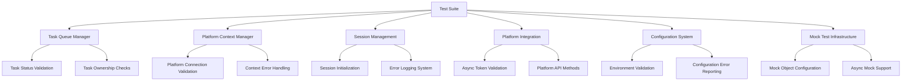

# Design Document

## Overview

This design addresses the systematic fixing of 54 test failures and errors across the comprehensive test suite. The failures span multiple system components including task queue management, platform context handling, session management, mock object configuration, platform integration, configuration validation, performance testing, and error handling. The solution involves targeted fixes to each component while maintaining system integrity and improving test reliability.

## Architecture

### Test Failure Categories and Root Causes

The test failures can be categorized into 8 main areas:

1. **Task Queue Management Issues**: Mock object configuration problems in task status validation and ownership checks
2. **Platform Context Management**: Missing validation and error handling for invalid platform connections
3. **Session Management**: Initialization and error logging interference with test execution
4. **Mock Object Handling**: Improper async mock configuration and tuple unpacking support
5. **Platform Integration**: Async token validation and API method selection issues
6. **Configuration Validation**: Missing environment variable validation and error reporting
7. **Performance Testing**: Task conflict resolution and concurrent operation handling
8. **Error Handling**: Platform switching error recovery and mock object error reporting

### System Components Affected



## Components and Interfaces

### 1. Task Queue Manager Fixes

**Interface**: `TaskQueueManager`
- **Issue**: Mock objects not properly configured for task status validation
- **Solution**: Fix mock object setup in tests to properly simulate database query chains
- **Key Methods**:
  - `cancel_task()`: Fix mock status validation
  - `complete_task()`: Handle nonexistent task scenarios
  - Task ownership validation: Improve error handling

### 2. Platform Context Manager Enhancements

**Interface**: `PlatformContextManager`
- **Issue**: Missing validation for platform connection existence and activity
- **Solution**: Add comprehensive validation and error handling
- **Key Methods**:
  - `set_context()`: Add platform connection validation
  - `switch_platform()`: Improve error handling for invalid connections
  - `require_context()`: Add SQL injection prevention

### 3. Session Management Stability

**Interface**: `SessionManager` and related components
- **Issue**: Session initialization interfering with test execution
- **Solution**: Isolate session initialization from test environment
- **Key Components**:
  - Session error logging: Prevent test interference
  - Session state management: Handle concurrent sessions
  - Authentication flow: Improve error handling

### 4. Mock Object Infrastructure

**Interface**: Test helper utilities
- **Issue**: Mock objects not configured for async operations and tuple unpacking
- **Solution**: Create standardized mock configurations
- **Key Features**:
  - Async mock support: Configure `AsyncMock` for async operations
  - Tuple unpacking: Configure mock objects to support unpacking
  - Database query mocks: Proper chain configuration

### 5. Platform Integration Reliability

**Interface**: Platform adapters and API clients
- **Issue**: Async token validation and incorrect API method usage
- **Solution**: Fix async handling and API method selection
- **Key Components**:
  - Mastodon token validation: Proper async mock configuration
  - Media caption updates: Use correct API methods per platform
  - Platform detection: Improve error reporting for unknown platforms

### 6. Configuration Validation System

**Interface**: Configuration validators
- **Issue**: Missing validation for required configuration parameters
- **Solution**: Comprehensive configuration validation with clear error messages
- **Key Features**:
  - Environment variable validation: Check all required variables
  - Configuration error reporting: Specific error messages
  - Validation recovery: Provide guidance for fixing issues

### 7. Performance Test Isolation

**Interface**: Performance test utilities
- **Issue**: Test conflicts with existing active tasks
- **Solution**: Proper test isolation and cleanup
- **Key Features**:
  - Task conflict resolution: Prevent concurrent task conflicts
  - Test user isolation: Separate test users from production data
  - Performance monitoring: Non-interfering monitoring

### 8. Error Handling Robustness

**Interface**: Error handling utilities
- **Issue**: Platform switching errors and mock object error handling
- **Solution**: Comprehensive error handling with recovery mechanisms
- **Key Features**:
  - Platform switching recovery: Handle switching failures gracefully
  - Mock object error reporting: Clear error messages for mock issues
  - Database error recovery: Maintain data integrity during failures

## Data Models

### Test Failure Tracking

```python
@dataclass
class TestFailure:
    test_suite: str
    test_name: str
    failure_type: str  # 'failure' or 'error'
    error_message: str
    component: str
    fix_priority: int
```

### Mock Configuration Standards

```python
@dataclass
class MockConfiguration:
    mock_type: str  # 'sync', 'async', 'database_query'
    return_value: Any
    side_effect: Optional[callable]
    supports_unpacking: bool = False
    async_support: bool = False
```

### Platform Context Validation

```python
@dataclass
class PlatformContextValidation:
    user_id: int
    platform_connection_id: Optional[int]
    validation_errors: List[str]
    is_valid: bool
    recovery_suggestions: List[str]
```

## Error Handling

### Test Failure Recovery Strategy

1. **Immediate Fixes**: Address critical failures that prevent test execution
2. **Mock Object Standardization**: Implement consistent mock configurations
3. **Validation Enhancement**: Add comprehensive input validation
4. **Error Message Improvement**: Provide clear, actionable error messages
5. **Test Isolation**: Ensure tests don't interfere with each other

### Error Categories and Handling

```python
class TestFixErrorHandler:
    def handle_mock_error(self, error: MockError) -> MockFix
    def handle_platform_error(self, error: PlatformError) -> PlatformFix
    def handle_session_error(self, error: SessionError) -> SessionFix
    def handle_config_error(self, error: ConfigError) -> ConfigFix
```

## Testing Strategy

### Test Fix Validation

1. **Unit Test Fixes**: Fix individual test failures
2. **Integration Test Validation**: Ensure fixes don't break integration
3. **Mock Object Testing**: Validate mock configurations work correctly
4. **Error Handling Testing**: Test error scenarios and recovery
5. **Performance Test Isolation**: Ensure performance tests don't interfere

### Test Suite Organization

```
tests/
├── unit/                    # Fixed unit tests
├── integration/            # Integration test fixes
├── security/               # Security test improvements
├── performance/            # Performance test isolation
├── web/                    # Web interface test fixes
├── error_handling/         # Error handling test improvements
├── platform/               # Platform integration fixes
├── config/                 # Configuration validation fixes
└── fixtures/               # Standardized test fixtures
    ├── mock_configs/       # Mock object configurations
    ├── test_data/          # Test data sets
    └── helpers/            # Test helper utilities
```

### Mock Object Standards

1. **Database Query Mocks**: Standardized query chain configurations
2. **Async Operation Mocks**: Proper `AsyncMock` usage
3. **Platform API Mocks**: Realistic platform behavior simulation
4. **Session Management Mocks**: Isolated session handling
5. **Configuration Mocks**: Environment variable simulation

## Implementation Phases

### Phase 1: Critical Fixes (High Priority)
- Task queue manager mock fixes
- Platform context validation
- Session management isolation
- Mock object standardization

### Phase 2: Integration Improvements (Medium Priority)
- Platform integration async fixes
- Configuration validation enhancement
- Error handling robustness
- Performance test isolation

### Phase 3: Test Infrastructure (Low Priority)
- Test helper utilities
- Mock configuration standards
- Test data management
- Documentation updates

## Success Criteria

1. **Test Pass Rate**: Achieve 100% test pass rate across all suites
2. **Test Reliability**: Tests pass consistently across multiple runs
3. **Error Clarity**: Clear, actionable error messages for all failures
4. **Test Isolation**: Tests don't interfere with each other or production data
5. **Mock Accuracy**: Mock objects accurately simulate real system behavior
6. **Performance**: Test execution time remains reasonable
7. **Maintainability**: Test fixes are maintainable and well-documented