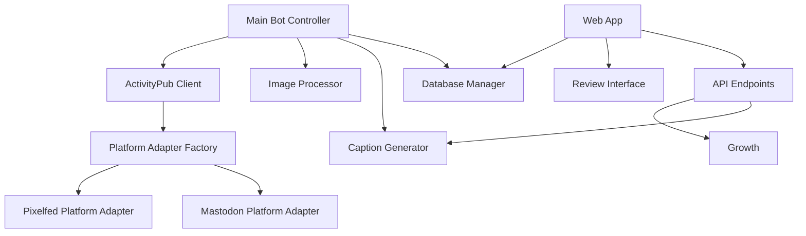
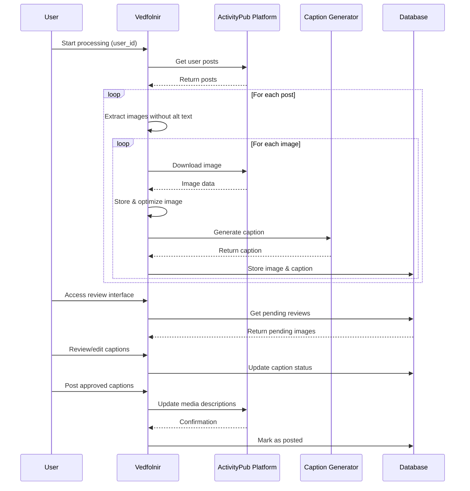

# Design Document: Vedfolnir

## Overview

The Vedfolnir is a system designed to enhance accessibility on ActivityPub platforms (Pixelfed and Mastodon) by automatically generating and managing alt text for images that lack descriptions. The system identifies posts with missing alt text, uses AI to generate appropriate descriptions, provides a human review interface, and updates the original posts with approved descriptions.

This design document outlines the architecture, components, data models, and workflows of the Vedfolnir system based on the existing implementation, with multi-platform support and suggestions for improvements and extensions.

## Architecture

The Vedfolnir follows a modular architecture with clear separation of concerns:



### Core Components

1. **Main Bot Controller** (`Vedfolnir` class in `main.py`): Orchestrates the overall process flow, managing the interaction between other components.

2. **ActivityPub Client** (`ActivityPubClient` class in `activitypub_client.py`): Handles communication with ActivityPub platforms (Pixelfed and Mastodon) via platform-specific adapters and APIs.

3. **Platform Adapters**: Provide platform-specific implementations for different ActivityPub servers:
   - **Pixelfed Platform Adapter**: Handles Pixelfed-specific API calls and data formats
   - **Mastodon Platform Adapter**: Handles Mastodon-specific API calls and OAuth2 authentication

4. **Image Processor** (`ImageProcessor` class in `image_processor.py`): Manages downloading, storing, and optimizing images.

5. **Caption Generator** (`OllamaCaptionGenerator` class in `ollama_caption_generator.py`): Generates alt text captions using the Ollama API with the LLaVA model.

6. **Database Manager** (`DatabaseManager` class in `database.py`): Handles all database operations, including storing posts, images, captions, and processing runs.

7. **Web Application** (`web_app.py`): Provides a web interface for reviewing and managing captions, with both single-image and batch review capabilities.

### System Flow



## Components and Interfaces

### 1. Main Bot Controller

The `Vedfolnir` class serves as the main controller, orchestrating the workflow:

- **Responsibilities**:
  - Initialize and coordinate other components
  - Track processing statistics
  - Handle error recovery and logging
  - Create and update processing run records

- **Key Methods**:
  - `run(user_id)`: Main entry point for processing a user's posts
  - `_process_post(post)`: Process a single post for alt text generation
  - `_process_image(image_info)`: Process a single image to generate alt text

- **Improvements**:
  - Add support for processing multiple users in a single run
  - Implement retry mechanisms for failed operations
  - Add support for scheduled runs via cron or similar

### 2. ActivityPub Client

The `ActivityPubClient` class handles communication with ActivityPub platforms through platform-specific adapters:

- **Responsibilities**:
  - Coordinate with platform adapters for authentication
  - Retrieve user posts through platform adapters
  - Extract images without alt text using platform-specific parsers
  - Update media descriptions via platform adapters

- **Key Methods**:
  - `get_user_posts(user_id, limit)`: Retrieve posts from a specific user
  - `extract_images_from_post(post)`: Extract images without alt text
  - `update_media_caption(image_post_id, caption)`: Update alt text on the platform

- **Improvements**:
  - ✅ Multi-platform support through adapter pattern
  - Implement rate limiting to avoid API throttling
  - Add pagination support for retrieving more than the API limit of posts

### 2.1. Platform Adapter Architecture

The system uses a platform adapter pattern to support multiple ActivityPub platforms:

#### Base Platform Interface

```python
class ActivityPubPlatform(ABC):
    @abstractmethod
    async def authenticate(self) -> bool:
        """Authenticate with the platform"""
        pass
    
    @abstractmethod
    async def get_user_posts(self, user_id: str, limit: int = 20) -> List[Dict]:
        """Get user posts from the platform"""
        pass
    
    @abstractmethod
    def extract_images_from_post(self, post: Dict) -> List[Dict]:
        """Extract images without alt text from a post"""
        pass
    
    @abstractmethod
    async def update_media_description(self, media_id: str, description: str) -> bool:
        """Update media description on the platform"""
        pass
    
    @abstractmethod
    def get_rate_limit_info(self, response_headers: Dict) -> Dict:
        """Extract rate limit information from response headers"""
        pass
```

#### Pixelfed Platform Adapter

- **Authentication**: Uses existing Pixelfed access token method
- **API Endpoints**: Current Pixelfed-specific endpoints
- **Media Format**: Existing Pixelfed media attachment parsing
- **Rate Limiting**: Current Pixelfed rate limit handling

#### Mastodon Platform Adapter

- **Authentication**: OAuth2 client credentials + access token
- **API Endpoints**: 
  - User posts: `/api/v1/accounts/{id}/statuses`
  - Media update: `/api/v1/media/{id}`
  - Account lookup: `/api/v1/accounts/lookup?acct={username}`
- **Media Format**: Mastodon media attachment JSON structure
- **Rate Limiting**: Mastodon `X-RateLimit-*` headers

#### Platform Detection and Factory

```python
class PlatformAdapterFactory:
    @staticmethod
    def create_adapter(config) -> ActivityPubPlatform:
        platform_type = config.activitypub_api_type
        if platform_type == 'mastodon':
            return MastodonPlatform(config)
        elif platform_type == 'pixelfed':
            return PixelfedPlatform(config)
        else:
            raise ValueError(f"Unsupported platform: {platform_type}")
```

### 3. Image Processor

The `ImageProcessor` class handles image downloading and processing:

- **Responsibilities**:
  - Download images from URLs
  - Store images locally with consistent naming
  - Optimize images for processing
  - Extract image metadata

- **Key Methods**:
  - `download_and_store_image(url, media_type)`: Download and store an image
  - `_optimize_image(image_path)`: Optimize an image for storage and processing
  - `get_image_info(image_path)`: Get information about an image

- **Improvements**:
  - Add support for more image formats
  - Implement better error handling for corrupted images
  - Add image validation to ensure only valid images are processed

### 4. Caption Generator

The `OllamaCaptionGenerator` class generates alt text using Ollama with LLaVA:

- **Responsibilities**:
  - Connect to Ollama API
  - Generate captions for images
  - Clean and format captions for accessibility

- **Key Methods**:
  - `generate_caption(image_path, prompt)`: Generate a caption for an image
  - `_clean_caption(caption)`: Clean and format the generated caption
  - `generate_multiple_captions(image_paths)`: Generate captions for multiple images

- **Improvements**:
  - Add support for alternative AI models
  - Implement prompt templates for different types of images
  - Add caption quality assessment
  - Implement fallback models when primary model fails

### 5. Database Manager

The `DatabaseManager` class handles all database operations:

- **Responsibilities**:
  - Create and manage database schema
  - Store posts, images, and captions
  - Track processing status
  - Provide statistics and reporting

- **Key Methods**:
  - `get_or_create_post(post_id, user_id, post_url, post_content)`: Get or create a post record
  - `save_image(post_id, image_url, local_path, ...)`: Save an image record
  - `review_image(image_id, reviewed_caption, status, reviewer_notes)`: Update image with review results
  - `get_processing_stats()`: Get processing statistics

- **Improvements**:
  - Add database migrations for schema updates
  - Implement connection pooling for better performance
  - Add indexes for frequently queried fields
  - Implement periodic cleanup of old data

### 6. Web Application

The Flask web application provides a user interface for reviewing and managing captions:

- **Responsibilities**:
  - Display pending reviews
  - Allow caption editing and approval
  - Provide batch review capabilities
  - Display statistics and system status

- **Key Routes**:
  - `/`: Main dashboard with statistics
  - `/review`: List of images pending review
  - `/review/<image_id>`: Single image review interface
  - `/batch_review`: Batch review interface
  - `/post_approved`: Post approved captions to Pixelfed

- **Improvements**:
  - Add user authentication for the web interface
  - Implement a more responsive UI with modern frameworks
  - Add filtering and sorting options for reviews
  - Implement a queue system for processing large batches

## Data Models

The system uses SQLAlchemy ORM with the following key models:

### Post

Represents a Pixelfed post:

- `id`: Primary key
- `post_id`: Unique identifier from Pixelfed
- `user_id`: User who created the post
- `post_url`: URL to the post
- `post_content`: Text content of the post
- `created_at`, `updated_at`: Timestamps
- Relationship to `Image` models

### Image

Represents an image from a post:

- `id`: Primary key
- `post_id`: Foreign key to Post
- `image_url`: Original URL of the image
- `local_path`: Path to stored image file
- `image_post_id`: Pixelfed ID for updating descriptions
- `attachment_index`: Position in the post's attachments
- `original_caption`: Original alt text if any
- `generated_caption`: AI-generated caption
- `reviewed_caption`: Human-reviewed caption
- `final_caption`: Final caption to be posted
- `status`: Processing status (PENDING, REVIEWED, APPROVED, REJECTED, POSTED, ERROR)
- `created_at`, `updated_at`, `reviewed_at`, `posted_at`: Timestamps
- `reviewer_notes`: Notes from the reviewer
- `processing_error`: Error information if applicable

### ProcessingRun

Represents a single execution of the bot:

- `id`: Primary key
- `user_id`: User being processed
- `started_at`, `completed_at`: Timestamps
- `posts_processed`, `images_processed`, `captions_generated`, `errors_count`: Statistics
- `status`: Run status (running, completed, error)

## Error Handling

The system implements comprehensive error handling:

1. **Component-level error handling**: Each component catches and logs exceptions to prevent cascading failures.
2. **Database transaction management**: All database operations use proper transaction handling with commit/rollback.
3. **API error handling**: API calls include error handling with appropriate status codes and messages.
4. **Logging**: Detailed logging at different levels (INFO, WARNING, ERROR) for troubleshooting.

## Testing Strategy

The testing strategy should include:

1. **Unit Tests**: Test individual components in isolation
   - Test caption generation with sample images
   - Test image processing functions
   - Test database operations

2. **Integration Tests**: Test component interactions
   - Test the full workflow with mock Pixelfed API
   - Test database interactions across components

3. **End-to-End Tests**: Test the complete system
   - Test with a test Pixelfed instance
   - Test the web interface with Selenium or similar

4. **Performance Testing**: Ensure the system can handle the expected load
   - Test with a large number of posts and images
   - Test concurrent web interface usage

## Security Considerations

1. **API Authentication**: Secure storage and use of Pixelfed API tokens
2. **Web Interface Security**: Implement authentication for the web interface
3. **Input Validation**: Validate all user inputs to prevent injection attacks
4. **File Security**: Ensure uploaded files are properly validated and stored securely
5. **Database Security**: Use parameterized queries to prevent SQL injection

## Deployment Considerations

1. **Environment Configuration**: Use environment variables for configuration
2. **Containerization**: Package the application in Docker for easy deployment
3. **Scheduled Execution**: Set up cron jobs or similar for regular processing
4. **Monitoring**: Implement health checks and monitoring
5. **Backup Strategy**: Regular database backups

## Future Enhancements

1. **User Preferences**: Allow users to set preferences for caption style and content
2. **Automatic Quality Assessment**: Automatically assess caption quality before human review
3. **Bulk Processing**: Add support for bulk processing of historical posts
4. **Caption Templates**: Provide templates for different types of images
5. **Accessibility Guidelines**: Enforce accessibility guidelines in captions