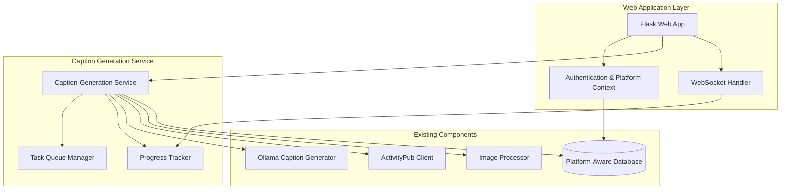

# Design Document

## Overview

This design integrates caption generation functionality directly into the Flask web application, transforming it from a command-line only tool to a web-based service. The system will leverage the existing platform-aware database architecture to use stored credentials instead of environment variables, and provide real-time progress monitoring through WebSocket connections.

## Architecture

### High-Level Architecture



### Component Integration

The design builds upon the existing platform-aware database system and integrates with current components:

- **Platform Context**: Uses existing `SessionManager` and `PlatformContextMiddleware`
- **Database**: Leverages existing `PlatformConnection` model for credentials
- **Caption Generation**: Wraps existing `OllamaCaptionGenerator` and related components
- **Security**: Integrates with existing `SecurityMiddleware` and authentication

## Components and Interfaces

### 1. Web Caption Generation Service

**Purpose**: Core service that orchestrates caption generation for web requests

**Interface**:
```python
class WebCaptionGenerationService:
    async def start_caption_generation(
        self, 
        user_id: int, 
        platform_connection_id: int,
        settings: CaptionGenerationSettings
    ) -> str  # Returns task_id
    
    def get_generation_status(self, task_id: str) -> GenerationStatus
    
    def cancel_generation(self, task_id: str) -> bool
    
    async def get_generation_results(self, task_id: str) -> GenerationResults
```

**Key Responsibilities**:
- Validate user permissions and platform access
- Create isolated caption generation tasks
- Manage task lifecycle and cleanup
- Coordinate with existing caption generation components

### 2. Task Queue Manager

**Purpose**: Manages concurrent caption generation requests and prevents resource conflicts

**Interface**:
```python
class TaskQueueManager:
    def enqueue_task(self, task: CaptionGenerationTask) -> str
    
    def get_task_status(self, task_id: str) -> TaskStatus
    
    def cancel_task(self, task_id: str) -> bool
    
    def cleanup_completed_tasks(self, older_than_hours: int = 24)
```

**Key Features**:
- Single task per user enforcement
- Priority queuing for admin users
- Automatic cleanup of completed tasks
- Resource usage monitoring

### 3. Progress Tracking System

**Purpose**: Provides real-time updates on caption generation progress

**Interface**:
```python
class ProgressTracker:
    def create_progress_session(self, task_id: str, user_id: int) -> str
    
    def update_progress(
        self, 
        task_id: str, 
        current_step: str, 
        progress_percent: int,
        details: Dict[str, Any]
    )
    
    def get_progress(self, task_id: str) -> ProgressStatus
    
    def complete_progress(self, task_id: str, results: GenerationResults)
```

### 4. WebSocket Progress Handler

**Purpose**: Delivers real-time progress updates to the web interface

**Interface**:
```python
class WebSocketProgressHandler:
    def connect(self, task_id: str, user_id: int) -> bool
    
    def broadcast_progress(self, task_id: str, progress_data: Dict)
    
    def disconnect(self, task_id: str, user_id: int)
```

### 5. Platform-Aware Caption Generator Adapter

**Purpose**: Adapts existing caption generation logic to work with database-stored credentials

**Interface**:
```python
class PlatformAwareCaptionAdapter:
    def __init__(self, platform_connection: PlatformConnection)
    
    async def generate_captions_for_user(
        self, 
        settings: CaptionGenerationSettings,
        progress_callback: Callable
    ) -> GenerationResults
```

## Data Models

### Caption Generation Task

```python
class CaptionGenerationTask(Base):
    __tablename__ = 'caption_generation_tasks'
    
    id = Column(String, primary_key=True)  # UUID
    user_id = Column(Integer, ForeignKey('users.id'), nullable=False)
    platform_connection_id = Column(Integer, ForeignKey('platform_connections.id'), nullable=False)
    status = Column(Enum(TaskStatus), default=TaskStatus.QUEUED)
    settings_json = Column(Text)  # Serialized CaptionGenerationSettings
    created_at = Column(DateTime, default=datetime.utcnow)
    started_at = Column(DateTime)
    completed_at = Column(DateTime)
    error_message = Column(Text)
    results_json = Column(Text)  # Serialized GenerationResults
```

### Caption Generation Settings

```python
@dataclass
class CaptionGenerationSettings:
    max_posts_per_run: int = 50
    max_caption_length: int = 500
    optimal_min_length: int = 80
    optimal_max_length: int = 200
    reprocess_existing: bool = False
    processing_delay: float = 1.0
```

### Generation Results

```python
@dataclass
class GenerationResults:
    task_id: str
    posts_processed: int
    images_processed: int
    captions_generated: int
    errors_count: int
    skipped_existing: int
    processing_time_seconds: float
    error_details: List[Dict[str, Any]]
    generated_image_ids: List[int]
```

## Error Handling

### Error Categories

1. **Authentication Errors**: Invalid user session, expired platform credentials
2. **Platform Errors**: API rate limits, network connectivity issues
3. **Resource Errors**: Ollama service unavailable, disk space issues
4. **Validation Errors**: Invalid settings, missing required parameters

### Error Recovery Strategy

```python
class ErrorRecoveryManager:
    def handle_platform_error(self, error: PlatformError, task: CaptionGenerationTask):
        # Retry with exponential backoff
        # Update task status with retry information
        # Notify user of temporary issues
    
    def handle_resource_error(self, error: ResourceError, task: CaptionGenerationTask):
        # Queue task for later retry
        # Notify administrators of resource issues
        # Provide user with estimated retry time
    
    def handle_validation_error(self, error: ValidationError, task: CaptionGenerationTask):
        # Mark task as failed immediately
        # Provide detailed feedback to user
        # Log for debugging purposes
```

## Testing Strategy

### Unit Tests

- **Service Layer**: Test caption generation service logic in isolation
- **Queue Management**: Test task queuing, prioritization, and cleanup
- **Progress Tracking**: Test progress updates and WebSocket delivery
- **Platform Integration**: Test credential retrieval and API client creation

### Integration Tests

- **End-to-End Flow**: Test complete caption generation workflow
- **Platform Switching**: Test generation with different platform connections
- **Concurrent Users**: Test multiple users generating captions simultaneously
- **Error Scenarios**: Test various failure modes and recovery

### Performance Tests

- **Load Testing**: Test system behavior under multiple concurrent requests
- **Memory Usage**: Monitor memory consumption during long-running tasks
- **Database Performance**: Test query performance with large datasets

### Security Tests

- **Authorization**: Test user can only access their own tasks
- **Platform Isolation**: Test users can't access other users' platform data
- **Input Validation**: Test all user inputs are properly sanitized
- **Session Security**: Test session handling and timeout behavior

## Security Considerations

### Authentication and Authorization

- All caption generation requests require authenticated user session
- Users can only generate captions for their own platform connections
- Platform connection credentials are never exposed in API responses
- Task results are filtered to show only user's own data

### Data Protection

- Platform credentials stored encrypted in database
- Task results automatically cleaned up after 24 hours
- Progress data transmitted over secure WebSocket connections
- All user inputs validated and sanitized

### Rate Limiting

- Maximum one active caption generation task per user
- API rate limiting applied to prevent abuse
- Resource usage monitoring to prevent system overload
- Automatic task cancellation for inactive sessions

## Performance Optimization

### Caching Strategy

- Cache platform connection data for active sessions
- Cache Ollama model initialization to reduce startup time
- Cache image processing results for duplicate images

### Resource Management

- Limit concurrent caption generation tasks (max 3 system-wide)
- Implement task queuing with priority for admin users
- Automatic cleanup of temporary files and completed tasks
- Memory usage monitoring and garbage collection

### Database Optimization

- Index on task status and user_id for quick lookups
- Partition large tables by date for better performance
- Use connection pooling for database access
- Implement read replicas for progress tracking queries