# Design Document

## Overview

This design addresses critical website issues through systematic enhancement of existing frameworks rather than creating new systems. The implementation leverages Vedfolnir's established architecture including the `security/` framework, Redis session management system, unified notification system, and existing monitoring infrastructure. The design ensures single-framework governance while fixing broken admin routes, security violations, accessibility issues, and user experience problems.

## Architecture

### Framework Consolidation Strategy

The design follows a strict single-framework-per-domain approach with comprehensive `app/` directory organization and clean root directory:

**Complete Framework Consolidation**:
1. **Security Domain**: All security functionality → `app/core/security/`
2. **Session Management**: All session functionality → `app/core/session/`
3. **Database Management**: All database functionality → `app/core/database/`
4. **Configuration Management**: All configuration functionality → `app/core/configuration/`
5. **Maintenance System**: All maintenance functionality → `app/services/maintenance/`
6. **Performance Management**: All performance functionality → `app/services/performance/`
7. **Platform Management**: All platform functionality → `app/services/platform/`
8. **Storage Management**: All storage functionality → `app/services/storage/`
9. **Task Management**: All task functionality → `app/services/task/`
10. **Alert System**: All alert functionality → `app/services/alerts/`
11. **ActivityPub Integration**: All ActivityPub functionality → `app/services/activitypub/`
12. **Admin System**: All admin functionality → `app/services/admin/`
13. **Batch Processing**: All batch functionality → `app/services/batch/`
14. **Notification System**: All notification functionality → `app/services/notification/`
15. **Monitoring System**: All monitoring functionality → `app/services/monitoring/`

**Complete Directory Structure Consolidation**:
```
app/
├── core/                  # Core system components
│   ├── security/          # Consolidated security framework
│   ├── session/           # Consolidated session management
│   ├── database/          # Consolidated database management (MySQL, Redis)
│   ├── configuration/     # Consolidated configuration management
│   └── middleware/        # Core middleware components
├── services/              # Business logic services
│   ├── maintenance/       # Consolidated maintenance system
│   ├── performance/       # Consolidated performance management
│   ├── platform/          # Consolidated platform management
│   ├── storage/           # Consolidated storage management
│   ├── task/              # Consolidated task management
│   ├── alerts/            # Consolidated alert system
│   ├── activitypub/       # Consolidated ActivityPub integration
│   ├── admin/             # Consolidated admin system
│   ├── batch/             # Consolidated batch processing
│   ├── notification/      # Consolidated notification system
│   └── monitoring/        # Consolidated monitoring framework
├── blueprints/            # Flask route blueprints
│   ├── admin/             # Admin route blueprints
│   ├── api/               # API route blueprints
│   └── platform/          # Platform route blueprints
└── utils/                 # Utility functions
    ├── framework/         # Framework utilities
    ├── helpers/           # Helper functions
    └── decorators/        # Decorator utilities
```

**Root Directory Cleanup Target**:
- Move all framework files from root to appropriate `app/` subdirectories
- Keep only essential files in root: `main.py`, `web_app.py`, `config.py`, `models.py`
- Move all service files, utility files, and framework files to `app/`
- Achieve clean, organized root directory structure

### System Integration Points

```mermaid
graph TB
    A[Web Application] --> B[app/core/]
    A --> C[app/services/]
    A --> D[app/blueprints/]
    
    B --> B1[app/core/security/]
    B --> B2[app/core/session/]
    B --> B3[app/core/database/]
    B --> B4[app/core/configuration/]
    
    C --> C1[app/services/maintenance/]
    C --> C2[app/services/performance/]
    C --> C3[app/services/platform/]
    C --> C4[app/services/storage/]
    C --> C5[app/services/task/]
    C --> C6[app/services/alerts/]
    C --> C7[app/services/activitypub/]
    C --> C8[app/services/admin/]
    C --> C9[app/services/batch/]
    C --> C10[app/services/notification/]
    C --> C11[app/services/monitoring/]
    
    D --> D1[app/blueprints/admin/]
    D --> D2[app/blueprints/api/]
    D --> D3[app/blueprints/platform/]
```



## Components and Interfaces

### 1. Admin Route Enhancement

**Existing Foundation**: `admin/routes/` directory with partial implementation

**Missing Routes to Implement**:
- `/admin/platforms` - Platform management interface
- `/admin/system` - System administration dashboard
- `/admin/security` - Security management (extends `security/` framework)
- `/admin/security/audit` - Security audit interface
- `/admin/storage/dashboard` - Storage management dashboard
- `/admin/notifications` - Notification management interface
- `/admin/websocket` - WebSocket management tools

**API Endpoints to Implement**:
- `/admin/api/system-status` - System status JSON API
- `/admin/api/performance-metrics` - Performance metrics JSON API
- `/admin/api/storage-status` - Storage status JSON API

**Design Pattern**:
```python
# Extend existing admin route pattern with proper app/ structure
from app.blueprints.admin.base import AdminRouteBase
from app.core.security.access_control import require_admin_access
from app.core.session.manager import SessionManager
from app.services.notification.manager import NotificationManager

class PlatformManagementRoutes(AdminRouteBase):
    def __init__(self, security_framework, session_manager, notification_manager):
        super().__init__()
        self.security = security_framework  # app/core/security/
        self.session = session_manager      # app/core/session/
        self.notifications = notification_manager  # app/services/notification/
    
    @require_admin_access
    def platform_management(self):
        # Implementation using consolidated app/ frameworks
        pass
```

### 2. Security Framework Enhancement

**Consolidation Target**: `app/core/security/` directory with unified framework

**Framework Consolidation Strategy**:
- Consolidate existing `security/` components into `app/core/security/`
- Move CSP functionality to `app/core/security/csp/`
- Consolidate validation into `app/core/security/validation/`
- Move audit functionality to `app/core/security/audit/`

**Implementation Approach**:
```python
# Consolidated security framework in app/core/security/
from app.core.security.csp.middleware import CSPMiddleware
from app.core.security.validation.content import ContentValidator

class EnhancedCSPMiddleware(CSPMiddleware):
    def generate_nonce(self):
        # Extend consolidated CSP framework
        pass
    
    def validate_inline_content(self, content):
        # Use consolidated security validation framework
        pass
```

**File Consolidation Plan**:
- `security/middleware/` → `app/core/security/middleware/`
- `security/core/` → `app/core/security/core/`
- `security/validation/` → `app/core/security/validation/`
- `security/monitoring/` → `app/services/monitoring/security/`
- `security_*.py` → `app/core/security/components/`

### 3. Session Management Enhancement

**Consolidation Target**: `app/core/session/` directory with unified framework

**Framework Consolidation Strategy**:
- Consolidate Redis session components into `app/core/session/redis/`
- Move session middleware to `app/core/session/middleware/`
- Consolidate sync functionality into `app/core/session/sync/`
- Move health checking to `app/core/session/health/`

**Implementation Approach**:
```python
# Consolidated session framework in app/core/session/
from app.core.session.middleware.session_middleware import SessionMiddleware
from app.core.session.sync.cross_tab import CrossTabSync

class EnhancedSessionSync(SessionMiddleware):
    def __init__(self, app, session_manager, websocket_manager):
        super().__init__(app, session_manager)
        self.websocket = websocket_manager
        self.cross_tab_sync = CrossTabSync()
    
    def sync_across_tabs(self, session_id, data):
        # Use consolidated session sync framework
        pass
```

**File Consolidation Plan**:
- `session_middleware_v2.py` → `app/core/session/middleware/session_middleware.py`
- `redis_session_manager.py` → `app/core/session/redis/manager.py`
- `session_*_checker.py` → `app/core/session/health/checkers.py`
- `unified_session_manager.py` → `app/core/session/manager.py`
- `session_*.py` → `app/core/session/components/`

### 4. WebSocket Connection Management

**Existing Foundation**: `app/websocket/` framework (already properly organized)

**Enhancement Strategy**:
- Enhance existing `app/websocket/core/auth_handler.py` for anonymous users
- Extend `app/websocket/core/namespace_manager.py` for conditional connections
- Use existing `app/websocket/middleware/` for error handling
- Integrate with `app/services/notification/websocket/` for notifications

### 5. Notification System Integration

**Consolidation Target**: `app/services/notification/` directory with unified framework

**Framework Consolidation Strategy**:
- Consolidate notification manager into `app/services/notification/manager/`
- Move service adapters to `app/services/notification/adapters/`
- Consolidate WebSocket integration into `app/services/notification/websocket/`
- Move monitoring to `app/services/notification/monitoring/`

**File Consolidation Plan**:
- `unified_notification_manager.py` → `app/services/notification/manager/unified_manager.py`
- `notification_service_adapters.py` → `app/services/notification/adapters/service_adapters.py`
- `notification_helpers.py` → `app/services/notification/helpers/notification_helpers.py`
- `notification_system_monitor.py` → `app/services/notification/monitoring/system_monitor.py`

### 6. Monitoring Framework Enhancement

**Consolidation Target**: `app/services/monitoring/` directory with unified framework

**Framework Consolidation Strategy**:
- Consolidate system monitoring into `app/services/monitoring/system/`
- Move performance monitoring to `app/services/monitoring/performance/`
- Consolidate health checkers into `app/services/monitoring/health/`
- Move alerting to `app/services/monitoring/alerts/`

**File Consolidation Plan**:
- `notification_system_monitor.py` → `app/services/monitoring/system/notification_monitor.py`
- `*_health_checker.py` → `app/services/monitoring/health/checkers/`
- `*_performance_monitor.py` → `app/services/monitoring/performance/monitors/`
- `alert_manager.py` → `app/services/monitoring/alerts/manager.py`

### 7. Database Framework Consolidation

**Consolidation Target**: `app/core/database/` directory with unified framework

**Framework Consolidation Strategy**:
- Consolidate MySQL components into `app/core/database/mysql/`
- Consolidate Redis components into `app/core/database/redis/`
- Move database utilities to `app/core/database/utils/`
- Consolidate connection management into `app/core/database/connections/`

**File Consolidation Plan**:
- `database.py` → `app/core/database/manager.py`
- `mysql_*.py` → `app/core/database/mysql/`
- `redis_*.py` → `app/core/database/redis/`
- `database_*.py` → `app/core/database/components/`

### 8. Configuration Framework Consolidation

**Consolidation Target**: `app/core/configuration/` directory with unified framework

**Framework Consolidation Strategy**:
- Consolidate configuration management into `app/core/configuration/manager/`
- Move configuration validation to `app/core/configuration/validation/`
- Consolidate configuration health into `app/core/configuration/health/`
- Move configuration cache to `app/core/configuration/cache/`

**File Consolidation Plan**:
- `configuration_*.py` → `app/core/configuration/components/`
- `config.py` → Keep in root (essential file)

### 9. Maintenance Framework Consolidation

**Consolidation Target**: `app/services/maintenance/` directory with unified framework

**Framework Consolidation Strategy**:
- Consolidate maintenance mode into `app/services/maintenance/mode/`
- Move maintenance operations to `app/services/maintenance/operations/`
- Consolidate maintenance monitoring to `app/services/maintenance/monitoring/`
- Move emergency handling to `app/services/maintenance/emergency/`

**File Consolidation Plan**:
- `maintenance_*.py` → `app/services/maintenance/components/`
- `enhanced_maintenance_*.py` → `app/services/maintenance/enhanced/`
- `emergency_maintenance_*.py` → `app/services/maintenance/emergency/`

### 10. Performance Framework Consolidation

**Consolidation Target**: `app/services/performance/` directory with unified framework

**Framework Consolidation Strategy**:
- Consolidate performance monitoring into `app/services/performance/monitoring/`
- Move performance optimization to `app/services/performance/optimization/`
- Consolidate performance cache to `app/services/performance/cache/`
- Move performance configuration to `app/services/performance/configuration/`

**File Consolidation Plan**:
- `performance_*.py` → `app/services/performance/components/`
- `*_performance_*.py` → `app/services/performance/monitors/`

### 11. Platform Framework Consolidation

**Consolidation Target**: `app/services/platform/` directory with unified framework

**Framework Consolidation Strategy**:
- Consolidate platform management into `app/services/platform/management/`
- Move platform adapters to `app/services/platform/adapters/`
- Consolidate platform utilities to `app/services/platform/utils/`
- Move platform context to `app/services/platform/context/`

**File Consolidation Plan**:
- `platform_*.py` → `app/services/platform/components/`
- `activitypub_*.py` → `app/services/activitypub/components/`
- `detect_platform.py` → `app/services/platform/detection/`

### 12. Storage Framework Consolidation

**Consolidation Target**: `app/services/storage/` directory with unified framework

**Framework Consolidation Strategy**:
- Consolidate storage management into `app/services/storage/management/`
- Move storage monitoring to `app/services/storage/monitoring/`
- Consolidate storage alerts to `app/services/storage/alerts/`
- Move storage configuration to `app/services/storage/configuration/`

**File Consolidation Plan**:
- `storage_*.py` → `app/services/storage/components/`

### 13. Task Framework Consolidation

**Consolidation Target**: `app/services/task/` directory with unified framework

**Framework Consolidation Strategy**:
- Consolidate task management into `app/services/task/management/`
- Move task queue to `app/services/task/queue/`
- Consolidate task scheduling to `app/services/task/scheduling/`
- Move task monitoring to `app/services/task/monitoring/`

**File Consolidation Plan**:
- `task_*.py` → `app/services/task/components/`
- `job_*.py` → `app/services/task/jobs/`
- `queue_*.py` → `app/services/task/queue/`

### 14. Alert Framework Consolidation

**Consolidation Target**: `app/services/alerts/` directory with unified framework

**Framework Consolidation Strategy**:
- Consolidate alert management into `app/services/alerts/management/`
- Move alert configuration to `app/services/alerts/configuration/`
- Consolidate alert delivery to `app/services/alerts/delivery/`
- Move alert monitoring to `app/services/alerts/monitoring/`

**File Consolidation Plan**:
- `alert_*.py` → `app/services/alerts/components/`

### 15. ActivityPub Framework Consolidation

**Consolidation Target**: `app/services/activitypub/` directory with unified framework

**Framework Consolidation Strategy**:
- Consolidate ActivityPub client into `app/services/activitypub/client/`
- Move ActivityPub platforms to `app/services/activitypub/platforms/`
- Consolidate ActivityPub utilities to `app/services/activitypub/utils/`
- Move post service to `app/services/activitypub/posts/`

**File Consolidation Plan**:
- `activitypub_*.py` → `app/services/activitypub/components/`
- `post_service.py` → `app/services/activitypub/posts/service.py`

### 16. Admin Framework Consolidation

**Consolidation Target**: `app/services/admin/` directory with unified framework

**Framework Consolidation Strategy**:
- Consolidate admin management into `app/services/admin/management/`
- Move admin security to `app/services/admin/security/`
- Consolidate admin monitoring to `app/services/admin/monitoring/`
- Move admin utilities to `app/services/admin/utils/`

**File Consolidation Plan**:
- `admin_*.py` → `app/services/admin/components/`
- `enhanced_admin_*.py` → `app/services/admin/enhanced/`

### 17. Batch Processing Framework Consolidation

**Consolidation Target**: `app/services/batch/` directory with unified framework

**Framework Consolidation Strategy**:
- Consolidate batch processing into `app/services/batch/processing/`
- Move batch management to `app/services/batch/management/`
- Consolidate batch monitoring to `app/services/batch/monitoring/`
- Move batch utilities to `app/services/batch/utils/`

**File Consolidation Plan**:
- `batch_*.py` → `app/services/batch/components/`
- `concurrent_*.py` → `app/services/batch/concurrent/`

## Data Models

### Enhanced Admin Route Models

```python
# Extend existing models for admin functionality
class AdminRouteAccess(db.Model):
    """Track admin route access for security auditing"""
    id = db.Column(db.Integer, primary_key=True)
    user_id = db.Column(db.Integer, db.ForeignKey('user.id'))
    route_path = db.Column(db.String(255))
    access_time = db.Column(db.DateTime)
    ip_address = db.Column(db.String(45))
    user_agent = db.Column(db.Text)
```

### Security Enhancement Models

```python
# Extend existing security models
class CSPViolationLog(db.Model):
    """Log CSP violations for monitoring"""
    id = db.Column(db.Integer, primary_key=True)
    violation_type = db.Column(db.String(100))
    blocked_uri = db.Column(db.Text)
    document_uri = db.Column(db.Text)
    timestamp = db.Column(db.DateTime)
    user_id = db.Column(db.Integer, db.ForeignKey('user.id'), nullable=True)
```

## Error Handling

### Framework-Consistent Error Handling

**Security Errors**:
- Use consolidated `app/core/security/error_handling/` framework
- Extend consolidated security exception classes
- Integrate with `app/core/security/audit/` logging

**Session Errors**:
- Use consolidated `app/core/session/error_handling/` framework
- Use consolidated Redis fallback in `app/core/session/redis/`
- Integrate with `app/core/session/health/` checking

**WebSocket Errors**:
- Use existing `app/websocket/middleware/` error handling
- Use existing `app/websocket/core/` connection recovery
- Integrate with `app/services/monitoring/` framework

### Error Recovery Patterns

```python
# Use consolidated error recovery patterns
from app.core.error_recovery.manager import ErrorRecoveryManager
from app.core.session.error_handling.handler import SessionErrorHandler
from app.core.security.error_handling.handler import SecurityErrorHandler

class WebsiteErrorRecovery:
    def __init__(self, security_framework, session_manager, notification_manager):
        self.security = security_framework      # app/core/security/
        self.session = session_manager          # app/core/session/
        self.notifications = notification_manager  # app/services/notification/
        self.recovery_manager = ErrorRecoveryManager()
    
    def handle_admin_route_error(self, error, route):
        # Use consolidated error recovery patterns
        pass
```

## Testing Strategy

### Dual Testing Approach

**Python Testing Framework**:
- Unit tests for all framework enhancements
- Integration tests for admin routes
- Security compliance tests for CSP
- Session management tests for Redis integration
- Notification system tests for unified manager

**Playwright Testing Framework**:
- Browser-based tests for all admin routes
- CSP violation detection in browser console
- Accessibility testing with screen readers
- WebSocket connection testing in browsers
- Cross-tab session synchronization testing

### Test Organization

```
tests/
├── admin/
│   ├── test_platform_routes.py          # Python admin route tests
│   ├── test_security_routes.py          # Python security route tests
│   └── test_admin_api_endpoints.py      # Python API tests
├── security/
│   ├── test_csp_enhancement.py          # Python CSP tests
│   └── test_security_framework.py       # Python security tests
├── integration/
│   ├── test_session_sync.py             # Python session tests
│   └── test_websocket_graceful.py       # Python WebSocket tests
└── playwright/
    ├── test_admin_interface.js          # Browser admin tests
    ├── test_csp_compliance.js           # Browser CSP tests
    ├── test_accessibility.js            # Browser accessibility tests
    └── test_session_cross_tab.js        # Browser session tests
```

### Framework Testing Requirements

**Security Framework Testing**:
- Test CSP nonce generation and validation
- Test inline content handling
- Test security audit logging
- Verify no duplicate security systems

**Session Management Testing**:
- Test Redis session operations
- Test cross-tab synchronization
- Test WebSocket session updates
- Verify single session framework usage

**Notification System Testing**:
- Test unified notification manager integration
- Test WebSocket notification delivery
- Test notification service adapters
- Verify no duplicate notification systems

**Monitoring Framework Testing**:
- Test consolidated monitoring system
- Test health check integration
- Test performance metric collection
- Verify single monitoring framework usage

## Implementation Phases

### Phase 1: Comprehensive Framework Assessment and Consolidation
1. **Audit existing frameworks** for completeness and identify all root-level files
2. **Consolidate core frameworks** into proper `app/core/` structure:
   - Move security components to `app/core/security/`
   - Move session components to `app/core/session/`
   - Move database components to `app/core/database/`
   - Move configuration components to `app/core/configuration/`
3. **Consolidate service frameworks** into proper `app/services/` structure:
   - Move maintenance components to `app/services/maintenance/`
   - Move performance components to `app/services/performance/`
   - Move platform components to `app/services/platform/`
   - Move storage components to `app/services/storage/`
   - Move task components to `app/services/task/`
   - Move alert components to `app/services/alerts/`
   - Move ActivityPub components to `app/services/activitypub/`
   - Move admin components to `app/services/admin/`
   - Move batch components to `app/services/batch/`
   - Move notification components to `app/services/notification/`
   - Move monitoring components to `app/services/monitoring/`
4. **Consolidate blueprint frameworks** into `app/blueprints/`
5. **Consolidate utility frameworks** into `app/utils/`
6. **Update all imports** throughout codebase to use new `app/` structure
7. **Clean root directory** - move all framework files, keep only essential files
8. **Update steering documents** with comprehensive framework governance
9. **Create framework integration tests** for all consolidated frameworks
10. **Verify clean root directory** with only essential files remaining

### Phase 2: Admin Route Implementation
1. Implement missing admin routes using existing patterns
2. Create API endpoints using existing admin API framework
3. Integrate with existing security framework
4. Add comprehensive testing (Python + Playwright)

### Phase 3: Security and Accessibility Enhancement
1. Enhance CSP middleware in existing security framework
2. Fix accessibility issues using existing validation patterns
3. Implement proper error pages using existing error handling
4. Add security and accessibility testing

### Phase 4: Performance and Monitoring Integration
1. Enhance WebSocket connection handling using existing framework
2. Improve session synchronization using existing Redis system
3. Integrate monitoring using existing monitoring framework
4. Add performance and monitoring testing

### Phase 5: Documentation and Governance
1. Update all steering documents with single-framework requirements
2. Create developer guidelines for framework usage
3. Implement code review checks for framework compliance
4. Add framework governance to CI/CD pipeline

## Success Metrics

### Framework Consolidation Metrics
- **Single Framework Compliance**: 100% of functionality uses designated frameworks
- **Duplicate System Elimination**: 0 duplicate frameworks in each domain
- **Root Directory Cleanup**: Clean root with only essential files (main.py, web_app.py, config.py, models.py)
- **App Directory Organization**: 100% of framework files properly organized in `app/` structure
- **Import Path Updates**: 100% of imports updated to use new `app/` structure
- **Documentation Coverage**: 100% of frameworks documented in steering documents

### Functional Improvement Metrics
- **Admin Route Availability**: 0 broken admin routes (currently 11)
- **Security Compliance**: 0 CSP violations (currently 663 per page)
- **Accessibility Compliance**: WCAG 2.1 AA compliance (currently failing)
- **Performance**: <500ms admin dashboard load time (currently 921ms)

### Testing Coverage Metrics
- **Python Test Coverage**: 100% of enhanced functionality
- **Playwright Test Coverage**: 100% of user-facing functionality
- **Framework Integration Tests**: 100% of framework interactions
- **Error Handling Tests**: 100% of error scenarios