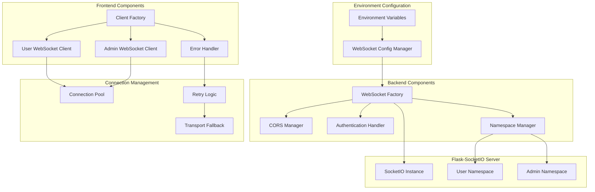

# WebSocket CORS Standardization Design

## Overview

This design document outlines the architecture for refactoring the WebSocket implementation to resolve CORS issues and standardize Socket.IO/flask-socketio configuration. The solution provides a unified, environment-aware WebSocket system that works consistently across user and admin interfaces while maintaining security and performance standards.

## Architecture

### High-Level Architecture



### Component Architecture

The system is organized into several key components:

1. **Configuration Layer**: Manages environment-based configuration
2. **Server Layer**: Handles Flask-SocketIO server setup and CORS
3. **Client Layer**: Provides standardized client connection logic
4. **Security Layer**: Manages authentication and authorization
5. **Error Handling Layer**: Provides robust error recovery and fallback

## Components and Interfaces

### 1. WebSocket Configuration Manager

**Purpose**: Centralized configuration management for WebSocket settings

**Interface**:
```python
class WebSocketConfigManager:
    def __init__(self, config: Config)
    def get_cors_origins(self) -> List[str]
    def get_socketio_config(self) -> Dict[str, Any]
    def get_client_config(self) -> Dict[str, Any]
    def validate_configuration(self) -> bool
```

**Key Features**:
- Dynamic CORS origin generation from FLASK_HOST/FLASK_PORT
- Environment-specific configuration loading
- Configuration validation and fallback defaults
- Support for development, staging, and production environments

### 2. CORS Manager

**Purpose**: Handles Cross-Origin Resource Sharing configuration and validation

**Interface**:
```python
class CORSManager:
    def __init__(self, config_manager: WebSocketConfigManager)
    def get_allowed_origins(self) -> List[str]
    def validate_origin(self, origin: str) -> bool
    def setup_cors_headers(self, app: Flask) -> None
    def handle_preflight_requests(self, app: Flask) -> None
```

**Key Features**:
- Dynamic origin calculation based on environment
- Support for both HTTP and HTTPS origins
- Proper handling of localhost/127.0.0.1 variations
- Comprehensive preflight request handling

### 3. WebSocket Factory

**Purpose**: Creates and configures Flask-SocketIO instances with standardized settings

**Interface**:
```python
class WebSocketFactory:
    def __init__(self, config_manager: WebSocketConfigManager, cors_manager: CORSManager)
    def create_socketio_instance(self, app: Flask) -> SocketIO
    def configure_namespaces(self, socketio: SocketIO) -> None
    def setup_error_handlers(self, socketio: SocketIO) -> None
```

**Key Features**:
- Standardized SocketIO configuration
- Automatic namespace setup
- Integrated error handling
- Transport fallback configuration

### 4. Authentication Handler

**Purpose**: Manages WebSocket authentication and authorization

**Interface**:
```python
class WebSocketAuthHandler:
    def __init__(self, db_manager: DatabaseManager)
    def authenticate_connection(self, session_data: dict) -> Optional[User]
    def authorize_admin_access(self, user: User) -> bool
    def validate_session(self, session_id: str) -> bool
    def handle_auth_failure(self, reason: str) -> None
```

**Key Features**:
- Session-based authentication
- Role-based authorization for admin features
- Consistent authentication across namespaces
- Security event logging

### 5. Namespace Manager

**Purpose**: Manages WebSocket namespaces for user and admin functionality

**Interface**:
```python
class NamespaceManager:
    def __init__(self, socketio: SocketIO, auth_handler: WebSocketAuthHandler)
    def setup_user_namespace(self) -> None
    def setup_admin_namespace(self) -> None
    def register_event_handlers(self, namespace: str, handlers: Dict) -> None
```

**Key Features**:
- Separate namespaces for user and admin functionality
- Shared authentication and error handling
- Event handler registration system
- Room management for targeted messaging

### 6. Client Factory

**Purpose**: Creates standardized WebSocket clients for frontend use

**Interface**:
```javascript
class WebSocketClientFactory {
    constructor(config)
    createUserClient(options = {})
    createAdminClient(options = {})
    getSharedConfig()
    validateConfiguration()
}
```

**Key Features**:
- Consistent client configuration
- Environment-aware connection settings
- Shared error handling and retry logic
- Transport fallback management

### 7. Error Recovery System

**Purpose**: Provides comprehensive error handling and connection recovery

**Interface**:
```javascript
class WebSocketErrorRecovery {
    constructor(client, config)
    handleConnectionError(error)
    attemptReconnection()
    switchToFallbackTransport()
    detectCORSIssues(error)
}
```

**Key Features**:
- Intelligent error categorization
- Exponential backoff retry logic
- Transport fallback mechanisms
- CORS-specific error handling

## Data Models

### Configuration Schema

```python
@dataclass
class WebSocketConfig:
    # CORS Configuration
    cors_origins: List[str]
    cors_credentials: bool
    cors_methods: List[str]
    cors_headers: List[str]
    
    # SocketIO Configuration
    async_mode: str
    transports: List[str]
    ping_timeout: int
    ping_interval: int
    max_http_buffer_size: int
    
    # Client Configuration
    reconnection: bool
    reconnection_attempts: int
    reconnection_delay: int
    reconnection_delay_max: int
    timeout: int
    
    # Security Configuration
    require_auth: bool
    session_validation: bool
    rate_limiting: bool
    csrf_protection: bool
```

### Connection State Model

```javascript
const ConnectionState = {
    DISCONNECTED: 'disconnected',
    CONNECTING: 'connecting',
    CONNECTED: 'connected',
    RECONNECTING: 'reconnecting',
    SUSPENDED: 'suspended',
    ERROR: 'error',
    AUTH_REQUIRED: 'auth_required',
    CORS_ERROR: 'cors_error'
};
```

### Event Message Schema

```python
@dataclass
class WebSocketMessage:
    event: str
    data: Dict[str, Any]
    namespace: str
    room: Optional[str]
    timestamp: datetime
    user_id: Optional[int]
    session_id: str
```

## Error Handling

### Error Categories

1. **Connection Errors**
   - Network connectivity issues
   - Server unavailability
   - Transport failures

2. **CORS Errors**
   - Origin validation failures
   - Preflight request issues
   - Header configuration problems

3. **Authentication Errors**
   - Invalid session tokens
   - Expired sessions
   - Insufficient permissions

4. **Rate Limiting Errors**
   - Too many connection attempts
   - Message rate limits exceeded
   - Resource exhaustion

### Error Recovery Strategies

1. **Exponential Backoff Retry**
   ```javascript
   const retryDelay = Math.min(
       baseDelay * Math.pow(2, attemptNumber),
       maxDelay
   );
   ```

2. **Transport Fallback**
   ```javascript
   const transportFallback = [
       ['websocket'],
       ['polling'],
       ['polling', 'websocket']
   ];
   ```

3. **CORS Error Recovery**
   - Detect CORS-specific error patterns
   - Attempt connection with different origins
   - Fall back to polling-only mode
   - Provide user-friendly error messages

4. **Authentication Recovery**
   - Detect authentication failures
   - Attempt session refresh
   - Redirect to login if necessary
   - Maintain connection state for post-auth reconnection

## Testing Strategy

### Unit Testing

1. **Configuration Manager Tests**
   - Environment variable parsing
   - CORS origin generation
   - Configuration validation
   - Fallback behavior

2. **CORS Manager Tests**
   - Origin validation logic
   - Header configuration
   - Preflight request handling
   - Security validation

3. **Authentication Handler Tests**
   - Session validation
   - User authentication
   - Admin authorization
   - Security event logging

### Integration Testing

1. **End-to-End Connection Tests**
   - Full connection lifecycle
   - Cross-browser compatibility
   - Network condition simulation
   - Error recovery validation

2. **CORS Integration Tests**
   - Cross-origin request validation
   - Preflight request handling
   - Multiple origin support
   - Security boundary testing

3. **Authentication Integration Tests**
   - Session-based authentication
   - Role-based authorization
   - Multi-user scenarios
   - Security violation handling

### Performance Testing

1. **Connection Load Tests**
   - Multiple concurrent connections
   - Message throughput testing
   - Memory usage monitoring
   - Resource cleanup validation

2. **Error Recovery Tests**
   - Retry logic performance
   - Fallback mechanism efficiency
   - Recovery time measurement
   - Resource usage during errors

### Security Testing

1. **CORS Security Tests**
   - Origin spoofing attempts
   - Header injection testing
   - Credential leakage prevention
   - Cross-site request validation

2. **Authentication Security Tests**
   - Session hijacking prevention
   - Privilege escalation testing
   - Rate limiting validation
   - CSRF protection verification

## Implementation Phases

### Phase 1: Core Configuration System
- Implement WebSocketConfigManager
- Create CORSManager with dynamic origin support
- Set up environment variable integration
- Add configuration validation

### Phase 2: Server-Side Refactoring
- Implement WebSocketFactory
- Refactor existing SocketIO setup
- Add namespace management
- Integrate authentication handler

### Phase 3: Client-Side Standardization
- Create WebSocketClientFactory
- Implement unified error recovery
- Add transport fallback logic
- Standardize connection management

### Phase 4: Enhanced Error Handling
- Implement comprehensive error categorization
- Add CORS-specific error detection
- Create intelligent retry mechanisms
- Add user-friendly error messaging

### Phase 5: Testing and Validation
- Comprehensive test suite implementation
- Cross-browser compatibility testing
- Performance optimization
- Security validation

### Phase 6: Documentation and Deployment
- Update configuration documentation
- Create troubleshooting guides
- Implement monitoring and metrics
- Production deployment preparation

## Security Considerations

### CORS Security
- Strict origin validation
- Proper credential handling
- Secure header configuration
- Prevention of origin spoofing

### Authentication Security
- Session-based authentication
- Role-based authorization
- Rate limiting implementation
- Security event logging

### Transport Security
- HTTPS enforcement in production
- Secure WebSocket (WSS) support
- Certificate validation
- Man-in-the-middle prevention

### Data Security
- Message encryption for sensitive data
- Input validation and sanitization
- XSS prevention in real-time messages
- CSRF protection for WebSocket events

## Performance Considerations

### Connection Management
- Efficient connection pooling
- Automatic connection cleanup
- Resource usage monitoring
- Graceful degradation under load

### Message Optimization
- Message batching for high-frequency updates
- Compression for large messages
- Selective message routing
- Bandwidth usage optimization

### Error Recovery Optimization
- Intelligent retry timing
- Efficient fallback mechanisms
- Minimal resource usage during errors
- Fast recovery from network issues

### Scalability Planning
- Horizontal scaling support
- Load balancer compatibility
- Session affinity considerations
- Multi-instance coordination