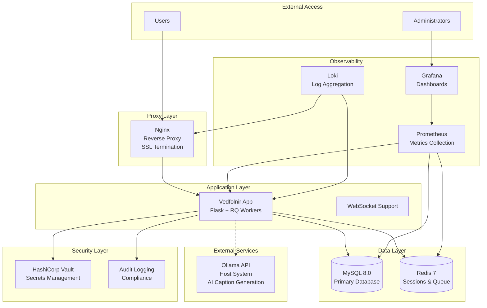

# Docker Compose Documentation

## Overview

This directory contains comprehensive documentation for deploying and managing Vedfolnir using Docker Compose. The containerized deployment provides improved portability, scalability, security, and operational consistency compared to traditional deployment methods.

## Documentation Structure

### Core Deployment Guides

#### [Docker Compose Deployment Guide](docker-compose-deployment-guide.md)
**Primary deployment documentation** - Start here for new deployments
- Quick start instructions
- Detailed configuration options
- Service architecture overview
- Environment setup procedures
- SSL/TLS configuration
- Performance optimization
- Development vs production configurations

#### [Migration from macOS Guide](migration-from-macos-guide.md)
**Migration procedures** - For users transitioning from macOS deployment
- Pre-migration assessment
- Step-by-step migration process
- Data export and import procedures
- Rollback procedures
- Migration validation
- Performance comparison

### Operational Documentation

#### [Operations Guide](docker-compose-operations-guide.md)
**Day-to-day operations** - Essential for system administrators
- Daily, weekly, and monthly maintenance procedures
- Service management (start, stop, restart)
- Health monitoring and diagnostics
- Log management and analysis
- Database and Redis operations
- Backup and recovery procedures
- Performance monitoring and optimization
- Scaling operations

#### [Troubleshooting Guide](docker-compose-troubleshooting-guide.md)
**Problem resolution** - When things go wrong
- Common issues and solutions
- Container startup problems
- Database and Redis connectivity issues
- Application performance problems
- Storage and volume issues
- Network connectivity problems
- Diagnostic commands and scripts
- Emergency procedures

### Security and Compliance

#### [Security and Compliance Guide](docker-compose-security-guide.md)
**Enterprise security** - Critical for production deployments
- Multi-layer security architecture
- Container hardening procedures
- Network security configuration
- SSL/TLS certificate management
- Secrets management with HashiCorp Vault
- Authentication and authorization
- Input validation and sanitization
- Audit logging and compliance
- GDPR compliance implementation
- Security monitoring and alerting

## Quick Reference

### Essential Commands

```bash
# Start all services
docker-compose up -d

# Check service status
docker-compose ps

# View logs
docker-compose logs -f vedfolnir

# Health check
curl -f http://localhost/health

# Stop all services
docker-compose down

# Emergency restart
docker-compose restart
```

### Key Directories

```
vedfolnir/
├── docker-compose.yml          # Main compose configuration
├── docker-compose.dev.yml      # Development overrides
├── docker-compose.prod.yml     # Production overrides
├── .env.docker                 # Environment configuration
├── data/                       # Persistent data
│   ├── mysql/                  # Database data
│   ├── redis/                  # Cache data
│   ├── prometheus/             # Metrics data
│   ├── grafana/                # Dashboard data
│   └── vault/                  # Secrets data
├── storage/                    # Application storage
│   ├── images/                 # Image files
│   ├── backups/                # Backup files
│   └── temp/                   # Temporary files
├── logs/                       # Log files
│   ├── app/                    # Application logs
│   ├── nginx/                  # Web server logs
│   ├── mysql/                  # Database logs
│   └── audit/                  # Audit logs
├── config/                     # Configuration files
│   ├── nginx/                  # Web server config
│   ├── mysql/                  # Database config
│   ├── redis/                  # Cache config
│   └── prometheus/             # Monitoring config
├── secrets/                    # Secret files
└── ssl/                        # SSL certificates
    ├── certs/                  # Certificate files
    └── keys/                   # Private keys
```

### Service URLs

- **Web Interface**: http://localhost/ (https://localhost/ with SSL)
- **Grafana Dashboard**: http://localhost:3000/
- **Prometheus Metrics**: http://localhost:9090/ (internal)
- **Loki Logs**: http://localhost:3100/ (internal)
- **Vault UI**: http://localhost:8200/ (internal)

## Getting Started

### For New Deployments
1. Read the [Deployment Guide](docker-compose-deployment-guide.md)
2. Follow the Quick Start section
3. Configure SSL/TLS for production
4. Set up monitoring and alerting
5. Review the [Security Guide](docker-compose-security-guide.md)

### For Migrations
1. Read the [Migration Guide](migration-from-macos-guide.md)
2. Complete pre-migration assessment
3. Follow the step-by-step migration process
4. Validate the migration
5. Update operational procedures

### For Operations Teams
1. Familiarize yourself with the [Operations Guide](docker-compose-operations-guide.md)
2. Set up automated maintenance scripts
3. Configure monitoring and alerting
4. Practice backup and recovery procedures
5. Review the [Troubleshooting Guide](docker-compose-troubleshooting-guide.md)

## Architecture Overview

### Service Components



### Key Features

- **Containerized Architecture**: All services run in isolated Docker containers
- **Service Orchestration**: Docker Compose manages service dependencies and networking
- **Persistent Storage**: Data persists across container restarts and updates
- **Comprehensive Monitoring**: Built-in observability with Prometheus, Grafana, and Loki
- **Enterprise Security**: Multi-layer security with secrets management and audit logging
- **High Availability**: Health checks, restart policies, and scaling capabilities
- **GDPR Compliance**: Built-in data protection and privacy features

### Benefits

- **Portability**: Run on any system with Docker support
- **Scalability**: Easy horizontal and vertical scaling
- **Consistency**: Identical environments across development, staging, and production
- **Security**: Container isolation and comprehensive security measures
- **Maintainability**: Simplified updates, backups, and recovery procedures
- **Monitoring**: Real-time visibility into system health and performance

## Support and Resources

### Documentation Hierarchy
1. **Start Here**: [Deployment Guide](docker-compose-deployment-guide.md)
2. **Operations**: [Operations Guide](docker-compose-operations-guide.md)
3. **Problems**: [Troubleshooting Guide](docker-compose-troubleshooting-guide.md)
4. **Security**: [Security Guide](docker-compose-security-guide.md)
5. **Migration**: [Migration Guide](migration-from-macos-guide.md)

### Additional Resources
- **Main Documentation**: `docs/README.md`
- **API Documentation**: `docs/api/`
- **Security Documentation**: `docs/security/`
- **Performance Documentation**: `docs/performance/`
- **Testing Documentation**: `docs/testing/`

### Getting Help
1. **Check Documentation**: Start with the relevant guide above
2. **Search Issues**: Look for similar problems in existing documentation
3. **Run Diagnostics**: Use the diagnostic scripts provided
4. **Collect Logs**: Gather relevant log files and system information
5. **Report Issues**: Create detailed issue reports with diagnostic information

### Community and Support
- **GitHub Repository**: Source code and issue tracking
- **Documentation Updates**: Contribute improvements and corrections
- **Feature Requests**: Suggest new features and enhancements
- **Security Reports**: Report security vulnerabilities responsibly

## Version Information

- **Docker Compose Version**: 2.0+
- **Docker Engine Version**: 20.10+
- **Supported Platforms**: Linux, macOS, Windows (with WSL2)
- **Python Version**: 3.12
- **Database**: MySQL 8.0
- **Cache**: Redis 7
- **Web Server**: Nginx (Alpine)
- **Monitoring**: Prometheus, Grafana, Loki
- **Secrets**: HashiCorp Vault

## License and Legal

This documentation is part of the Vedfolnir project and is subject to the same license terms. Please refer to the main project LICENSE file for details.

For enterprise support, custom deployments, or professional services, please contact the development team.