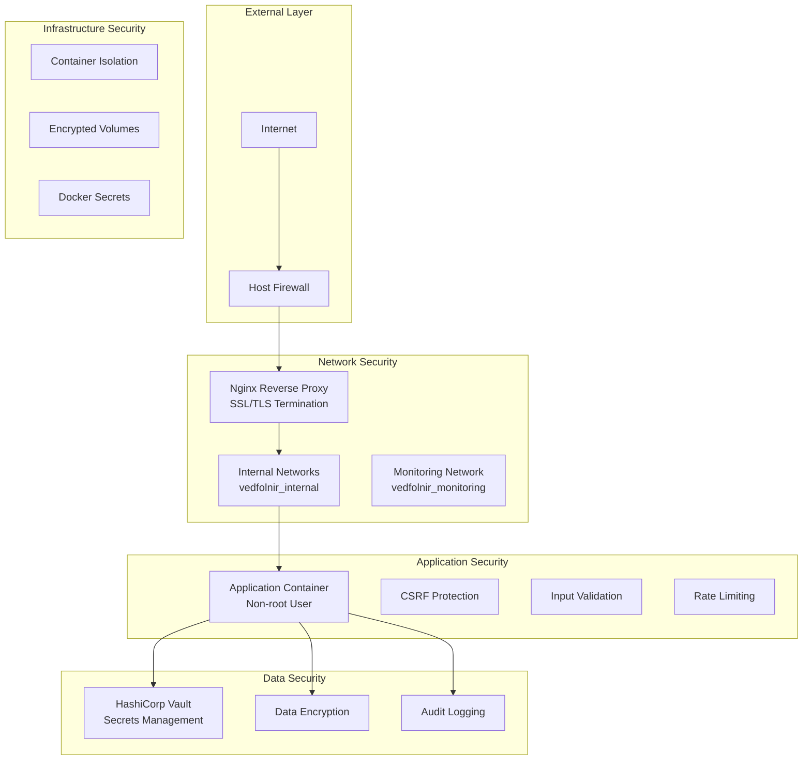

# Docker Compose Security and Compliance Guide

## Overview

This guide covers security procedures, compliance features, and audit capabilities for the Vedfolnir Docker Compose deployment. It provides comprehensive security hardening, monitoring, and compliance management for enterprise environments.

## Security Architecture

### Multi-Layer Security Model



### Security Principles

1. **Defense in Depth**: Multiple security layers
2. **Least Privilege**: Minimal required permissions
3. **Zero Trust**: Verify all access attempts
4. **Encryption Everywhere**: Data at rest and in transit
5. **Continuous Monitoring**: Real-time security monitoring
6. **Audit Everything**: Comprehensive audit trails

## Container Security

### Container Hardening

#### Dockerfile Security Best Practices
```dockerfile
# Use minimal base image
FROM python:3.12-slim

# Create non-root user
RUN groupadd -r vedfolnir && useradd -r -g vedfolnir vedfolnir

# Install security updates
RUN apt-get update && apt-get upgrade -y && \
    apt-get install -y --no-install-recommends \
    curl default-mysql-client pkg-config \
    default-libmysqlclient-dev build-essential && \
    rm -rf /var/lib/apt/lists/*

# Set secure permissions
COPY --chown=vedfolnir:vedfolnir . /app
WORKDIR /app

# Drop privileges
USER vedfolnir

# Use specific port
EXPOSE 5000

# Health check
HEALTHCHECK --interval=30s --timeout=10s --start-period=5s --retries=3 \
  CMD curl -f http://localhost:5000/health || exit 1
```

#### Docker Compose Security Configuration
```yaml
version: '3.8'

services:
  vedfolnir:
    build: .
    security_opt:
      - no-new-privileges:true
    cap_drop:
      - ALL
    cap_add:
      - NET_BIND_SERVICE
    read_only: true
    tmpfs:
      - /tmp:noexec,nosuid,size=100m
    user: "1000:1000"
    environment:
      - PYTHONDONTWRITEBYTECODE=1
      - PYTHONUNBUFFERED=1
    deploy:
      resources:
        limits:
          cpus: '2.0'
          memory: 2G
        reservations:
          cpus: '1.0'
          memory: 1G
```

### Runtime Security

#### Container Scanning
```bash
# Create security scanning script
cat > scripts/security/container_scan.sh << 'EOF'
#!/bin/bash
# container_scan.sh - Container vulnerability scanning

echo "=== Container Security Scan - $(date) ==="

# Scan base images
echo "Scanning base images..."
docker run --rm -v /var/run/docker.sock:/var/run/docker.sock \
  aquasec/trivy image python:3.12-slim

# Scan application image
echo "Scanning application image..."
docker run --rm -v /var/run/docker.sock:/var/run/docker.sock \
  aquasec/trivy image vedfolnir_vedfolnir

# Scan for secrets in images
echo "Scanning for secrets..."
docker run --rm -v /var/run/docker.sock:/var/run/docker.sock \
  aquasec/trivy image --scanners secret vedfolnir_vedfolnir

# Generate security report
echo "Generating security report..."
docker run --rm -v /var/run/docker.sock:/var/run/docker.sock \
  aquasec/trivy image --format json --output security_report_$(date +%Y%m%d).json vedfolnir_vedfolnir

echo "=== Container Security Scan Complete ==="
EOF

chmod +x scripts/security/container_scan.sh

# Schedule regular scans
echo "0 2 * * 1 /path/to/vedfolnir/scripts/security/container_scan.sh >> /var/log/security_scan.log 2>&1" | crontab -
```

#### Runtime Security Monitoring
```bash
# Create runtime security monitoring
cat > scripts/security/runtime_monitor.sh << 'EOF'
#!/bin/bash
# runtime_monitor.sh - Runtime security monitoring

LOGFILE="logs/security/runtime_monitor.log"
mkdir -p logs/security

echo "=== Runtime Security Monitor - $(date) ===" >> $LOGFILE

# Monitor container processes
echo "Container Processes:" >> $LOGFILE
docker-compose exec vedfolnir ps aux >> $LOGFILE

# Check for privilege escalation
echo "Privilege Check:" >> $LOGFILE
docker-compose exec vedfolnir whoami >> $LOGFILE
docker-compose exec vedfolnir id >> $LOGFILE

# Monitor network connections
echo "Network Connections:" >> $LOGFILE
docker-compose exec vedfolnir netstat -tulpn >> $LOGFILE 2>/dev/null || echo "netstat not available" >> $LOGFILE

# Check file system changes
echo "File System Integrity:" >> $LOGFILE
docker diff $(docker-compose ps -q vedfolnir) >> $LOGFILE

# Monitor resource usage for anomalies
echo "Resource Usage:" >> $LOGFILE
docker stats --no-stream >> $LOGFILE

echo "=== Runtime Security Monitor Complete ===" >> $LOGFILE
EOF

chmod +x scripts/security/runtime_monitor.sh

# Schedule runtime monitoring
echo "*/30 * * * * /path/to/vedfolnir/scripts/security/runtime_monitor.sh" | crontab -
```

## Network Security

### Network Isolation

#### Docker Network Configuration
```yaml
networks:
  vedfolnir_external:
    driver: bridge
    ipam:
      config:
        - subnet: 172.20.0.0/16
  
  vedfolnir_internal:
    driver: bridge
    internal: true
    ipam:
      config:
        - subnet: 172.21.0.0/16
  
  vedfolnir_monitoring:
    driver: bridge
    internal: true
    ipam:
      config:
        - subnet: 172.22.0.0/16
```

#### Firewall Configuration
```bash
# Create firewall configuration script
cat > scripts/security/configure_firewall.sh << 'EOF'
#!/bin/bash
# configure_firewall.sh - Host firewall configuration

echo "=== Configuring Host Firewall ==="

# Enable UFW (Ubuntu/Debian)
if command -v ufw >/dev/null 2>&1; then
    # Reset UFW rules
    ufw --force reset
    
    # Default policies
    ufw default deny incoming
    ufw default allow outgoing
    
    # Allow SSH (adjust port as needed)
    ufw allow 22/tcp
    
    # Allow HTTP/HTTPS
    ufw allow 80/tcp
    ufw allow 443/tcp
    
    # Allow Grafana (restrict to specific IPs in production)
    ufw allow 3000/tcp
    
    # Allow Ollama (localhost only)
    ufw allow from 127.0.0.1 to any port 11434
    
    # Enable UFW
    ufw --force enable
    
    echo "UFW firewall configured"
fi

# Configure iptables for Docker
iptables -I DOCKER-USER -i ext_if ! -s 172.20.0.0/16 -j DROP
iptables -I DOCKER-USER -i ext_if ! -s 172.21.0.0/16 -j DROP
iptables -I DOCKER-USER -i ext_if ! -s 172.22.0.0/16 -j DROP

echo "=== Firewall Configuration Complete ==="
EOF

chmod +x scripts/security/configure_firewall.sh
```

### SSL/TLS Security

#### SSL Certificate Management
```bash
# Create SSL certificate management script
cat > scripts/security/manage_ssl.sh << 'EOF'
#!/bin/bash
# manage_ssl.sh - SSL certificate management

ACTION="$1"
DOMAIN="$2"

case "$ACTION" in
    "generate")
        echo "Generating SSL certificate for $DOMAIN"
        mkdir -p ssl/{certs,keys}
        
        # Generate private key
        openssl genrsa -out ssl/keys/$DOMAIN.key 4096
        
        # Generate certificate signing request
        openssl req -new -key ssl/keys/$DOMAIN.key -out ssl/$DOMAIN.csr \
          -subj "/C=US/ST=State/L=City/O=Organization/CN=$DOMAIN"
        
        # Generate self-signed certificate
        openssl x509 -req -days 365 -in ssl/$DOMAIN.csr \
          -signkey ssl/keys/$DOMAIN.key -out ssl/certs/$DOMAIN.crt
        
        # Set secure permissions
        chmod 600 ssl/keys/$DOMAIN.key
        chmod 644 ssl/certs/$DOMAIN.crt
        
        echo "SSL certificate generated for $DOMAIN"
        ;;
    
    "letsencrypt")
        echo "Obtaining Let's Encrypt certificate for $DOMAIN"
        
        # Stop Nginx temporarily
        docker-compose stop nginx
        
        # Obtain certificate
        certbot certonly --standalone -d $DOMAIN --agree-tos --no-eff-email
        
        # Copy certificates
        cp /etc/letsencrypt/live/$DOMAIN/fullchain.pem ssl/certs/$DOMAIN.crt
        cp /etc/letsencrypt/live/$DOMAIN/privkey.pem ssl/keys/$DOMAIN.key
        
        # Start Nginx
        docker-compose start nginx
        
        echo "Let's Encrypt certificate obtained for $DOMAIN"
        ;;
    
    "renew")
        echo "Renewing SSL certificates"
        
        # Renew Let's Encrypt certificates
        certbot renew --quiet
        
        # Copy renewed certificates
        for domain in $(certbot certificates | grep "Certificate Name" | cut -d: -f2 | tr -d ' '); do
            if [ -f "/etc/letsencrypt/live/$domain/fullchain.pem" ]; then
                cp /etc/letsencrypt/live/$domain/fullchain.pem ssl/certs/$domain.crt
                cp /etc/letsencrypt/live/$domain/privkey.pem ssl/keys/$domain.key
            fi
        done
        
        # Reload Nginx
        docker-compose exec nginx nginx -s reload
        
        echo "SSL certificates renewed"
        ;;
    
    "check")
        echo "Checking SSL certificate expiration"
        
        for cert in ssl/certs/*.crt; do
            if [ -f "$cert" ]; then
                echo "Certificate: $cert"
                openssl x509 -in "$cert" -text -noout | grep -A2 "Validity"
                
                # Check expiration
                expiry_date=$(openssl x509 -in "$cert" -text -noout | grep "Not After" | cut -d: -f2-)
                expiry_timestamp=$(date -d "$expiry_date" +%s)
                current_timestamp=$(date +%s)
                days_until_expiry=$(( ($expiry_timestamp - $current_timestamp) / 86400 ))
                
                if [ "$days_until_expiry" -lt 30 ]; then
                    echo "WARNING: Certificate expires in $days_until_expiry days"
                else
                    echo "Certificate valid for $days_until_expiry days"
                fi
                echo ""
            fi
        done
        ;;
    
    *)
        echo "Usage: $0 {generate|letsencrypt|renew|check} [domain]"
        echo "  generate    - Generate self-signed certificate"
        echo "  letsencrypt - Obtain Let's Encrypt certificate"
        echo "  renew       - Renew all certificates"
        echo "  check       - Check certificate expiration"
        ;;
esac
EOF

chmod +x scripts/security/manage_ssl.sh

# Schedule certificate renewal
echo "0 3 1 * * /path/to/vedfolnir/scripts/security/manage_ssl.sh renew >> /var/log/ssl_renewal.log 2>&1" | crontab -
```

#### Nginx Security Configuration
```nginx
# config/nginx/security.conf
server {
    listen 443 ssl http2;
    server_name your-domain.com;
    
    # SSL Configuration
    ssl_certificate /etc/nginx/ssl/certs/your-domain.com.crt;
    ssl_certificate_key /etc/nginx/ssl/keys/your-domain.com.key;
    
    # SSL Security
    ssl_protocols TLSv1.2 TLSv1.3;
    ssl_ciphers ECDHE-RSA-AES256-GCM-SHA512:DHE-RSA-AES256-GCM-SHA512:ECDHE-RSA-AES256-GCM-SHA384:DHE-RSA-AES256-GCM-SHA384;
    ssl_prefer_server_ciphers off;
    ssl_session_cache shared:SSL:10m;
    ssl_session_timeout 10m;
    
    # HSTS
    add_header Strict-Transport-Security "max-age=31536000; includeSubDomains; preload" always;
    
    # Security Headers
    add_header X-Frame-Options "SAMEORIGIN" always;
    add_header X-Content-Type-Options "nosniff" always;
    add_header X-XSS-Protection "1; mode=block" always;
    add_header Referrer-Policy "strict-origin-when-cross-origin" always;
    add_header Content-Security-Policy "default-src 'self'; script-src 'self' 'unsafe-inline'; style-src 'self' 'unsafe-inline'; img-src 'self' data:; font-src 'self';" always;
    
    # Rate Limiting
    limit_req_zone $binary_remote_addr zone=login:10m rate=5r/m;
    limit_req_zone $binary_remote_addr zone=api:10m rate=10r/s;
    
    location /login {
        limit_req zone=login burst=3 nodelay;
        proxy_pass http://vedfolnir:5000;
        proxy_set_header Host $host;
        proxy_set_header X-Real-IP $remote_addr;
        proxy_set_header X-Forwarded-For $proxy_add_x_forwarded_for;
        proxy_set_header X-Forwarded-Proto $scheme;
    }
    
    location /api/ {
        limit_req zone=api burst=20 nodelay;
        proxy_pass http://vedfolnir:5000;
        proxy_set_header Host $host;
        proxy_set_header X-Real-IP $remote_addr;
        proxy_set_header X-Forwarded-For $proxy_add_x_forwarded_for;
        proxy_set_header X-Forwarded-Proto $scheme;
    }
    
    location / {
        proxy_pass http://vedfolnir:5000;
        proxy_set_header Host $host;
        proxy_set_header X-Real-IP $remote_addr;
        proxy_set_header X-Forwarded-For $proxy_add_x_forwarded_for;
        proxy_set_header X-Forwarded-Proto $scheme;
        
        # WebSocket support
        proxy_http_version 1.1;
        proxy_set_header Upgrade $http_upgrade;
        proxy_set_header Connection "upgrade";
    }
}
```

## Secrets Management

### HashiCorp Vault Integration

#### Vault Configuration
```hcl
# config/vault/vault.hcl
storage "file" {
  path = "/vault/data"
}

listener "tcp" {
  address = "0.0.0.0:8200"
  tls_disable = true
}

api_addr = "http://127.0.0.1:8200"
cluster_addr = "https://127.0.0.1:8201"
ui = true

# Enable audit logging
audit "file" {
  file_path = "/vault/logs/audit.log"
}
```

#### Vault Operations
```bash
# Create Vault management script
cat > scripts/security/manage_vault.sh << 'EOF'
#!/bin/bash
# manage_vault.sh - Vault secrets management

ACTION="$1"
SECRET_PATH="$2"
SECRET_VALUE="$3"

export VAULT_ADDR="http://localhost:8200"
export VAULT_TOKEN="$(cat secrets/vault_token.txt)"

case "$ACTION" in
    "init")
        echo "Initializing Vault..."
        docker-compose exec vault vault operator init -key-shares=5 -key-threshold=3
        ;;
    
    "unseal")
        echo "Unsealing Vault..."
        echo "Enter unseal keys when prompted:"
        docker-compose exec vault vault operator unseal
        docker-compose exec vault vault operator unseal
        docker-compose exec vault vault operator unseal
        ;;
    
    "status")
        echo "Vault status:"
        docker-compose exec vault vault status
        ;;
    
    "put")
        echo "Storing secret at $SECRET_PATH"
        docker-compose exec vault vault kv put secret/$SECRET_PATH value="$SECRET_VALUE"
        ;;
    
    "get")
        echo "Retrieving secret from $SECRET_PATH"
        docker-compose exec vault vault kv get secret/$SECRET_PATH
        ;;
    
    "list")
        echo "Listing secrets:"
        docker-compose exec vault vault kv list secret/
        ;;
    
    "rotate")
        echo "Rotating secrets..."
        # Rotate database password
        NEW_DB_PASSWORD=$(openssl rand -base64 32)
        docker-compose exec vault vault kv put secret/database password="$NEW_DB_PASSWORD"
        
        # Update MySQL password
        docker-compose exec mysql mysql -u root -p$(cat secrets/mysql_root_password.txt) -e "
        ALTER USER 'vedfolnir'@'%' IDENTIFIED BY '$NEW_DB_PASSWORD';
        FLUSH PRIVILEGES;"
        
        # Update application configuration
        echo "$NEW_DB_PASSWORD" > secrets/mysql_password.txt
        docker-compose restart vedfolnir
        
        echo "Database password rotated"
        ;;
    
    *)
        echo "Usage: $0 {init|unseal|status|put|get|list|rotate} [path] [value]"
        echo "  init     - Initialize Vault"
        echo "  unseal   - Unseal Vault"
        echo "  status   - Show Vault status"
        echo "  put      - Store secret"
        echo "  get      - Retrieve secret"
        echo "  list     - List secrets"
        echo "  rotate   - Rotate secrets"
        ;;
esac
EOF

chmod +x scripts/security/manage_vault.sh
```

### Docker Secrets Integration
```yaml
# Docker Compose secrets configuration
secrets:
  flask_secret_key:
    file: ./secrets/flask_secret_key.txt
  platform_encryption_key:
    file: ./secrets/platform_encryption_key.txt
  mysql_root_password:
    file: ./secrets/mysql_root_password.txt
  mysql_password:
    file: ./secrets/mysql_password.txt
  redis_password:
    file: ./secrets/redis_password.txt
  vault_token:
    file: ./secrets/vault_token.txt

services:
  vedfolnir:
    secrets:
      - flask_secret_key
      - platform_encryption_key
      - mysql_password
      - redis_password
      - vault_token
    environment:
      - FLASK_SECRET_KEY_FILE=/run/secrets/flask_secret_key
      - PLATFORM_ENCRYPTION_KEY_FILE=/run/secrets/platform_encryption_key
      - MYSQL_PASSWORD_FILE=/run/secrets/mysql_password
      - REDIS_PASSWORD_FILE=/run/secrets/redis_password
      - VAULT_TOKEN_FILE=/run/secrets/vault_token
```

## Application Security

### Authentication and Authorization

#### Multi-Factor Authentication Setup
```python
# app/security/mfa.py
from cryptography.fernet import Fernet
import pyotp
import qrcode
import io
import base64

class MFAManager:
    def __init__(self, config):
        self.config = config
        self.cipher = Fernet(config.PLATFORM_ENCRYPTION_KEY.encode())
    
    def generate_secret(self, user_id):
        """Generate MFA secret for user"""
        secret = pyotp.random_base32()
        encrypted_secret = self.cipher.encrypt(secret.encode())
        
        # Store encrypted secret in database
        # Implementation depends on your user model
        
        return secret
    
    def generate_qr_code(self, user_email, secret):
        """Generate QR code for MFA setup"""
        totp_uri = pyotp.totp.TOTP(secret).provisioning_uri(
            name=user_email,
            issuer_name="Vedfolnir"
        )
        
        qr = qrcode.QRCode(version=1, box_size=10, border=5)
        qr.add_data(totp_uri)
        qr.make(fit=True)
        
        img = qr.make_image(fill_color="black", back_color="white")
        img_buffer = io.BytesIO()
        img.save(img_buffer, format='PNG')
        img_buffer.seek(0)
        
        return base64.b64encode(img_buffer.getvalue()).decode()
    
    def verify_token(self, user_id, token):
        """Verify MFA token"""
        # Retrieve and decrypt user's secret
        # Implementation depends on your user model
        
        totp = pyotp.TOTP(secret)
        return totp.verify(token, valid_window=1)
```

#### Role-Based Access Control
```python
# app/security/rbac.py
from functools import wraps
from flask import abort, session
from enum import Enum

class Permission(Enum):
    READ_POSTS = "read_posts"
    WRITE_POSTS = "write_posts"
    MANAGE_USERS = "manage_users"
    ADMIN_ACCESS = "admin_access"
    PLATFORM_MANAGEMENT = "platform_management"

class Role(Enum):
    VIEWER = "viewer"
    REVIEWER = "reviewer"
    ADMIN = "admin"
    SUPER_ADMIN = "super_admin"

ROLE_PERMISSIONS = {
    Role.VIEWER: [Permission.READ_POSTS],
    Role.REVIEWER: [Permission.READ_POSTS, Permission.WRITE_POSTS],
    Role.ADMIN: [
        Permission.READ_POSTS, 
        Permission.WRITE_POSTS, 
        Permission.MANAGE_USERS,
        Permission.ADMIN_ACCESS
    ],
    Role.SUPER_ADMIN: [
        Permission.READ_POSTS,
        Permission.WRITE_POSTS,
        Permission.MANAGE_USERS,
        Permission.ADMIN_ACCESS,
        Permission.PLATFORM_MANAGEMENT
    ]
}

def require_permission(permission):
    """Decorator to require specific permission"""
    def decorator(f):
        @wraps(f)
        def decorated_function(*args, **kwargs):
            if not has_permission(permission):
                abort(403)
            return f(*args, **kwargs)
        return decorated_function
    return decorator

def has_permission(permission):
    """Check if current user has permission"""
    user_role = session.get('user_role')
    if not user_role:
        return False
    
    try:
        role = Role(user_role)
        return permission in ROLE_PERMISSIONS.get(role, [])
    except ValueError:
        return False
```

### Input Validation and Sanitization

#### Comprehensive Input Validation
```python
# app/security/validation.py
import re
from html import escape
from urllib.parse import urlparse
import bleach

class InputValidator:
    def __init__(self):
        self.email_pattern = re.compile(r'^[a-zA-Z0-9._%+-]+@[a-zA-Z0-9.-]+\.[a-zA-Z]{2,}$')
        self.username_pattern = re.compile(r'^[a-zA-Z0-9_]{3,30}$')
        self.url_pattern = re.compile(r'^https?://[^\s/$.?#].[^\s]*$')
    
    def validate_email(self, email):
        """Validate email format"""
        if not email or len(email) > 254:
            return False
        return bool(self.email_pattern.match(email))
    
    def validate_username(self, username):
        """Validate username format"""
        if not username:
            return False
        return bool(self.username_pattern.match(username))
    
    def validate_url(self, url):
        """Validate URL format and scheme"""
        if not url:
            return False
        
        if not self.url_pattern.match(url):
            return False
        
        parsed = urlparse(url)
        return parsed.scheme in ['http', 'https'] and parsed.netloc
    
    def sanitize_html(self, content):
        """Sanitize HTML content"""
        allowed_tags = ['p', 'br', 'strong', 'em', 'u', 'ol', 'ul', 'li']
        allowed_attributes = {}
        
        return bleach.clean(content, tags=allowed_tags, attributes=allowed_attributes)
    
    def sanitize_text(self, text):
        """Sanitize plain text"""
        if not text:
            return ""
        
        # Remove null bytes and control characters
        text = ''.join(char for char in text if ord(char) >= 32 or char in '\n\r\t')
        
        # Escape HTML
        return escape(text)
    
    def validate_file_upload(self, file):
        """Validate file upload"""
        if not file or not file.filename:
            return False, "No file selected"
        
        # Check file extension
        allowed_extensions = {'.jpg', '.jpeg', '.png', '.gif', '.webp'}
        file_ext = os.path.splitext(file.filename)[1].lower()
        
        if file_ext not in allowed_extensions:
            return False, "Invalid file type"
        
        # Check file size (10MB limit)
        if len(file.read()) > 10 * 1024 * 1024:
            return False, "File too large"
        
        file.seek(0)  # Reset file pointer
        return True, "Valid file"
```

## Audit and Compliance

### Comprehensive Audit Logging

#### Audit Logger Implementation
```python
# app/services/compliance/audit_logger.py
import json
import hashlib
from datetime import datetime
from cryptography.fernet import Fernet

class AuditLogger:
    def __init__(self, config):
        self.config = config
        self.log_file = "logs/audit/audit.log"
        self.cipher = Fernet(config.AUDIT_ENCRYPTION_KEY.encode())
    
    def log_event(self, event_type, user_id, details, ip_address=None, user_agent=None):
        """Log audit event"""
        timestamp = datetime.utcnow().isoformat()
        
        audit_entry = {
            "timestamp": timestamp,
            "event_type": event_type,
            "user_id": user_id,
            "details": details,
            "ip_address": ip_address,
            "user_agent": user_agent,
            "session_id": session.get('session_id'),
            "request_id": request.headers.get('X-Request-ID')
        }
        
        # Create hash for integrity
        entry_json = json.dumps(audit_entry, sort_keys=True)
        entry_hash = hashlib.sha256(entry_json.encode()).hexdigest()
        audit_entry["hash"] = entry_hash
        
        # Encrypt sensitive data
        encrypted_entry = self.cipher.encrypt(json.dumps(audit_entry).encode())
        
        # Write to audit log
        with open(self.log_file, 'a') as f:
            f.write(f"{timestamp}:{encrypted_entry.decode()}\n")
    
    def log_authentication(self, user_id, success, ip_address, user_agent):
        """Log authentication attempt"""
        self.log_event(
            "AUTHENTICATION",
            user_id,
            {"success": success, "method": "password"},
            ip_address,
            user_agent
        )
    
    def log_data_access(self, user_id, resource_type, resource_id, action):
        """Log data access"""
        self.log_event(
            "DATA_ACCESS",
            user_id,
            {
                "resource_type": resource_type,
                "resource_id": resource_id,
                "action": action
            }
        )
    
    def log_configuration_change(self, user_id, setting, old_value, new_value):
        """Log configuration change"""
        self.log_event(
            "CONFIGURATION_CHANGE",
            user_id,
            {
                "setting": setting,
                "old_value": old_value,
                "new_value": new_value
            }
        )
    
    def generate_audit_report(self, start_date=None, end_date=None):
        """Generate audit report"""
        # Implementation for audit report generation
        pass
```

### GDPR Compliance Implementation

#### Data Protection and Privacy
```python
# app/services/gdpr/data_protection_service.py
import hashlib
import json
from datetime import datetime, timedelta

class DataProtectionService:
    def __init__(self, db_manager):
        self.db_manager = db_manager
    
    def anonymize_user_data(self, user_id):
        """Anonymize user data for GDPR compliance"""
        with self.db_manager.get_session() as session:
            user = session.query(User).filter_by(id=user_id).first()
            if not user:
                return False
            
            # Generate anonymous identifier
            anonymous_id = hashlib.sha256(f"user_{user_id}_{datetime.utcnow()}".encode()).hexdigest()[:16]
            
            # Anonymize personal data
            user.username = f"anonymous_{anonymous_id}"
            user.email = f"anonymous_{anonymous_id}@example.com"
            user.first_name = "Anonymous"
            user.last_name = "User"
            user.is_anonymized = True
            user.anonymized_at = datetime.utcnow()
            
            session.commit()
            return True
    
    def export_user_data(self, user_id):
        """Export user data for GDPR data portability"""
        with self.db_manager.get_session() as session:
            user = session.query(User).filter_by(id=user_id).first()
            if not user:
                return None
            
            # Collect all user data
            user_data = {
                "personal_information": {
                    "username": user.username,
                    "email": user.email,
                    "first_name": user.first_name,
                    "last_name": user.last_name,
                    "created_at": user.created_at.isoformat(),
                    "last_login": user.last_login.isoformat() if user.last_login else None
                },
                "platform_connections": [],
                "posts": [],
                "images": []
            }
            
            # Platform connections
            platforms = session.query(PlatformConnection).filter_by(user_id=user_id).all()
            for platform in platforms:
                user_data["platform_connections"].append({
                    "platform_name": platform.platform_name,
                    "instance_url": platform.instance_url,
                    "username": platform.username,
                    "created_at": platform.created_at.isoformat()
                })
            
            # Posts and images
            posts = session.query(Post).filter_by(user_id=user_id).all()
            for post in posts:
                post_data = {
                    "post_id": post.id,
                    "content": post.content,
                    "created_at": post.created_at.isoformat(),
                    "images": []
                }
                
                images = session.query(Image).filter_by(post_id=post.id).all()
                for image in images:
                    post_data["images"].append({
                        "filename": image.filename,
                        "caption": image.caption,
                        "created_at": image.created_at.isoformat()
                    })
                
                user_data["posts"].append(post_data)
            
            return user_data
    
    def delete_user_data(self, user_id):
        """Delete user data for GDPR right to be forgotten"""
        with self.db_manager.get_session() as session:
            # Delete in correct order to maintain referential integrity
            session.query(Image).filter(Image.post_id.in_(
                session.query(Post.id).filter_by(user_id=user_id)
            )).delete(synchronize_session=False)
            
            session.query(Post).filter_by(user_id=user_id).delete()
            session.query(PlatformConnection).filter_by(user_id=user_id).delete()
            session.query(UserSession).filter_by(user_id=user_id).delete()
            session.query(User).filter_by(id=user_id).delete()
            
            session.commit()
            return True
    
    def check_data_retention(self):
        """Check and enforce data retention policies"""
        retention_period = timedelta(days=2555)  # 7 years
        cutoff_date = datetime.utcnow() - retention_period
        
        with self.db_manager.get_session() as session:
            # Find old data
            old_posts = session.query(Post).filter(Post.created_at < cutoff_date).all()
            
            for post in old_posts:
                # Archive or delete based on policy
                self.archive_post(post)
            
            session.commit()
```

### Compliance Monitoring and Reporting

#### Compliance Dashboard
```python
# app/services/compliance/compliance_monitor.py
from datetime import datetime, timedelta
import json

class ComplianceMonitor:
    def __init__(self, db_manager, audit_logger):
        self.db_manager = db_manager
        self.audit_logger = audit_logger
    
    def generate_compliance_report(self, report_type="monthly"):
        """Generate compliance report"""
        if report_type == "monthly":
            start_date = datetime.utcnow().replace(day=1)
            end_date = datetime.utcnow()
        elif report_type == "quarterly":
            # Calculate quarter start
            current_quarter = (datetime.utcnow().month - 1) // 3 + 1
            start_date = datetime.utcnow().replace(month=(current_quarter - 1) * 3 + 1, day=1)
            end_date = datetime.utcnow()
        
        report = {
            "report_type": report_type,
            "period": {
                "start": start_date.isoformat(),
                "end": end_date.isoformat()
            },
            "gdpr_compliance": self.check_gdpr_compliance(start_date, end_date),
            "security_events": self.analyze_security_events(start_date, end_date),
            "data_processing": self.analyze_data_processing(start_date, end_date),
            "user_rights_requests": self.analyze_user_rights_requests(start_date, end_date)
        }
        
        return report
    
    def check_gdpr_compliance(self, start_date, end_date):
        """Check GDPR compliance metrics"""
        with self.db_manager.get_session() as session:
            # Data subject requests
            export_requests = session.query(DataExportRequest).filter(
                DataExportRequest.created_at.between(start_date, end_date)
            ).count()
            
            deletion_requests = session.query(DataDeletionRequest).filter(
                DataDeletionRequest.created_at.between(start_date, end_date)
            ).count()
            
            # Response times
            avg_response_time = session.query(func.avg(
                DataExportRequest.completed_at - DataExportRequest.created_at
            )).filter(
                DataExportRequest.created_at.between(start_date, end_date),
                DataExportRequest.completed_at.isnot(None)
            ).scalar()
            
            return {
                "export_requests": export_requests,
                "deletion_requests": deletion_requests,
                "average_response_time_hours": avg_response_time.total_seconds() / 3600 if avg_response_time else 0,
                "compliance_score": self.calculate_compliance_score()
            }
    
    def analyze_security_events(self, start_date, end_date):
        """Analyze security events"""
        # Parse audit logs for security events
        security_events = {
            "failed_logins": 0,
            "successful_logins": 0,
            "privilege_escalations": 0,
            "data_breaches": 0,
            "suspicious_activities": 0
        }
        
        # Implementation to parse audit logs
        return security_events
    
    def generate_audit_trail(self, user_id=None, event_type=None, start_date=None, end_date=None):
        """Generate audit trail report"""
        # Implementation to generate audit trail
        pass
```

## Security Monitoring and Alerting

### Real-time Security Monitoring
```bash
# Create security monitoring script
cat > scripts/security/security_monitor.sh << 'EOF'
#!/bin/bash
# security_monitor.sh - Real-time security monitoring

ALERT_EMAIL="security@example.com"
LOGFILE="logs/security/security_monitor.log"
THRESHOLD_FAILED_LOGINS=10
THRESHOLD_HIGH_CPU=80
THRESHOLD_HIGH_MEMORY=80

mkdir -p logs/security

while true; do
    TIMESTAMP=$(date '+%Y-%m-%d %H:%M:%S')
    
    # Monitor failed login attempts
    FAILED_LOGINS=$(docker-compose logs vedfolnir | grep -c "Failed login attempt" | tail -1)
    if [ "$FAILED_LOGINS" -gt "$THRESHOLD_FAILED_LOGINS" ]; then
        echo "$TIMESTAMP - ALERT: High number of failed login attempts: $FAILED_LOGINS" >> $LOGFILE
        # Send alert email
        echo "High number of failed login attempts detected: $FAILED_LOGINS" | \
            mail -s "Security Alert - Failed Logins" $ALERT_EMAIL
    fi
    
    # Monitor resource usage for anomalies
    CPU_USAGE=$(docker stats --no-stream --format "table {{.CPUPerc}}" | grep -v CPU | head -1 | sed 's/%//')
    MEMORY_USAGE=$(docker stats --no-stream --format "table {{.MemPerc}}" | grep -v MEM | head -1 | sed 's/%//')
    
    if (( $(echo "$CPU_USAGE > $THRESHOLD_HIGH_CPU" | bc -l) )); then
        echo "$TIMESTAMP - ALERT: High CPU usage: $CPU_USAGE%" >> $LOGFILE
    fi
    
    if (( $(echo "$MEMORY_USAGE > $THRESHOLD_HIGH_MEMORY" | bc -l) )); then
        echo "$TIMESTAMP - ALERT: High memory usage: $MEMORY_USAGE%" >> $LOGFILE
    fi
    
    # Monitor for suspicious network activity
    CONNECTIONS=$(docker-compose exec vedfolnir netstat -an | grep ESTABLISHED | wc -l)
    if [ "$CONNECTIONS" -gt 100 ]; then
        echo "$TIMESTAMP - ALERT: High number of network connections: $CONNECTIONS" >> $LOGFILE
    fi
    
    # Check for container anomalies
    EXITED_CONTAINERS=$(docker ps -a --filter "status=exited" --format "{{.Names}}" | wc -l)
    if [ "$EXITED_CONTAINERS" -gt 0 ]; then
        echo "$TIMESTAMP - ALERT: Containers have exited unexpectedly" >> $LOGFILE
    fi
    
    sleep 60  # Check every minute
done
EOF

chmod +x scripts/security/security_monitor.sh

# Run security monitor in background
nohup ./scripts/security/security_monitor.sh &
```

This comprehensive security and compliance guide provides enterprise-grade security measures, monitoring capabilities, and compliance features for the Vedfolnir Docker Compose deployment. Regular implementation and monitoring of these security procedures will ensure a robust and compliant system.