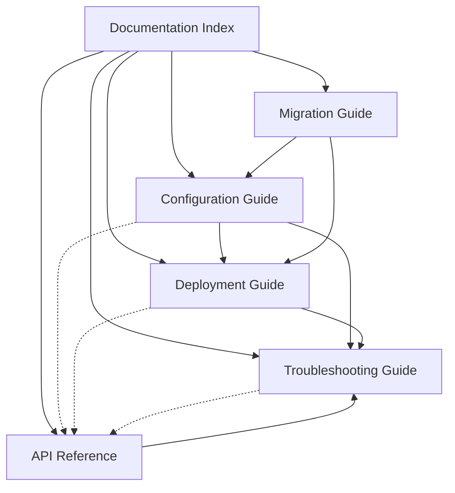

# WebSocket CORS Standardization Documentation Index

## Overview

This documentation suite provides comprehensive guidance for implementing, configuring, deploying, and maintaining the WebSocket CORS standardization system in Vedfolnir. The documentation is organized into four main categories to support different user needs and use cases.

## Documentation Structure

### 1. Configuration Documentation
**File**: [`websocket-cors-configuration.md`](websocket-cors-configuration.md)  
**Purpose**: Comprehensive configuration guide with environment examples  
**Audience**: Developers, System Administrators, DevOps Engineers

**Contents**:
- Environment variable reference
- Development, staging, and production configurations
- Dynamic CORS origin generation
- Socket.IO configuration options
- Authentication and security settings
- Performance and monitoring configuration
- Configuration validation and troubleshooting

**Key Features**:
- Complete environment variable reference
- Environment-specific configuration templates
- Automatic CORS origin generation rules
- Security best practices
- Performance optimization settings

### 2. Troubleshooting Guide
**File**: [`websocket-troubleshooting-guide.md`](websocket-troubleshooting-guide.md)  
**Purpose**: Diagnostic and resolution guide for common issues  
**Audience**: Developers, Support Engineers, System Administrators

**Contents**:
- Common CORS issues and solutions
- Connection problems and diagnostics
- Browser-specific issues
- Network environment challenges
- Debugging tools and commands
- Error log analysis
- Performance troubleshooting
- Emergency procedures

**Key Features**:
- Step-by-step diagnostic procedures
- Browser developer tools guidance
- Network troubleshooting for corporate environments
- Real-time monitoring and debugging tools
- Emergency recovery procedures

### 3. Deployment Guide
**File**: [`websocket-deployment-guide.md`](websocket-deployment-guide.md)  
**Purpose**: Environment-specific deployment instructions  
**Audience**: DevOps Engineers, System Administrators, Infrastructure Teams

**Contents**:
- Development environment setup
- Staging environment deployment
- Production environment deployment
- Container deployment (Docker/Kubernetes)
- High-availability configurations
- Load balancer setup
- SSL/TLS configuration
- Monitoring and alerting
- Backup and recovery procedures

**Key Features**:
- Complete environment setup procedures
- Container orchestration examples
- High-availability architecture patterns
- Security hardening guidelines
- Performance optimization strategies

### 4. API Reference
**File**: [`websocket-api-reference.md`](websocket-api-reference.md)  
**Purpose**: Complete WebSocket API documentation  
**Audience**: Frontend Developers, Integration Engineers, API Consumers

**Contents**:
- Connection endpoints and namespaces
- Authentication mechanisms
- Event definitions and message formats
- Client-to-server and server-to-client events
- Error handling and response formats
- Rate limiting and security considerations
- Client implementation examples
- Testing and development utilities

**Key Features**:
- Complete event catalog with examples
- Message format specifications
- Authentication and security details
- Rate limiting and validation rules
- Client implementation patterns

### 5. Migration Guide
**File**: [`websocket-migration-guide.md`](websocket-migration-guide.md)  
**Purpose**: Step-by-step migration from legacy implementations  
**Audience**: Developers, System Administrators, Project Managers

**Contents**:
- Pre-migration assessment
- Step-by-step migration procedures
- Configuration migration
- Server-side and client-side code updates
- Testing and validation procedures
- Common migration issues and solutions
- Rollback procedures
- Post-migration verification

**Key Features**:
- Automated migration scripts
- Comprehensive testing procedures
- Risk mitigation strategies
- Rollback and recovery plans
- Success criteria and validation

## Quick Reference

### Getting Started
1. **New Implementation**: Start with [Configuration Documentation](websocket-cors-configuration.md)
2. **Existing Implementation**: Begin with [Migration Guide](websocket-migration-guide.md)
3. **Deployment**: Follow [Deployment Guide](websocket-deployment-guide.md)
4. **Integration**: Reference [API Documentation](websocket-api-reference.md)
5. **Issues**: Consult [Troubleshooting Guide](websocket-troubleshooting-guide.md)

### Common Use Cases

#### Setting Up Development Environment
1. Read: [Configuration Documentation - Development Environment](websocket-cors-configuration.md#development-environment-env-development)
2. Follow: [Deployment Guide - Development Environment](websocket-deployment-guide.md#development-environment-deployment)
3. Test: [API Reference - Testing and Development](websocket-api-reference.md#testing-and-development)

#### Deploying to Production
1. Plan: [Deployment Guide - Production Environment](websocket-deployment-guide.md#production-environment-deployment)
2. Configure: [Configuration Documentation - Production Environment](websocket-cors-configuration.md#production-environment-env-production)
3. Monitor: [Troubleshooting Guide - Performance Troubleshooting](websocket-troubleshooting-guide.md#performance-troubleshooting)

#### Integrating WebSocket Events
1. Reference: [API Reference - Event Definitions](websocket-api-reference.md#user-namespace-events)
2. Implement: [API Reference - Client Implementation Examples](websocket-api-reference.md#client-implementation-examples)
3. Test: [API Reference - Testing Tools](websocket-api-reference.md#testing-and-development)

#### Troubleshooting CORS Issues
1. Diagnose: [Troubleshooting Guide - CORS Issues](websocket-troubleshooting-guide.md#common-cors-issues)
2. Configure: [Configuration Documentation - CORS Configuration](websocket-cors-configuration.md#dynamic-cors-origin-generation)
3. Validate: [Troubleshooting Guide - Debugging Tools](websocket-troubleshooting-guide.md#debugging-tools-and-commands)

## Documentation Standards

### Format and Structure
- **Markdown Format**: All documentation uses GitHub-flavored Markdown
- **Consistent Structure**: Each document follows a standard structure with overview, detailed sections, and examples
- **Code Examples**: All code examples are tested and validated
- **Cross-References**: Documents include cross-references to related sections

### Maintenance and Updates
- **Version Control**: All documentation is version-controlled with the codebase
- **Regular Updates**: Documentation is updated with each system change
- **Validation**: Examples and procedures are regularly tested
- **Feedback Integration**: User feedback is incorporated into documentation improvements

### Accessibility and Usability
- **Clear Navigation**: Each document includes a table of contents
- **Search-Friendly**: Content is structured for easy searching
- **Multiple Skill Levels**: Content addresses different experience levels
- **Practical Examples**: Real-world examples and use cases are provided

## Support and Resources

### Additional Resources
- **System Requirements**: See [Configuration Documentation](websocket-cors-configuration.md#environment-variables)
- **Security Guidelines**: Reference [Deployment Guide - Security](websocket-deployment-guide.md#security-hardening)
- **Performance Optimization**: Check [Configuration Documentation - Performance](websocket-cors-configuration.md#performance-configuration)
- **Monitoring Setup**: Follow [Deployment Guide - Monitoring](websocket-deployment-guide.md#monitoring-and-alerting)

### Getting Help
1. **Documentation Search**: Use browser search (Ctrl+F) within documents
2. **Troubleshooting Guide**: Check common issues and solutions
3. **API Reference**: Verify event formats and requirements
4. **Migration Guide**: For implementation changes and updates

### Contributing to Documentation
- **Feedback**: Report documentation issues or suggestions
- **Examples**: Contribute additional examples and use cases
- **Updates**: Help maintain accuracy with system changes
- **Translations**: Assist with documentation translations

## Document Relationships

## Version Information

- **Documentation Version**: 1.0.0
- **System Version**: WebSocket CORS Standardization v1.0
- **Last Updated**: January 2025
- **Compatibility**: Vedfolnir WebSocket System v2.0+

## Feedback and Improvements

This documentation is continuously improved based on user feedback and system updates. To contribute:

1. **Report Issues**: Document any inaccuracies or missing information
2. **Suggest Improvements**: Recommend additional examples or clarifications
3. **Share Use Cases**: Contribute real-world implementation examples
4. **Update Notifications**: Subscribe to documentation update notifications

The WebSocket CORS standardization documentation provides comprehensive coverage of all aspects of the system, from initial setup through production deployment and ongoing maintenance. Use this index to navigate to the most relevant documentation for your specific needs and use cases.